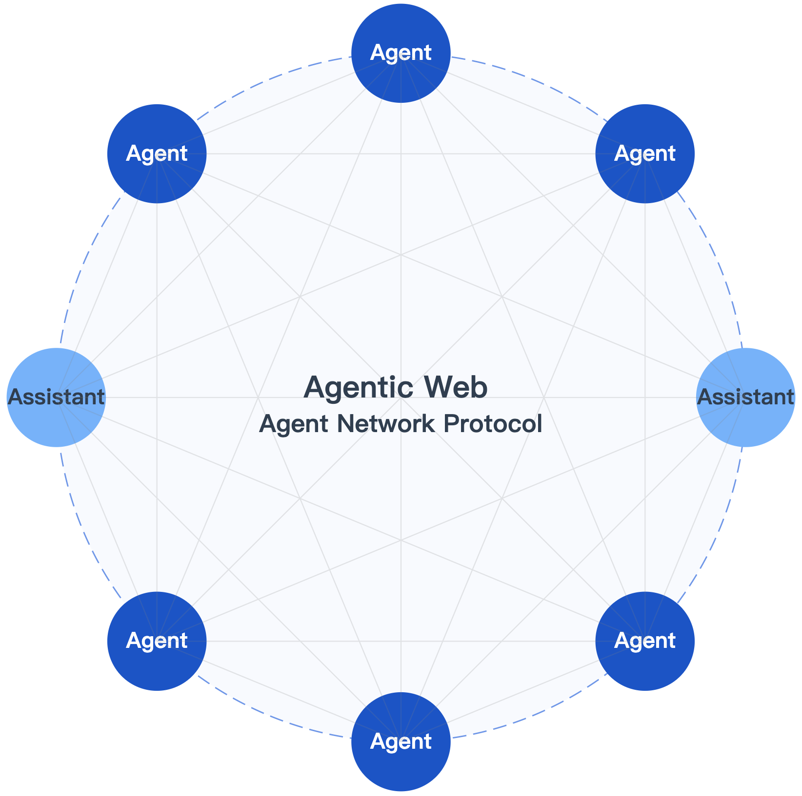
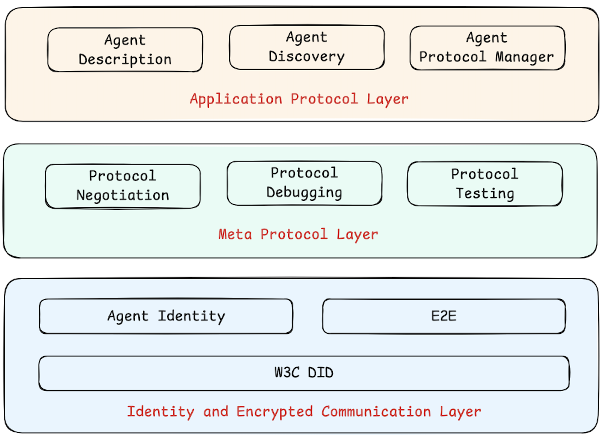

  
[English](README.md) | [中文](README.cn.md) | [한국어](README.kr.md)

## AgentNetworkProtocol(ANP)

> TL;DR: ANP는 에이전트 인터넷 시대의 HTTP가 되는 것을 목표로 합니다.

<!-- TOC -->
### 목차
- [비전과 포지셔닝](#비전과-포지셔닝)
- [ANP가 필요한 이유](#anp가-필요한-이유)
- [3계층 프로토콜 아키텍처](#3계층-프로토콜-아키텍처)
- [빠른 시작](#빠른-시작)
- [프로토콜 구현](#프로토콜-구현)
- [추가 자료](#추가-자료)
- [마일스톤](#마일스톤)
- [연락처](#연락처)
- [기여하기](#기여하기)
- [라이선스](#라이선스)

## 비전과 포지셔닝

AgentNetworkProtocol(ANP)은 지능형 에이전트를 위한 오픈소스 통신 프로토콜입니다.

AgentNetworkProtocol(ANP)은 **에이전트 인터넷 시대의 HTTP**가 되는 것을 목표로 합니다.

우리의 비전은 **에이전트들이 서로 연결되는 방식을 정의하여, 수십억 개의 에이전트를 위한 개방적이고 안전하며 효율적인 협업 네트워크를 구축하는 것**입니다.

  

우리는 에이전트 인터넷이 인간 인터넷 다음의 차세대 정보 인프라를 대표하며, 디지털 세계의 연결과 협업 방식을 근본적으로 변화시킬 것이라고 믿습니다. 이러한 비전에서:

- **플랫폼 중심에서 프로토콜 중심으로**: 현재 인터넷 생태계는 플랫폼을 중심으로 구축되어 있으며, 데이터와 서비스가 "데이터 사일로"에 갇혀 있습니다. 에이전트 인터넷은 이러한 불균형을 재구성하여, 인터넷을 폐쇄적이고 분절된 상태에서 개방적이고 자유롭게 연결된 본래의 모습으로 되돌릴 것입니다.

- **연결이 곧 힘**: 진정으로 개방적이고 상호연결된 네트워크에서 노드 간의 자유로운 상호작용은 혁신 잠재력을 극대화하고 엄청난 가치를 창출합니다. 미래에는 각 에이전트가 정보 소비자이자 서비스 제공자가 되며, 모든 노드가 장벽 없이 네트워크의 다른 모든 노드를 발견하고 연결하며 상호작용할 수 있을 것입니다.

- **AI 네이티브 네트워크**: 인간을 위해 설계된 웹페이지와 인터페이스와 달리, 에이전트 인터넷은 AI 친화적인 네이티브 데이터 네트워크를 구축하여 모든 노드가 설명 가능하고 발견 가능하며 호출 가능한 에이전트나 데이터 단위가 되고, 모든 링크가 의미론적으로 명확하고 구조적으로 통일된 프로토콜 연결이 될 것입니다.

이러한 비전을 실현하려면 인간 인터넷에서 HTTP가 하는 역할과 유사한 기초 프로토콜이 필요합니다. 이것이 바로 ANP가 만들어진 이유입니다.

**참고**: 이 프로젝트는 어떤 플랫폼이나 블록체인에서도 디지털 화폐를 발행하지 않았습니다.

## ANP가 필요한 이유

현재 인터넷 인프라는 매우 포괄적이지만, 에이전트 네트워크의 특별한 요구사항에 대한 최적의 통신 및 연결 솔루션이 여전히 부족합니다. 우리는 에이전트 네트워크가 직면한 세 가지 주요 과제를 해결하는 데 전념하고 있습니다:

- 🌐 **상호연결**: 모든 에이전트가 서로 통신할 수 있도록 하여 데이터 사일로를 깨고 AI가 완전한 컨텍스트 정보에 접근할 수 있도록 합니다.
- 🖥️ **네이티브 인터페이스**: AI는 인간의 인터넷 브라우징을 모방할 필요가 없어야 하며, 대신 AI가 가장 능숙한 방법(API 또는 통신 프로토콜)을 사용하여 디지털 세계와 상호작용해야 합니다.
- 🤝 **효율적인 협업**: AI를 사용하여 에이전트들이 자율 조직화하고 자율 협상하여 기존 인터넷보다 더 비용 효율적이고 효과적인 협업 네트워크를 구축할 수 있습니다.

## 3계층 프로토콜 아키텍처

  

- 🔒 **신원 및 보안 통신 계층**: W3C DID(Decentralized Identifiers) 사양을 기반으로 하고, 기존의 성숙한 웹 인프라를 기반으로 분산형 신원 인증 체계와 종단 간 암호화 통신 솔루션을 만듭니다. 어떤 플랫폼의 에이전트든 중앙집중식 시스템에 의존하지 않고 서로를 인증할 수 있습니다.
- 🌍 **메타 프로토콜 계층**: 에이전트 간의 통신 프로토콜을 협상하는 프로토콜입니다. 에이전트 네트워크가 자율 조직화, 자율 협상하는 효율적인 협업 네트워크로 진화하는 핵심입니다.
- 📡 **애플리케이션 프로토콜 계층**: 시맨틱 웹 사양을 기반으로 하여 에이전트가 자신의 능력과 지원하는 애플리케이션 프로토콜을 설명하고 이러한 프로토콜을 효율적으로 관리할 수 있도록 합니다.

## 빠른 시작

ANP의 기본 개념과 사용법을 빠르게 이해하고 싶다면, 기술 백서를 확인하세요: [ANP 기술 백서](korean/01-agentnetworkprotocol-technical-white-paper-kor.md)

ANP 관련 프로토콜 사양을 자세히 보려면 다음 문서들을 확인하세요:
- [DID-WBA 방법 설계 사양](korean/03-did-wba-method-design-specification-kor.md)
- [ANP 에이전트 통신 메타 프로토콜 사양](korean/06-anp-agent-communication-meta-protocol-specification-kor.md)
- [ANP 에이전트 설명 프로토콜 사양](korean/07-anp-agent-description-protocol-specification-kor.md)

## 프로토콜 SDK

AgentNetworkProtocol의 오픈소스 구현을 개발하고 있습니다. 저장소: [https://github.com/agent-network-protocol/AgentConnect](https://github.com/agent-network-protocol/AgentConnect)

## 추가 자료

- [확장 자료](docs/links.md)의 전체 자료
- 자세한 설계는 [ANP 기술 백서](korean/01-agentnetworkprotocol-technical-white-paper-kor.md)를 읽어보세요
- 참조 오픈소스 구현 [AgentConnect 예제](https://github.com/agent-network-protocol/AgentConnect)

## 마일스톤

프로토콜과 오픈소스 코드 구현 모두에 대해 다음 순서로 점진적으로 진행하고 있습니다:

- [x] 신원 인증 및 종단 간 암호화 통신 프로토콜과 구현 구축. 이것은 전체 프로젝트의 기초이자 핵심으로, 프로토콜 설계와 코드가 기본적으로 완료되었습니다.
- [x] 메타 프로토콜 설계 및 메타 프로토콜 코드 구현. 현재 프로토콜 설계와 코드 개발이 기본적으로 완료되었습니다.
- [x] 애플리케이션 계층 프로토콜 설계 및 개발.
  - [x] 에이전트 설명 지원.
  - [x] 에이전트 발견 지원.
  - [ ] 특정 도메인을 위한 애플리케이션 프로토콜 설계.

## 연락처

ANP 개발을 오픈소스 커뮤니티 접근법을 통해 추진하기 위해 ANP 오픈소스 기술 커뮤니티를 구축했습니다. 우리의 오픈소스 기술 커뮤니티에 참여하시길 진심으로 초대합니다. 창립 위원회, 커뮤니티 고문, 기술 위원회, 개발 위원회, 기업 옵저버 및 기타 팀들이 지속적으로 모집하고 있습니다.

이메일: chgaowei@gmail.com  
- Discord: [https://discord.gg/sFjBKTY7sB](https://discord.gg/sFjBKTY7sB)  
- 공식 웹사이트: [https://agent-network-protocol.com/](https://agent-network-protocol.com/)  
- GitHub: [https://github.com/agent-network-protocol/AgentNetworkProtocol](https://github.com/agent-network-protocol/AgentNetworkProtocol)
- WeChat: flow10240

## 기여하기

모든 형태의 기여를 환영합니다. [CONTRIBUTING.kor.md](CONTRIBUTING.kor.md) 파일을 참조하세요.

## 라이선스

이 프로젝트는 MIT 라이선스 하에 오픈소스로 제공됩니다. 자세한 내용은 [LICENSE](LICENSE) 파일을 참조하세요. 그러나 저작권은 GaoWei Chang에게 있습니다. 이 프로젝트의 모든 사용자는 원본 저작권 고지와 라이선스 파일을 유지해야 합니다.

## 저작권 고지  
Copyright (c) 2024 GaoWei Chang  
이 파일은 [MIT License](./LICENSE) 하에 배포됩니다. 자유롭게 사용하고 수정할 수 있지만 이 저작권 고지를 유지해야 합니다.