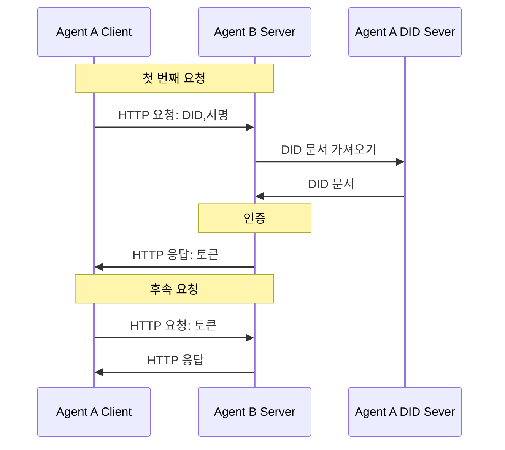

# Agent Network Protocol Technical White Paper

## 초록

대형 모델과 자율 의사결정 AI의 발전으로 에이전트(Agent)는 모바일 앱에 이어 인터넷의 새로운 주체로 빠르게 부상하고 있습니다. 그러나 기존 인터넷 인프라는 주로 인간 상호작용을 위해 설계되어, 데이터 사일로, 비친화적 인터페이스, 에이전트 간 높은 협업 비용 등의 문제로 대규모 에이전트 상호연결 및 협업 요구를 지원하기 어렵습니다. 인터넷은 에이전트가 전통적인 소프트웨어를 대체하고, 보편적인 에이전트 상호연결, 네이티브 프로토콜 기반 연결, 자율적 에이전트 조직화 및 협업이라는 네 가지 핵심 트렌드를 보이며 심오한 변화를 겪고 있습니다.

이러한 트렌드에 부응하기 위해 Agent Network Protocol (ANP)은 Agentic Web을 위한 차세대 통신 프로토콜을 제안합니다. ANP는 AI 네이티브 설계를 고수하고, 기존 인터넷 프로토콜과의 호환성을 유지하며, 모듈식 구성 가능한 아키텍처를 채택하고, 최소주의적이면서도 확장 가능한 원칙을 따르며, 기존 인프라를 기반으로 빠른 배포를 가능하게 합니다. 신원 및 암호화 통신 계층, 메타 프로토콜 협상 계층, 애플리케이션 프로토콜 계층의 3계층 프로토콜 시스템을 통해 ANP는 에이전트 신원 인증, 동적 협상, 능력 발견 상호운용성 문제를 체계적으로 해결합니다.

애플리케이션 계층에서 ANP는 Agent Description Protocol (ADP)과 에이전트 발견 프로토콜을 통해 AI 친화적인 네이티브 데이터 네트워크를 구축하여, 에이전트가 구조화된 방식으로 능력을 개방하고 상호연결할 수 있도록 합니다. 보안 및 프라이버시 설계 측면에서 ANP는 인간 권한과 에이전트 권한 구분 메커니즘을 도입하고, 다중 DID 프라이버시 보호 전략을 지원하며, 최소 정보 공개와 종단 간 암호화 통신을 촉진하여 개방된 네트워크 환경에서 사용자와 에이전트의 자율성과 데이터 보안을 보장합니다.

미래를 전망하면, ANP는 디지털 사일로를 깨고 인터넷이 폐쇄된 플랫폼 생태계에서 개방형 프로토콜을 중심으로 한 협업 네트워크로 다시 진화하도록 추진하는 데 전념하고 있습니다. "연결이 곧 힘이다"라는 설계 철학을 고수하며, 고품질의 저마찰 에이전트 연결과 협업을 촉진함으로써 집단 지능의 막대한 잠재력을 해방시킵니다. ANP는 단순한 통신 표준이 아니라 Agentic Web 시대의 개방성, 공정성, 혁신 활력을 재구성하는 중요한 인프라를 대표합니다. 우리는 전 세계 개발자, 연구자, 조직이 ANP 생태계 구축에 참여하여 에이전트가 주도하는 새로운 인터넷의 미래를 함께 창조하기를 초대합니다.

## 1. 서론

### 1.1 배경과 과제

대형 모델과 자율 의사결정 AI의 발전으로 에이전트는 모바일 앱에 이어 인터넷의 새로운 주체가 되고 있습니다. 에이전트는 기존 소프트웨어를 대체하고 인터넷의 중요한 부분이 될 것으로 예상됩니다. 그러나 현재의 인터넷 기술 기반과 연결 패러다임은 에이전트의 요구를 충족시키기 어려우며, 주로 다음과 같은 측면에서 나타납니다:

- **데이터 사일로와 컨텍스트 제한**: 에이전트는 의사결정을 위해 포괄적인 컨텍스트 정보를 통합해야 하지만, 현재 인터넷 플랫폼들은 단절되어 있고 데이터는 서로 다른 애플리케이션과 서버에 고립되어 있습니다. 이러한 데이터 사일로 현상은 에이전트가 완전한 정보에 접근하는 것을 제한하여 지능적인 의사결정의 이점을 활용하기 어렵게 만듭니다.

- **비친화적 인터페이스 (비네이티브)**: 기존 인터넷 애플리케이션은 주로 인간을 위해 설계되어 GUI를 통해 서비스를 제공합니다. 에이전트가 기존의 인간 인터페이스를 사용하려면 인간의 작업을 시뮬레이션해야 하는데, 이는 비효율적이고 오류가 발생하기 쉽습니다. 에이전트는 디지털 세계와 상호작용하기 위해 API나 통신 프로토콜을 직접 사용하는 것이 더 적합하므로, 정보 처리 중개자를 줄이고 상호작용 효율성을 향상시키기 위한 에이전트용 네이티브 데이터 인터페이스가 필요합니다.

- **높은 협업 비용**: 현재 서로 다른 에이전트들은 서로 고립되어 있으며, 직접적인 통신 메커니즘이 부족합니다. 대형 언어 모델이 에이전트가 자연어를 사용하여 협상할 수 있게 해주지만, 표준 프로토콜 지원 없이는 자율 조직화 협업이 여전히 어렵습니다. 모든 에이전트가 다른 에이전트와 직접 통신하고 자율적으로 협상할 수 있다면, 기존 인터넷보다 더 비용 효율적이고 효과적인 협업 네트워크를 만들 수 있을 것입니다.

### 1.2 Agentic Web의 네 가지 트렌드

위의 분석을 바탕으로, 우리는 인터넷이 에이전트를 중심으로 한 새로운 심오한 변화를 겪고 있다고 믿습니다. 이러한 변화는 다음 네 가지 주요 트렌드에 반영됩니다.

#### 1.2.1 에이전트가 전통적인 소프트웨어를 완전히 대체할 것

미래에는 에이전트가 기존 소프트웨어 애플리케이션을 점진적으로 대체하고 인터넷의 중요한 인프라가 될 것입니다. 개인 수준에서 AI 비서는 기존 앱의 대부분을 대체하여 사용자가 인터넷에 접근하는 주요 진입점이 될 것입니다. 전통적인 앱과 비교하여 개인 AI 비서는 정보 통합, 의사결정 지원, 시나리오 상호작용 경험에서 수십 배의 개선을 달성할 수 있습니다. 기업 수준에서 기업들은 에이전트를 배포하여 인터넷에서 사용자와 직접 연결하고 상호작용하며 정확하고 효율적인 서비스를 제공할 것입니다. 한편, 개인 비서와 기업 에이전트 간의 점대점, 탈플랫폼화 연결로 대표되는 새로운 연결 패러다임이 형성되고 있습니다.

#### 1.2.2 에이전트 간의 보편적 상호연결

Agentic Web의 두 번째 핵심 트렌드는 모든 에이전트 간의 자유로운 연결을 달성하는 것으로, 이는 현재 인터넷의 데이터 사일로 패턴을 완전히 깨고 정보의 자유로운 흐름을 가능하게 합니다. 완전히 연결된 에이전트 네트워크는 AI가 도메인과 플랫폼을 넘나드는 완전한 컨텍스트 정보에 완전히 접근할 수 있게 하여, 개인과 기업이 더 포괄적이고 정확한 결정을 내리는 데 도움을 줍니다. 동시에 이러한 개방형 연결 모드는 에이전트가 네트워크 전체의 모든 도구 기능을 호출할 수 있게 하여 에이전트 협업의 깊이와 복잡성을 크게 확장하고, 에이전트 간의 상호작용을 미래 인터넷에서 가장 주류적인 연결 방법으로 만듭니다.

#### 1.2.3 에이전트를 위한 프로토콜 기반 네이티브 연결 모드

현재 AI와 인터넷의 상호작용은 주로 브라우저나 소프트웨어 인터페이스(Computer Use / Browser Use)와 같은 인간 중심 설계 방법을 통해 이루어집니다. 그러나 이러한 방법은 임시적인 전환 솔루션일 뿐이며 AI의 잠재력을 완전히 해방시킬 수 없습니다. AI는 본질적으로 인간 인터페이스와 웹페이지 HTML보다는 기본 구조화된 데이터와 시맨틱 정보를 직접 처리하는 데 더 적합합니다. 따라서 우리는 미래에 에이전트가 AI 네이티브 사용을 위해 특별히 설계된 통신 프로토콜(Protocol)을 통해 연결될 것이며, 이는 HTTP처럼 널리 적용되어 산업 표준이 될 것이라고 믿습니다. 이 프로토콜을 기반으로 AI를 위해 특별히 설계되고 에이전트가 더 쉽게 접근하고 조작할 수 있는 새로운 데이터 네트워크도 등장할 것입니다.

#### 1.2.4 에이전트의 자율 조직화 및 협업 능력

Agentic Web의 네 번째 핵심 트렌드는 에이전트가 자율 조직화하고 협업하는 능력을 갖추는 것입니다. 표준 프로토콜 지원을 통해 에이전트는 자연어를 사용하여 유연한 자동 협상을 수행하고, 서로의 요구사항을 빠르게 파악하고, 동적으로 협업 관계를 형성하여 복잡한 작업을 함께 완료할 수 있습니다. 고정된 구조화 인터페이스가 필요 없는 이러한 협업 모드는 네트워크 운영 효율성과 작업 응답 능력을 크게 향상시키고 인간 개입과 통신 비용을 크게 줄입니다. 결과적으로 매우 유연하고 효율적이며 저비용의 에이전트 네트워크가 점차 형성될 것입니다.

이러한 트렌드를 고려할 때, 우리는 Agentic Web의 발전을 지원하기 위한 새로운 통신 프로토콜이 시급히 필요합니다. Agent Network Protocol (ANP)은 이러한 배경에서 제안되었으며, 에이전트에게 개방적이고 통합된 연결 메커니즘을 제공하여 상호연결, 네이티브 인터페이스, 효율적인 협업이라는 세 가지 주요 과제를 해결함으로써 AI 에이전트의 전체 잠재력을 해방시키는 것을 목표로 합니다.

## 2. 핵심 설계 원칙

Agent Network Protocol (ANP)은 처음부터 Agentic Web의 요구사항을 핵심으로 설계되어, 개방적이고 유연하며 구현 가능한 에이전트 통신 표준을 구축하고자 합니다. 설계는 다음과 같은 핵심 원칙을 따릅니다:

### 2.1 AI 네이티브 설계

ANP는 인간-기계 상호작용을 위해 설계된 프로토콜(HTML이나 GUI 인터페이스 등)이 아니라, AI 에이전트 간의 직접 통신을 위해 네이티브로 설계되었습니다. 구조화된 데이터, 시맨틱 표현, 자연어 통합을 강조하여 에이전트가 인간 작업을 시뮬레이션하지 않고도 이해하고, 발견하고, 협업할 수 있도록 합니다.

목표: 에이전트가 가장 효율적이고 자연스러운 방식으로 인터넷 세계에 접근하여 AI 의사결정과 행동의 잠재력을 해방시킬 수 있도록 합니다.

### 2.2 호환성과 재사용

ANP는 OpenAPI, JSON-RPC, 오디오-비디오 프로토콜(WebRTC 등)과 같이 널리 사용되는 인터넷 프로토콜 표준을 존중하고 호환합니다. 바퀴를 재발명하지 않고, ANP는 가벼운 메타 프로토콜과 설명 표준을 통해 이러한 기존 프로토콜을 에이전트가 이해하고 협상할 수 있는 시맨틱 프레임워크로 캡슐화합니다.

목표: 혁신을 보장하면서 학습 비용과 마이그레이션 임계값을 최소화하여 기존 생태계가 Agentic Web에 빠르게 통합되도록 촉진합니다.

### 2.3 구성 가능성

ANP는 모듈식 설계를 채택하여 에이전트 신원(DID), 에이전트 설명(ADP), 에이전트 발견과 같은 핵심 구성요소를 독립적으로 사용하거나 자유롭게 조합할 수 있습니다. 개발자는 실제 요구에 따라 단일 프로토콜 구성요소를 사용하거나 완전히 통합하는 것을 유연하게 선택할 수 있습니다.

목표: 최소 실행 가능 단위부터 대규모 시스템까지 필요에 따라 적응할 수 있는 다양한 복잡성과 단계의 애플리케이션 시나리오를 지원합니다.

### 2.4 단순성과 확장성

ANP는 최소주의 원칙(Keep It Simple)을 따르며, 프로토콜이 간결하고 직관적이 되도록 노력하여 이해와 구현의 장벽을 낮춥니다. 동시에 에이전트 생태계가 발전함에 따라 새로운 기능을 자연스럽게 추가할 수 있도록 충분한 확장 인터페이스와 유연한 Schema 메커니즘을 유지합니다.

목표: 다양한 애플리케이션 요구사항을 위한 성장 공간을 확보하면서 핵심 프로토콜을 작고 안정적으로 유지합니다.

### 2.5 실용적 배포 가능성

ANP의 설계는 실제 배포 가능성을 충분히 고려하여, 복잡하거나 보급하기 어려운 새로운 기술이나 독점 구성요소에 의존하지 않고 주로 기존 인터넷 인프라(DNS, HTTPS, 웹 서버, DID 시스템 등)에서 작동합니다. 모든 개발자나 기업이 ANP를 지원하는 에이전트 서비스를 빠르게 구축할 수 있습니다.

목표: 초기 배포 장벽을 낮추고 실제 환경에서 프로토콜의 빠른 파일럿, 적용 및 채택을 촉진합니다.

### 2.6 최소 신뢰 원칙

네트워크의 참가자(에이전트, 노드 등)는 기본적으로 완전히 신뢰받아서는 안 됩니다. 모든 상호작용은 인증과 권한 부여를 거쳐야 하며, 특정 작업을 완료하는 데 필요한 최소 권한만 부여해야 합니다. 이를 위해서는 잠재적인 보안 위험과 남용을 완화하기 위한 강력한 신원 확인, 접근 제어 및 데이터 검증 메커니즘이 프로토콜 설계에 포함되어야 합니다.

목표: 신뢰할 수 없는 환경에서도 안전하게 작동할 수 있는 에이전트 네트워크를 구축합니다.

## 3. 핵심 프로토콜 설계

### 3.1 프로토콜 계층 아키텍처

우리는 다음 다이어그램과 같이 3계층 프로토콜 아키텍처를 설계했습니다:

  

ANP 프로토콜 아키텍처는 아래에서 위로 세 개의 계층으로 나뉘며, 각각 서로 다른 핵심 기능을 담당합니다:

1. 신원 및 보안 통신 계층

이 계층은 에이전트 간의 신원 인증과 암호화 통신을 위한 기본 표준을 정의하여 플랫폼 간 신원 상호 인증과 종단 간 암호화 통신 문제를 해결합니다.

ANP는 W3C DID 표준을 기반으로 가볍고 확장 가능한 분산 신원 인증 메커니즘(did:wba 방법 등)을 설계하여, 두 에이전트가 중앙 기관의 개입 없이도 서로의 신원을 안전하게 확인하고 비공개의 신뢰할 수 있는 암호화 통신 채널을 구축할 수 있도록 보장합니다.

2. 메타 프로토콜 계층

이 계층은 에이전트가 자연어를 기반으로 통신 프로토콜을 동적이고 적응적으로 협상하는 방법을 정의합니다.

요구사항, 능력 및 협업 의도를 자연어로 교환함으로써, 에이전트는 현재 시나리오에 적합한 통신 세부사항(요청 형식, 인터페이스 호출 방법, 세션 관리 전략 등)을 유연하게 협상하여 매우 적응적인 프로토콜 조정과 런타임 최적화를 달성할 수 있습니다.

3. 애플리케이션 프로토콜 계층

이 계층에는 에이전트 설명과 에이전트 발견이라는 두 가지 핵심 모듈이 있습니다. 에이전트는 구조화된 설명 문서(ADP Agent Description Protocol 등)를 통해 기능과 인터페이스를 공개하고, 발견 프로토콜을 기반으로 능동적 또는 수동적으로 서비스 진입점을 노출합니다.

### 3.2 신원 및 보안 통신 계층

모든 에이전트 간의 상호연결과 상호운용성을 달성하기 위한 주요 작업은 에이전트 간의 신원 인증 문제를 해결하는 것입니다. 현재 대부분의 인터넷 애플리케이션은 중앙집중식 신원 기술을 사용하므로 서로 다른 기술 구현으로 인해 시스템 간 계정 인증이 어렵습니다. OAuth2.0 기술이 이 문제를 어느 정도 완화했지만[^2], OAuth2.0은 시스템 간 신원 인증을 위해 특별히 설계되지 않아 프로세스가 상대적으로 복잡하고 분산화에 제한이 있습니다. 따라서 편리하고 플랫폼 간 호환이 가능하며 분산된 신원 인증 기술이 절실히 필요합니다.

블록체인 기반 분산 신원 인증 솔루션이 잠재적인 접근 방식을 제공하지만, 대규모 애플리케이션의 확장성 문제로 인해 아직 최적의 솔루션이 되지 못했습니다.

이러한 문제를 해결하기 위해 우리는 W3C Decentralized Identifier (DID) 표준을 도입합니다[^3]. DID는 전통적인 중앙집중식 신원 관리 시스템의 종속성을 해결하기 위해 설계된 새로운 식별자 표준입니다. 이를 통해 사용자는 중앙집중식 시스템에 의존하지 않고도 자신의 신원을 제어하고 서로 인증할 수 있습니다. DID 핵심 사양은 분산 식별자를 구축하기 위한 특정 계산 인프라를 의무화하지 않으므로, 기존의 성숙한 기술과 잘 구축된 웹 인프라를 완전히 활용할 수 있습니다. 또한 다양한 유형의 식별자 시스템이 DID 지원을 추가하여 중앙집중식, 연합식, 분산식 식별자 시스템 간의 상호운용성 브리지를 구축할 수 있습니다. 이는 기존 중앙집중식 식별자 시스템이 완전한 재구성이 필요 없이 기반에 DID를 생성하기만 하면 시스템 간 상호운용성을 달성할 수 있음을 의미하며, 기술 구현의 어려움을 크게 줄입니다.

  

DID의 핵심 구성 요소는 DID 문서로, 특정 DID와 관련된 주요 정보를 포함하여 DID 소유자의 신원을 확인하고 DID와 관련된 작업, 권한 및 접근 제어 관리를 지원하는 데 사용됩니다.

  

인증 프로세스에서 DID 문서는 사용자 신원을 확인하기 위한 방법과 해당 공개 키를 포함합니다(개인 키는 사용자가 보관). 클라이언트는 첫 번째 HTTP 요청 시 HTTP 헤더에 DID와 서명을 포함할 수 있습니다. 상호작용 빈도를 늘리지 않고도 서버는 DID 문서의 공개 키를 사용하여 클라이언트 신원을 빠르게 확인할 수 있습니다. 초기 확인 후 서버는 토큰을 반환할 수 있고, 클라이언트는 후속 요청에 토큰을 포함하여 서버가 매번 클라이언트 신원 대신 토큰을 확인할 수 있도록 합니다. 이 프로세스의 핵심은 검증자가 신뢰할 수 있는 공개 키를 사용하여 사용자 서명 정보를 확인하고, 단일 요청으로 신원 인증, 권한 확인 및 데이터 교환을 완료하여 프로세스를 간결하고 효율적으로 만드는 것입니다.

DID 방법은 DID와 DID 문서를 생성, 해석, 업데이트 및 비활성화하는 방법과 인증 및 권한 부여를 수행하는 방법을 정의합니다. 기존 DID 방법 초안 중에서 `did:web` 방법[^5]은 성숙한 웹 기술을 기반으로 구축되어 시스템이 중앙집중식 기술(클라우드 컴퓨팅 등)을 사용하여 DID와 DID 문서를 생성, 업데이트, 비활성화할 수 있도록 합니다. 서로 다른 시스템은 HTTP 프로토콜을 통해 상호운용성을 달성하며, 이는 인터넷의 이메일 서비스와 유사합니다. 각 플랫폼은 중앙집중식 방식으로 자체 계정 시스템을 구현하면서 플랫폼 간 상호연결을 가능하게 합니다.

`did:web` 방법을 기반으로, 우리는 에이전트 통신 시나리오를 위해 특별히 설계된 새로운 DID 방법인 `did:wba` (Web-Based Agent)를 제안했습니다. 이는 플랫폼 간 신원 인증 프로세스와 에이전트 설명 서비스를 추가합니다. `did:wba` 방법은 `did:web`의 장점을 계승하면서 에이전트 간 신원 인증 메커니즘을 더욱 최적화하여 에이전트 네트워크에서의 적용성을 향상시킵니다.

또한 사용자는 일반적으로 DID에 대해 하나 이상의 공개-개인 키 쌍을 생성하며, 이는 신원 확인뿐만 아니라 종단 간 암호화 통신에도 사용됩니다. 이러한 DID 키 쌍을 기반으로 Elliptic Curve Diffie-Hellman Ephemeral (ECDHE) 프로토콜[^6]을 사용하여 종단 간 암호화 체계를 설계하여 두 DID 간의 보안 통신을 가능하게 하고 중간 노드가 통신 내용을 해독할 수 없도록 보장합니다. 종단 간 암호화는 에이전트 역방향 프록시에 사용될 수 있습니다. 예를 들어, 에이전트는 운영 비용을 줄이기 위해 타사 플랫폼에서 포트를 임대할 수 있으며, 타사 플랫폼은 메시지를 전달하지만 내용을 해독할 수는 없습니다.

### 3.3 메타 프로토콜 계층

메타 프로토콜은 통신 프로토콜의 작동, 구문 분석, 조합 및 상호작용 규칙을 정의하는 프로토콜입니다. 본질적으로 통신 프로토콜을 협상하기 위한 프로토콜로, 특정 데이터 전송을 직접 처리하지 않고 유연하고 일반적이며 확장 가능한 통신 프레임워크를 제공합니다.

현재 에이전트 간의 통신에는 주로 두 가지 방법이 있습니다:

1. **인간 엔지니어가 통신 프로토콜을 설계**: 일반적인 산업 표준과 같이. 인간 엔지니어가 에이전트를 위한 통신 프로토콜을 설계하고, 프로토콜 코드를 개발하며, 디버깅, 테스트 및 배포를 수행합니다. 그러나 이 접근 방식은 종종 높은 개발 비용, 느린 프로토콜 업데이트, 새로운 시나리오에 적응하기 어려움과 같은 문제에 직면합니다.

2. **에이전트가 직접 자연어를 사용하여 통신**: 에이전트가 자연어를 사용하여 통신하고 내부적으로 대형 언어 모델(LLM)을 사용하여 이 데이터를 처리합니다. 그러나 이 방법은 높은 데이터 처리 비용과 낮은 처리 정확도 문제가 있습니다.

이러한 문제를 해결하기 위해 메타 프로토콜과 AI 코드 생성의 조합을 사용할 수 있습니다. 메타 프로토콜을 사용하고 AI 코드 생성 기술을 활용함으로써 에이전트 간의 통신 효율성을 크게 향상시키고 비용을 줄이면서 유연성과 개인화를 유지할 수 있습니다[^7].

메타 프로토콜을 사용한 통신의 기본 프로세스는 다음과 같습니다:

1. **메타 프로토콜 요청**: 에이전트 A가 먼저 에이전트 B에게 메타 프로토콜 요청을 보냅니다. 요청 본문은 자연어를 사용하여 자신의 요구사항, 입력, 예상 출력을 설명하고 후보 통신 프로토콜을 제안합니다. 후보 프로토콜에는 일반적으로 전송 계층 프로토콜, 데이터 형식, 데이터 처리 방법 등이 포함됩니다.

2. **프로토콜 협상**: 메타 프로토콜 요청을 받은 후 에이전트 B는 AI를 사용하여 자연어 설명을 처리하고 자체 능력과 결합하여 A의 요청과 후보 프로토콜을 수락할지 결정합니다. B의 능력이 A의 요청을 충족할 수 없으면 직접 거부합니다. B가 A의 후보 프로토콜을 수락하지 않으면 자체 프로토콜을 제안하여 다음 협상 라운드에 진입할 수 있습니다. 이 프로세스는 양측이 합의에 도달하거나 협상이 실패할 때까지 계속됩니다.

3. **코드 생성 및 배포**: 합의에 도달한 후 각 당사자는 협상된 프로토콜에 따라 프로토콜 처리 코드를 생성하고 배포합니다.

4. **공동 테스트**: 코드 배포 후 양측은 테스트 데이터를 협상하여 프로토콜과 AI가 생성한 프로토콜 처리 코드를 공동으로 디버그하고 테스트합니다.

5. **정식 통신**: 테스트가 완료되면 프로토콜이 정식으로 작동합니다. 그 후 에이전트 A와 B는 최종 협상된 프로토콜을 사용하여 통신을 시작하고 AI가 생성한 코드를 사용하여 데이터를 처리합니다.

6. **요구사항 변경 처리**: 요구사항이 변경되면 양측이 다시 합의에 도달할 때까지 위 프로세스를 반복합니다.

  

그러나 메타 프로토콜 협상은 시간이 많이 걸리고 AI 코드 생성 능력에 의존합니다. 각 통신에 대해 메타 프로토콜 협상이 수행되면 막대한 비용 소비와 열악한 상호작용 경험을 초래할 것입니다. 에이전트 간에 동일하거나 유사한 통신 프로세스가 많다는 점을 고려하여, 에이전트는 메타 프로토콜 협상 결과를 저장할 수 있습니다. 나중에 유사한 요구사항이 발생하면 이전 협상 결과를 정식 프로토콜로 직접 사용하여 통신하거나 후보 프로토콜로 사용하여 협상할 수 있습니다. 동시에 에이전트는 다른 에이전트가 쿼리하고 사용할 수 있도록 협상 결과를 공유할 수도 있습니다.

에이전트가 협상 결과를 적극적으로 업로드하도록 경제적으로 인센티브를 제공하고 에이전트 간의 합의 프로토콜을 선택하는 방법은 메타 프로토콜 계층에서 여전히 심층적인 연구가 필요한 문제입니다.

### 3.4 애플리케이션 프로토콜 계층

애플리케이션 프로토콜 계층에는 에이전트 설명과 에이전트 발견이라는 두 가지 핵심 모듈이 있습니다.

#### 3.4.1 에이전트 설명 프로토콜 (ADP)

Agent Description Protocol (ADP)은 각 에이전트에 표준화된 자기 설명 방법을 제공합니다. ADP 문서는 JSON-LD(JSON 기반 연결 데이터 형식)로 작성되며, ANP 사용자 정의 어휘와 결합된 확장과 함께 schema.org에서 제공하는 일반 어휘를 사용하여 에이전트를 위한 통합 메타데이터 형식을 정의합니다. Agent Description (AD) 문서는 네트워크 세계에서 에이전트의 명함이나 프로필과 같으며, 다른 에이전트가 이 문서를 읽어 상호작용하는 방법을 이해할 수 있도록 합니다.

에이전트 설명 문서는 일반적으로 다음과 같은 주요 정보를 포함합니다:

- **기본 정보**: 에이전트 이름, 고유 식별자, 소속 엔티티(개인, 조직 또는 다른 에이전트) 및 기타 식별 메타데이터.
- **능력 설명**: 에이전트가 제공하는 기능, 제품 또는 서비스 목록과 해당 설명. 예를 들어, 채팅 어시스턴트인지, 데이터 분석 서비스인지, 로봇 실행 기능을 가지고 있는지 등.
- **인터페이스 및 프로토콜**: 호출 가능한 API 엔드포인트와 지원되는 통신 프로토콜 버전 또는 사양을 포함하여 에이전트와 상호작용하는 방법. 다른 에이전트는 이 정보를 사용하여 요청이나 메시지를 보내는 방법을 알 수 있습니다.
- **보안 및 권한 부여**: 에이전트의 인증 방법과 권한 요구사항. 예를 들어, 신원을 확인하는 데 사용되는 DID 식별자와 공개 키. ADP 사양은 플랫폼 간 신원 인증 요구사항을 충족하기 위한 통합 보안 메커니즘으로 did:wba 방법을 사용할 것을 권장합니다.
- **연락처 정보**: 자동 상호작용 외부의 인간 개입이나 디버깅을 용이하게 하기 위한 선택적 기술 지원 또는 연락 채널(서비스 엔드포인트 URL, 관리자 연락처 이메일 등).

위의 정보는 JSON-LD 문서로 구조화된 형태로 제시되어 에이전트 설명을 기계가 구문 분석할 수 있고 의미론적으로 풍부하게 만듭니다. JSON-LD 컨텍스트를 통해 AD 문서의 어휘는 공개적으로 정의된 온톨로지에 연결되어 서로 다른 시스템 간에 의미론적 일관성을 달성할 수 있습니다. 예를 들어, ADP는 "Agent", "Service", "Interface" 등과 같은 핵심 어휘를 정의하며, 이 사양을 따르는 모든 에이전트에게 그 의미가 통합됩니다. 이는 에이전트가 서로의 능력을 이해하기 위한 기반을 제공합니다.

주목할 만한 점은 ADP가 분산 신원을 설명 문서의 보안 아키텍처에 통합한다는 것입니다. 각 에이전트 설명은 DID에 바인딩될 수 있으며, 에이전트 신원을 인증하기 위한 내장 확인 방법과 공개 키 정보를 포함합니다. 다른 에이전트가 설명을 읽고 통신할 때 DID 서명을 확인하여 상대방의 신원이 신뢰할 수 있음을 확인할 수 있으므로 개방된 네트워크에서 보안 연결을 구축할 수 있습니다. 이 설계는 에이전트 간의 상호 신뢰를 보장하여 추가 협업을 위한 기반을 마련합니다.

마지막으로 에이전트 설명 문서는 웹사이트의 홈페이지와 유사하게 에이전트 네트워크에서 에이전트의 진입점 역할을 하여, 다른 에이전트가 에이전트 설명 문서를 읽어 상호작용하는 방법을 이해할 수 있도록 합니다.

#### 3.4.2 에이전트 발견 프로토콜

에이전트 설명이 마련되면 에이전트가 서로를 발견하고 연결을 설정할 수 있는 메커니즘이 필요합니다. 에이전트 발견 프로토콜은 이러한 목적을 위한 표준 프로토콜로 설계되었습니다. 네트워크에서 에이전트 설명 문서를 게시하고 검색하는 방법을 지정하여 모든 에이전트나 검색 서비스가 다른 에이전트의 진입점을 쉽게 찾을 수 있도록 합니다. 본질적으로 에이전트 발견 프로토콜은 에이전트를 위한 "검색 엔진 프로토콜" 역할을 하여 에이전트 인터넷의 노드가 가시적이고 접근 가능하도록 보장합니다.

에이전트 발견 프로토콜은 두 가지 보완적인 발견 방법을 제공합니다:

1. **능동적 발견**: 일반적인 웹 .well-known 경로 규약을 기반으로 하여 알려진 도메인에서 공개적으로 사용 가능한 모든 에이전트 설명을 쿼리할 수 있습니다. 구체적으로, 인터넷 도메인 아래에 통합 디렉토리 진입점이 예약되어 있으며(기본 경로: /.well-known/agent-descriptions), 이 URL에 접근하면 해당 도메인의 모든 에이전트 AD 문서의 URL을 포함하는 JSON-LD 매니페스트가 반환됩니다. 매니페스트 문서 유형은 CollectionPage로, 각 에이전트 설명 문서의 링크 주소를 나열하고 대량의 에이전트를 지원하기 위해 페이지를 나눌 수 있습니다. 능동적 발견 메커니즘을 통해 모든 에이전트는 다른 에이전트의 도메인 이름만 알면 에이전트 디렉토리를 얻을 수 있으므로 전체 에이전트 네트워크를 단계별로 순회할 수 있습니다.

2. **수동적 발견**: 검색 엔진이 웹 페이지를 인덱싱하는 방법과 유사하게, 에이전트는 전문 검색 서비스 에이전트에 자신의 정보를 적극적으로 제출할 수 있습니다. 구체적인 접근 방식은 검색 서비스가 등록 API 인터페이스(에이전트 설명에 공개적으로 문서화됨)를 제공하고, 다른 에이전트가 이를 호출하여 AD 문서 URL을 등록할 수 있습니다. 등록 요청을 받은 후 검색 서비스는 주기적으로 URL을 크롤링하여 최신 에이전트 설명을 얻고 데이터베이스에 인덱싱합니다. 에이전트나 사용자가 관련 서비스를 쿼리하면 검색 서비스는 등록된 에이전트에 대한 정보를 반환할 수 있습니다. 수동적 발견을 통해 새로운 에이전트는 자신의 존재를 알리고 인덱싱 서비스에 의해 인덱싱되어 더 많은 노드에서 찾을 수 있습니다.

이 두 메커니즘은 서로를 보완합니다: 능동적 발견은 분산 도메인 디렉토리를 사용하여 에이전트 목록을 게시하는 데 중점을 두고, 수동적 발견은 인덱스 집계를 위한 중앙집중식 검색 에이전트를 도입합니다. 모든 발견 정보는 ADP 사양과 일치하는 JSON-LD 형식으로 표현됩니다. 획득 경로에 관계없이 발견 결과는 궁극적으로 다양한 에이전트의 설명 문서를 가리킵니다.

에이전트 발견 프로토콜을 통해 ANP는 에이전트 네트워크의 개방성을 보장합니다: 새로 가입한 에이전트는 정보 섬이 되지 않습니다. 프로토콜에 따라 설명 문서를 게시하거나 등록하기만 하면 네트워크에서 검색될 수 있습니다. 이는 대규모 에이전트 생태계 형성을 위한 기본 지원을 제공합니다.

주목할 만한 점은 에이전트 발견 프로토콜이 대량의 에이전트 정보를 효율적으로 관리하기 위해 결과 페이지 매김과 연결을 위한 표준 방법도 지정한다는 것입니다. 도메인에 많은 에이전트가 있을 때 .well-known/agent-descriptions 문서는 next 필드를 통해 후속 페이지에 연결하여 증분 로딩을 가능하게 할 수 있습니다. 검색 서비스는 쿼리 결과를 반환할 때 유사한 페이지 매김 메커니즘을 채택할 수 있습니다. 이러한 세부사항은 발견 프로세스의 확장성과 견고성을 보장합니다.

에이전트 설명 프로토콜과 발견 프로토콜의 조합을 통해 ANP는 애플리케이션 계층에서 폐쇄 루프를 달성합니다: 에이전트는 ADP를 사용하여 자신을 설명하고 에이전트 발견 프로토콜을 사용하여 자신을 노출하고 다른 에이전트를 발견합니다. 이 메커니즘은 앞서 언급한 에이전트 인터넷에서 "서로를 인식하는 방법"이라는 과제를 해결하여 에이전트 상호연결 요구사항을 충족합니다. 보안 신원 계층과 유연한 메타 프로토콜 계층과 결합하여 ANP는 에이전트 간에 개방적이고 효율적이며 신뢰할 수 있는 연결을 설정하기 위한 완전한 솔루션을 제공합니다.

### 3.5 AI 네이티브 데이터 네트워크

기존 인터넷 인프라는 인간 접근을 위해 설계되었습니다. 웹페이지는 하이퍼링크(HTML+HTTP)를 통해 연결되며, 정보는 페이지, 양식, 이미지 및 기타 시각적 인터페이스 형태로 제시되어 주로 인간의 브라우징과 조작을 위해 제공됩니다. 그러나 이러한 인간 중심의 연결 모드는 AI 에이전트의 효율적인 접근과 처리에 적합하지 않습니다. AI가 기존 인터넷을 사용하려면 인간 행동(클릭, 브라우징, 웹페이지 구문 분석)을 시뮬레이션해야 하며, 이는 에이전트의 능력을 크게 제한합니다.

이 문제를 해결하기 위해 Agent Network Protocol (ANP)은 AI 네이티브 데이터 네트워크 구조를 제안합니다. Agent Description Protocol (ADP)과 에이전트 발견 프로토콜을 통해 각 에이전트는 구조화되고 표준화된 방식으로 서비스 인터페이스, 능력 정보 및 데이터 리소스를 공개하고 개방된 발견 메커니즘을 통해 전체 에이전트 네트워크에 자동으로 노출될 수 있습니다.

이 프레임워크 하에서 모든 에이전트와 그들이 운반하는 데이터 리소스(텍스트, API, 오디오/비디오, 이미지 등)는 기계 친화적인 개방 네트워크를 형성합니다:

- 각 노드는 설명 가능하고, 발견 가능하며, 호출 가능한 에이전트 또는 데이터 단위입니다.
- 각 링크는 단순히 인간이 읽을 수 있는 하이퍼텍스트가 아니라 의미론적으로 명확하고 구조적으로 균일한 프로토콜 연결입니다.
- 에이전트는 통합 표준에 따라 다른 에이전트가 제공하는 리소스와 서비스를 빠르게 검색하고, 이해하고, 호출할 수 있습니다.

이 AI 네이티브 데이터 네트워크를 통해 에이전트는 웹페이지 크롤링이나 인터페이스 시뮬레이션에 의존하지 않고 인터넷에 널리 분산된 능력과 지식에 직접적이고 효율적이며 일괄적으로 접근할 수 있으므로 자율 학습, 추론 및 협업을 위한 AI의 잠재력이 크게 해방됩니다.

더 많은 개인 에이전트, 서비스 에이전트 및 검색 에이전트가 ANP를 통해 연결됨에 따라, 에이전트를 노드로 하고 구조화된 데이터를 연결로 하는 이 네트워크는 계속 성장하여 결국 글로벌하고 동적으로 진화하는 에이전트 인터넷을 형성할 것입니다.

## 4. 보안 및 프라이버시

에이전트 인터넷에서 보안 및 프라이버시 보호는 근본적이고 타협할 수 없는 요구사항입니다. Agent Network Protocol (ANP)은 초기 설계부터 **신원 인증 보안, 운영 권한 구분, 프라이버시 보호, 세밀한 권한 제어**를 핵심 메커니즘으로 통합하여 개방된 네트워크 환경에서 에이전트 간의 신뢰할 수 있는 통신과 안전한 데이터 공유를 보장합니다.

이 섹션에서는 신원 및 권한 관리, 프라이버시 보호 메커니즘, 통신 보안의 세 가지 측면에서 ANP의 보안 및 프라이버시 설계를 체계적으로 설명합니다.

### 4.1 인간 권한과 에이전트 권한의 구분

민감한 작업에 대한 인간의 제어를 보장하기 위해 ANP는 DID 문서에 `humanAuthorization`이라는 전용 확인 방법을 도입합니다.

- **저위험 작업** (공개 정보 쿼리, 데이터 검색 등)은 에이전트가 인간 개입 없이 자율 키를 사용하여 자동으로 권한을 부여할 수 있습니다.
- **고위험 작업** (자금 이체, 중요 데이터 제출, 개인 정보 공개 등)은 인간 사용자의 명시적 권한이 있어야 합니다.

고위험 요청을 실행할 때 사용자 에이전트는 `humanAuthorization` 방법을 사용하여 서명해야 합니다. 이 프로세스에서는 에이전트가 먼저 인간 사용자에게 권한 요청을 시작하고, 사용자의 명시적 확인(예: 생체 인증, 비밀번호 확인 또는 하드웨어 보안 모듈 확인을 통해) 후에만 해당 방법에 바인딩된 개인 키를 호출하여 서명하고 제출할 수 있습니다.

이 메커니즘은 **중요한 의사결정 작업의 최종 단계가 인간 의지에 의해 구동되어야 함**을 효과적으로 보장하여 에이전트가 오용되거나 인식 없이 고위험 명령을 실행하는 것을 방지합니다.

### 4.2 개인 키 관리 및 권한 격리

에이전트 개발자는 특히 `humanAuthorization` 키를 포함한 다양한 키에 대해 다음을 포함하되 이에 국한되지 않는 엄격한 권한 격리 및 보안 관리를 구현해야 합니다:

- **계층적 관리**: 일반 요청 키와 매우 민감한 키를 분리하여 별도로 관리하고 사용합니다.
- **로컬 암호화 저장소**: 개인 키는 안전하게 암호화된 로컬 장치(TEE, HSM 등) 또는 보호된 키 관리 시스템에 저장되어야 합니다.
- **동적 확인**: 매우 민감한 개인 키에 접근하려면 추가 동적 확인(지문, 얼굴 인식, 일회용 비밀번호 등)이 필요합니다.
- **작업 로깅**: 사후 감사 및 추적을 용이하게 하기 위해 각 민감한 서명 작업에 대한 완전한 작업 로그를 기록해야 합니다.

이러한 메커니즘은 키 유출, 도난 또는 오용 위험을 최대한 방지합니다.

### 4.3 다중 DID 전략 및 세밀한 프라이버시 보호

프라이버시 보호와 익명성을 향상시키기 위해 ANP는 사용자와 에이전트가 **다중 DID 관리 전략**을 채택할 것을 권장합니다. 구체적인 접근 방식은 다음과 같습니다:

- **주 DID와 하위 DID의 분리**: 주 DID는 장기적인 사회적 관계(친구, 비즈니스 파트너 등)를 유지하는 데 사용되며, 서로 다른 애플리케이션 시나리오(전자상거래 쇼핑, 음식 배달, 온라인 서비스 등)에 대해 독립적인 하위 DID가 생성됩니다.
- **최소 권한 원칙**: 각 하위 DID에는 특정 작업을 완료하는 데 필요한 최소 권한과 역할만 부여됩니다.
- **정기적인 교체 및 만료**: 하위 DID는 정의된 수명 주기를 가져야 하며, 사용 후 폐기하고 다시 신청하여 교차 시나리오 추적 및 신원 상관 공격을 방지해야 합니다.

다중 DID 시스템을 통해 신원과 행동의 효과적인 격리를 달성하여 대규모 데이터 분석에서 프라이버시 노출 위험을 줄이고 전반적인 신원 보안을 향상시킬 수 있습니다.

### 4.4 최소 정보 공개 및 통신 프라이버시

에이전트 간 통신에서 ANP는 **최소 공개 원칙** 준수를 강조합니다:

- 에이전트는 요청을 완료할 때 필요한 정보 필드만 전송하고 관련 없는 데이터 유출을 피해야 합니다.
- 민감한 필드는 종단 간 암호화를 사용하여 전송되어야 하며, 통신 링크가 가로채더라도 데이터 내용이 보호되도록 보장해야 합니다.
- 모든 통신 세션은 중간자 공격과 통신 위조를 방지하기 위해 해당 신원 확인 정보에 바인딩되어야 합니다.

또한 ANP는 개인 데이터의 보호 및 접근 제어를 강화하기 위해 애플리케이션 계층에서 익명 통신 기술(검증 가능한 암호화, 선택적 공개 자격 증명 등)을 추가로 채택할 것을 권장합니다.

## 5. 미래 전망: 연결을 통한 개방형 네트워크 재구성

인터넷의 진화는 핵심 개념을 깊이 검증합니다: "연결이 곧 힘이다." 진정으로 개방적이고 상호 연결된 네트워크에서 노드 간의 자유로운 상호작용은 혁신 잠재력을 최대화하고 막대한 가치를 창출합니다. 그러나 오늘날의 인터넷 생태계는 점점 더 소수의 대형 플랫폼에 의해 지배되고 있으며, 방대한 양의 데이터와 서비스가 폐쇄된 "디지털 사일로" 내에 갇혀 있어 연결의 힘이 소수의 기술 거대 기업의 손에 집중되어 있습니다.

Agentic Web의 출현은 이러한 불균형을 재구성할 역사적 기회를 제공합니다. 우리의 목표는 인터넷을 현재의 폐쇄되고 파편화된 상태에서 개방적이고 자유롭게 연결된 원래의 모습으로 되돌리는 것입니다. 미래의 에이전트 네트워크에서 모든 에이전트는 정보 소비자와 서비스 제공자의 이중 역할을 동시에 수행할 것입니다. 더 중요한 것은, 각 노드가 네트워크의 다른 노드를 장벽 없이 발견하고, 연결하고, 상호작용할 수 있어야 한다는 것입니다. 이러한 보편적 상호연결의 비전은 정보 흐름과 협업의 장벽을 크게 줄여 연결의 힘을 모든 사용자와 개별 에이전트에게 돌려줄 것입니다.

이는 중요한 변화를 나타냅니다: 플랫폼 중심의 폐쇄 생태계에서 프로토콜 중심의 개방 생태계로. 후자에서 가치 획득은 폐쇄된 플랫폼에 대한 통제보다는 참가자가 개방형 프로토콜을 따름으로써 네트워크에 가져오는 고유한 능력과 기여에 더 의존합니다. 이러한 변화는 성공의 핵심이 더 이상 사용자를 "가두는" 것이 아니라 우수한 에이전트 서비스를 제공하는 것이기 때문에 더 강렬한 애플리케이션 계층 혁신과 경쟁을 자극할 것입니다. 이는 TCP/IP 및 SMTP와 같은 개방형 프로토콜이 역사적으로 촉진한 혁신 패턴과 유사합니다.

에이전트 인터넷 네트워크를 구축하는 것은 광범위한 협력과 집단적 노력이 필요한 거대한 사업입니다. 기본 프로토콜 프레임워크로서 ANP의 성공은 개발자 커뮤니티의 채택, 구현 및 지속적인 기여에 달려 있습니다. 우리는 에이전트 기술과 개방형 인터넷의 미래에 관심이 있는 모든 연구자, 개발자, 기업 및 조직이 ANP의 개발, 테스트 및 애플리케이션 홍보에 참여하여 효율적인 에이전트 협업의 더 나은 미래를 함께 구축하기를 초대합니다.

## 참고문헌

[^2]: The OAuth 2.0 Authorization Framework, [https://tools.ietf.org/html/rfc6749](https://tools.ietf.org/html/rfc6749)

[^3]: Decentralized Identifiers (DIDs) v1.0:Core architecture, data model, and representations[https://www.w3.org/TR/did-core/](https://www.w3.org/TR/did-core/)

[^5]: did:web Method Specification, [https://w3c-ccg.github.io/did-method-web/](https://w3c-ccg.github.io/did-method-web/)

[^6]: The Transport Layer Security (TLS) Protocol Version 1.3，[https://www.rfc-editor.org/rfc/rfc8446.html](https://www.rfc-editor.org/rfc/rfc8446.html)

[^7]: A Scalable Communication Protocol for Networks of Large Language Models, [https://arxiv.org/pdf/2410.11905](https://arxiv.org/pdf/2410.11905)

## 저작권 고지  

Copyright (c) 2024 GaoWei Chang  
이 파일은 [MIT 라이선스](./LICENSE)에 따라 배포됩니다. 자유롭게 사용하고 수정할 수 있지만, 이 저작권 고지는 반드시 유지해야 합니다.
