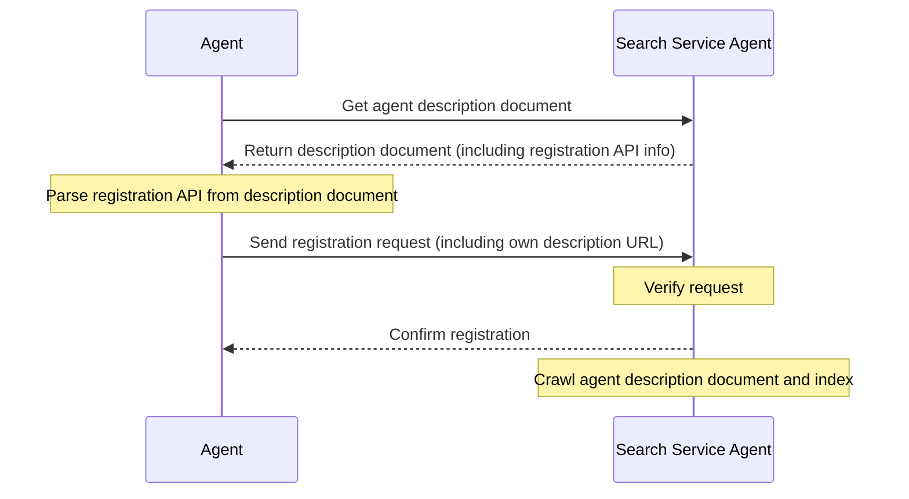

# ANP-Agent Discovery Protocol Specification (Draft)

## 초록

이 명세서는 에이전트 발견을 위한 표준화된 프로토콜인 Agent Discovery Service Protocol (ADSP)을 정의합니다. JSON-LD 형식을 기반으로 하여 능동적 발견과 수동적 발견이라는 두 가지 발견 메커니즘을 제공하며, 네트워크상의 다른 에이전트나 검색 엔진이 에이전트를 효과적으로 발견하고 접근할 수 있도록 하는 것을 목표로 합니다.

프로토콜의 핵심 요소는 다음과 같습니다:

1. JSON-LD를 기초 데이터 형식으로 사용하여 연결된 데이터와 시맨틱 웹 기능 지원
2. 능동적 발견 메커니즘을 정의하여 .well-known URI 경로를 에이전트 발견 진입점으로 사용
3. 수동적 발견 메커니즘을 제공하여 에이전트가 자신의 설명을 검색 서비스에 제출할 수 있도록 허용
4. 에이전트 설명의 페이지네이션과 연결을 지원하여 대량의 에이전트 정보 관리를 용이하게 함

이 명세서는 네트워크상의 에이전트 발견 가능성을 향상시켜 에이전트 네트워크 생태계 구축을 위한 기초적 지원을 제공하는 것을 목표로 합니다.

## 서론

에이전트의 수가 지속적으로 증가함에 따라, 이러한 에이전트들을 효과적으로 발견하고 접근하는 방법이 핵심 과제가 되었습니다. Agent Discovery Service Protocol (ADSP)은 에이전트가 다른 에이전트나 검색 엔진에 의해 발견될 수 있는 표준화된 방법을 제공함으로써 이 문제를 해결하는 것을 목표로 합니다.

이 명세서는 능동적 발견과 수동적 발견이라는 두 가지 에이전트 발견 메커니즘을 정의합니다. 능동적 발견은 검색 엔진이나 다른 에이전트가 알려진 도메인 하에서 모든 공개 에이전트를 발견할 수 있도록 합니다. 수동적 발견은 에이전트가 검색 서비스에 자신의 설명을 능동적으로 등록할 수 있도록 합니다. 이 두 메커니즘은 서로 보완하여 에이전트의 발견 가능성을 공동으로 향상시킵니다.

## 개요

[JSON-LD](https://www.w3.org/TR/json-ld11/) (JavaScript Object Notation for Linked Data)를 에이전트 발견 문서의 형식으로 사용하며, 이는 Agent Description Protocol과 일치합니다. JSON-LD를 사용함으로써 단순성과 사용 편의성을 유지하면서도 풍부한 시맨틱 표현과 연결 관계를 달성할 수 있습니다.

에이전트 설명 문서는 [ANP-Agent Description Protocol Specification](07-anp-agent-description-protocol-specification.md)에서 참조된 바와 같이 에이전트 정보의 상세한 표현입니다. 에이전트 발견 문서는 컬렉션 페이지 역할을 하며, 도메인 하의 모든 공개 에이전트 설명 문서의 URL을 포함하여 검색 엔진이나 다른 에이전트의 색인화와 접근을 용이하게 합니다.

## 프로토콜 세부사항

### 능동적 발견

능동적 발견은 검색 엔진이나 에이전트가 도메인만 알면 해당 도메인 하의 모든 공개 에이전트 설명 문서를 발견할 수 있는 것을 의미합니다. 웹 표준인 `.well-known` URI 경로를 에이전트 발견의 진입점으로 채택합니다.

#### .well-known URI

[RFC 8615](https://tools.ietf.org/html/rfc8615)에 따르면, `.well-known` URI는 서비스와 리소스를 발견하는 표준화된 방법을 제공합니다. 에이전트 발견을 위해 다음 경로를 정의합니다:

```
https://{domain}/.well-known/agent-descriptions
```

이 경로는 도메인 하의 모든 공개 에이전트 설명 문서의 URL을 포함하는 JSON-LD 문서를 반환해야 합니다.

#### 발견 문서 형식

능동적 발견 문서는 JSON-LD 형식을 채택하며, `CollectionPage` 타입을 사용하여 다음과 같은 핵심 속성을 포함합니다:

- `@context`: 문서에서 사용되는 JSON-LD 컨텍스트를 정의
- `@type`: 문서 타입, 값은 "CollectionPage"
- `url`: 현재 페이지의 URL
- `items`: 에이전트 설명 항목의 배열
- `next`: (선택사항) 다음 페이지의 URL, 페이지네이션 시나리오에서 사용

각 에이전트 설명 항목은 다음을 포함합니다:

- `@type`: 타입, 값은 "ad:AgentDescription"
- `name`: 에이전트 이름
- `@id`: 에이전트 설명 문서의 URL (리소스의 고유 식별자)

예시:

```json
{
  "@context": {
    "@vocab": "https://schema.org/",
    "did": "https://w3id.org/did#",
    "ad": "https://agent-network-protocol.com/ad#"
  },
  "@type": "CollectionPage",
  "url": "https://agent-network-protocol.com/.well-known/agent-descriptions",
  "items": [
    {
      "@type": "ad:AgentDescription",
      "name": "Smart Assistant",
      "@id": "https://agent-network-protocol.com/agents/smartassistant/ad.json"
    },
    {
      "@type": "ad:AgentDescription",
      "name": "Customer Support Agent",
      "@id": "https://agent-network-protocol.com/agents/customersupport/ad.json"
    }
  ],
  "next": "https://agent-network-protocol.com/.well-known/agent-descriptions?page=2"
}
```

#### 페이지네이션 메커니즘

도메인 하에 많은 수의 에이전트가 있을 때는 페이지네이션 메커니즘을 채택해야 합니다. 페이지네이션은 `next` 속성을 통해 구현되며, 다음 페이지의 URL을 가리킵니다. 클라이언트는 `next` 속성이 없을 때까지 모든 페이지를 재귀적으로 검색해야 합니다.

### 수동적 발견

수동적 발견은 에이전트가 다른 에이전트(일반적으로 검색 서비스 에이전트)에게 자신의 에이전트 설명 URL을 능동적으로 제출하여 그들이 자신의 정보를 색인화하고 크롤링할 수 있도록 하는 것을 의미합니다.

#### 등록 API

수동적 발견은 일반적으로 검색 서비스 에이전트가 제공하는 등록 API를 사용해야 합니다. 이러한 API는 검색 서비스 에이전트 자체에 의해 정의되며 그들의 에이전트 설명 문서에 명확히 명시되어야 합니다. 에이전트는 이러한 API를 호출하여 자신의 설명 URL을 검색 서비스에 등록할 수 있습니다.

#### 등록 과정

1. 에이전트가 검색 서비스 에이전트의 설명 문서를 획득
2. 설명 문서에서 등록 API 엔드포인트와 매개변수 요구사항을 찾음
3. 자신의 에이전트 설명 URL과 기타 필요한 정보를 포함한 등록 요청을 구성
4. 검색 서비스에 등록 요청을 전송
5. 검색 서비스가 요청을 검증하고 에이전트를 색인화



### 보안 고려사항

에이전트 발견의 보안을 보장하기 위해 다음 조치들이 권장됩니다:

1. **콘텐츠 검증**: 검색 서비스는 에이전트 설명 문서의 유효성과 무결성을 검증해야 함
2. **DID 인증**: did:wba 방법을 사용한 신원 인증으로 에이전트 신원의 진정성을 보장
3. **속도 제한**: 악의적인 요청과 DoS 공격을 방지하기 위한 적절한 속도 제한 조치 구현
4. **권한 제어**: 공개 및 비공개 에이전트를 구분하여 발견 문서에는 공개 에이전트만 포함

## 다른 프로토콜과의 관계

Agent Discovery Protocol은 다음 프로토콜들과 밀접한 관련이 있습니다:

1. **Agent Description Protocol**: 발견 프로토콜은 설명 문서의 색인화와 접근 메커니즘을 제공
2. **DID:WBA Method**: 신원 인증과 보안 보장을 제공
3. **Meta-Protocol**: 에이전트 통신에서 프로토콜 협상은 발견 결과를 기반으로 할 수 있음

## 저작권 고지

Copyright (c) 2024 GaoWei Chang  
이 문서는 [MIT License](./LICENSE) 하에 배포되며, 자유롭게 사용하고 수정할 수 있지만 이 저작권 고지를 유지해야 합니다.
