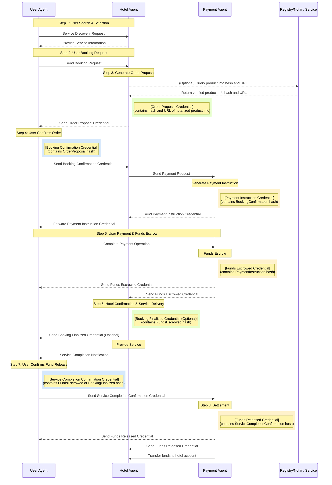

# ANP-based Agent Transaction Framework: Requirements and Technical Design Document (Draft)

## 1. 서론

### 1.1. 문제 정의: 안전하고 상호운용 가능한 에이전트 거래의 필요성

인공지능 기술의 급속한 발전으로 AI 에이전트는 점점 더 보편화되고 있으며, 인터넷에 접근하고 정보를 처리하며 작업을 실행하는 데 있어 인간을 점점 더 대체하게 될 것입니다. 이러한 에이전트 확산의 시대에 새로운 상호작용 패러다임이 형성되고 있습니다.

미래의 인터넷은 더 이상 인간 대 인간 또는 인간 대 웹사이트 상호작용이 특징이 아니라, 에이전트 간의 직접적인 연결과 통신이 특징이 될 수 있습니다. 이러한 peer-to-peer 에이전트 상호작용 모델은 기존의 중개자 모델보다 더 효율적이어서, 중간 단계를 줄이고 정보 전송 및 의사결정 프로세스를 가속화할 것입니다.

그러나 인터넷은 본질적으로 신뢰할 수 없는 환경이며, 에이전트가 사용자를 대표하여 거래를 수행할 때 몇 가지 핵심 과제에 직면합니다:

- **Authentication**: 상호작용하는 에이전트의 신원이 진짜이고 신뢰할 수 있음을 어떻게 보장할 것인가?
- **정보 진위성**: 에이전트 간에 교환되는 정보가 변조되지 않았음을 어떻게 검증할 것인가?
- **거래 보안**: 중앙 플랫폼 없이 거래 보안을 어떻게 보장할 것인가?
- **분쟁 해결**: 거래 문제가 발생할 때 분쟁을 어떻게 효과적으로 처리할 것인가?

따라서 안전하고 효율적이며 직관적인 에이전트 peer-to-peer 거래 프레임워크를 설계하는 것은 에이전트 경제의 인프라 역할을 하므로 특히 중요합니다. Agent Network Protocol (ANP)의 비전은 바로 에이전트 네트워크의 상호연결과 효율적인 협업 문제를 해결하여 데이터 사일로를 깨고 AI가 완전한 컨텍스트 정보에 접근할 수 있도록 하는 것입니다 (1).

### 1.2. 솔루션 개요: ANP 기반 에이전트 거래 프레임워크

이 제안은 앞서 언급한 문제들을 해결하기 위해 설계된 에이전트 기반 거래 프레임워크를 제시합니다. 프레임워크는 다양한 참가자(사용자, 호텔, 결제 플랫폼, 중재 기관 등)를 대표하는 에이전트들이 Agent Network Protocol (ANP)을 통해 상호작용하도록 활용합니다 (2). 핵심 기술 스택은 다음을 포함합니다:

1. **Agent Network Protocol (ANP)**: 에이전트 간 통신의 기본 프로토콜 역할을 하며, 발견, 상호작용, 메시지 전달 메커니즘을 정의하여 안전하고 상호운용 가능한 통신을 달성하는 것을 목표로 합니다 (2).
2. **Decentralized Identifiers (DIDs)**: 각 참가자와 그들의 에이전트를 고유하게 식별하고, 신원을 확인하는 데 필요한 공개 키 및 기타 정보를 연결하여 신뢰의 기반을 형성하는 데 사용됩니다 (3).
3. **W3C Verifiable Credentials (VCs) and Data Integrity Proofs**: 거래 중에 구조화되고 검증 가능한 데이터 클레임(주문 제안, 결제 확인 등)을 교환하는 데 사용되어 정보의 진위성, 무결성, 부인방지를 보장합니다 (6). Credential subject에 이전 credential의 해시를 포함하여 credential chain의 불변성을 달성합니다.

이 문서는 호텔 예약 및 결제를 예시로 사용하여 프레임워크의 요구사항, 핵심 프로세스, 기술 설계, 보안 메커니즘을 자세히 설명할 것입니다. 전체 설계는 최소 신뢰, 추적가능성, 자동화, 사용자 제어, 상호운용성의 원칙을 따라 보다 안전하고 투명하며 효율적인 탈중앙화 거래 생태계를 구축하는 것을 목표로 합니다.

## 2. 시스템 요구사항

### 2.1. 기능적 요구사항

- **에이전트 능력**:
  - **사용자 에이전트**: 서비스 발견, 예약 요청, 호텔 credential 검증, 확인 credential 생성, 결제 지시 처리, 결제 개시, 서비스 완료 확인 또는 분쟁 개시 능력을 가져야 합니다.
  - **호텔 에이전트**: 서비스 정보 게시, 주문 제안 credential 생성(견적 포함), 재고 임시 잠금, 사용자 확인 credential 검증, 결제 당사자에게 결제 요청 개시, 결제 수령 확인 및 예약 확정, 서비스 이행 기록, 취소 또는 분쟁 응답 처리 능력을 가져야 합니다.
  - **결제 에이전트**: 결제 요청 수신 및 검증, 결제 지시 credential 생성(에스크로 링크 등), 사용자 결제 처리 및 자금 에스크로, 자금 상태 알림 credential 발송, 지시에 따라 호텔에 자금 해제 또는 사용자에게 환불(사용자 확인, 타임아웃, 중재) 능력을 가져야 합니다.
  - **중재 에이전트** (선택사항): 양측이 제출한 증거 credential 수신, 규칙에 따른 중재 또는 판정, 구속력 있는 "분쟁 해결 credential" 생성 능력을 가져야 합니다.

- **거래 생명주기**: 시스템은 서비스 발견, 견적 및 제안, 주문 확인, 결제 요청 및 지시 생성, 자금 에스크로, 서비스 이행 확인, 자금 정산 또는 환불, 분쟁 개시 및 해결을 포함한 완전한 거래 프로세스를 지원해야 합니다. 이러한 단계들은 Part Four에서 설명된 핵심 프로세스에 매핑되어야 합니다.

- **Credential 처리**: 모든 에이전트는 특정 유형의 verifiable credentials (VCs)를 발행, 제시, 수신, 검증하는 능력을 가져야 합니다. 검증 프로세스는 credential의 데이터 무결성(proof를 통해)과 발행자 서명의 암호학적 검증뿐만 아니라 credential chain 무결성(credentialSubject의 이전 credential 해시를 통해) 검증을 포함해야 합니다. Credential 유형은 주문 제안, 예약 확인, 결제 요청, 자금 에스크로 확인 등과 같은 주요 거래 노드를 다뤄야 합니다 (6).

- **상태 관리**: 시스템은 거래 주문의 정확한 상태를 유지해야 하며, 상태 전환은 수신된 유효한 VCs 또는 미리 정의된 이벤트(타임아웃 등)에 의해 트리거되어야 합니다. 핵심 상태는 새 주문, 결제 대기, 에스크로, 이행 중, 정산 대기, 정산 완료를 포함하며, 취소됨, 분쟁 중 등을 포함할 수 있습니다.

- **예외 처리**: 시스템은 Part Five에서 설명된 다양한 예외 상황을 처리할 수 있어야 합니다: credential 검증 실패, 사용자 결제 타임아웃, 호텔 객실 없음/초과 예약, 사용자 취소(결제 전/후), 서비스 분쟁, 결제 실패, 자동 결제 해제 타임아웃, 키 손상/신원 이상, 에이전트/네트워크 중단 등. 처리 방법은 명확히 정의되어야 하며, 일반적으로 특정 오류 또는 상태 알림 VCs를 발송하는 것을 포함합니다.

### 2.2. 비기능적 요구사항

- **보안**:
  - **통신 보안**: 에이전트 간 통신은 도청과 변조를 방지하기 위해 end-to-end 암호화를 사용해야 합니다(ANP의 보안 계층에 의존) (1).
  - **신원 인증**: 상호작용하는 에이전트의 신원 진위성을 보장하기 위해 DID 기반 강력한 인증 메커니즘을 사용해야 합니다 (1).
  - **데이터 무결성**: 교환되는 모든 중요한 credential은 변조를 방지하기 위해 암호학적 증명(Data Integrity proofs 등)으로 보호되어야 합니다 (12).
  - **부인방지**: Credential 발행자는 그들이 발행한 유효한 credential을 거부할 수 없습니다(디지털 서명을 통해).
  - **불변성**: 거래 흐름 credential은 검증 가능한 체인인 VC Hash Chain을 형성하여 초기 credential의 변조를 방지해야 합니다(credentialSubject에 이전 credential의 해시를 포함하여).
  - **키 관리**: 각 에이전트의 개인 키 생성, 저장, 사용, 회전, 복구를 위한 안전한 메커니즘을 가져야 합니다.

- **상호운용성**: 시스템 설계는 ANP, W3C DID, W3C VC 등과 같은 개방 표준을 엄격히 준수하여 서로 다른 개발자가 구현한 에이전트 간의 원활한 상호작용을 보장해야 합니다 (2).

- **추적가능성/감사가능성**: 모든 주요 거래 단계와 상태 변경은 타임스탬프와 서명이 있는 verifiable credentials를 통해 기록되어 불변의 감사 가능한 기록 체인을 형성해야 합니다. VCs, Data Integrity 메커니즘, credential subjects의 해시 체인이 이 목표를 달성하는 핵심입니다 (12).

- **신뢰성/가용성**: 시스템은 높은 가용성을 가져야 하며 일부 에이전트나 네트워크 노드의 일시적인 장애를 견딜 수 있어야 합니다. 메시지 전달 보장 메커니즘(예: ANP가 메시지 큐나 재시도 메커니즘을 제공하는지 여부)과 에이전트 자체의 상태 지속성 능력을 명확히 해야 합니다 (1). ANP 프로토콜 자체의 견고성에 의존성이 있습니다.

- **확장성**: 아키텍처 설계는 미래의 에이전트 수와 거래량 증가를 지원해야 합니다. 대규모 애플리케이션 시나리오에서 ANP 프로토콜의 실제 성능을 고려해야 합니다 (2).

- **프라이버시**: 거래 요구사항을 충족하는 동시에 사용자 프라이버시를 고려해야 합니다. 예를 들어, 결제 에이전트에게 공개되는 불필요한 주문 세부사항을 제한하는 것입니다. W3C VC 표준의 채택은 또한 미래의 선택적 공개 기술(BBS+ 서명 기반 VCs 등) 채택 가능성을 제공합니다 (13).

## 3. 핵심 개념 및 아키텍처

### 3.1. 주요 용어

- **ANP (Agent Network Protocol)**: 에이전트 간 안전하고 상호운용 가능한 통신을 가능하게 하도록 설계된 오픈소스 프로토콜 프레임워크입니다. 에이전트 발견, 상호작용, 메시지 전달 메커니즘을 정의하며, 에이전트 시대의 HTTP가 되는 것을 목표로 합니다 (15).
- **Agent**: 특정 엔티티(사용자, 호텔 등)를 대표하여 작업을 실행하고 ANP 프로토콜을 통해 상호작용할 수 있는 자율적인 소프트웨어 프로그램입니다.
- **DID (Decentralized Identifier)**: 엔티티가 중앙화된 등록 기관에 의존하지 않고 자신의 식별자를 생성하고 제어할 수 있도록 하는 새로운 유형의 전역적으로 고유한 식별자입니다 (3). DID는 DID document로 해석될 수 있습니다.
- **DID Document**: 검증용 암호학적 자료(공개 키), 서비스 엔드포인트 등과 같이 DID와 연관된 정보를 포함하는 데이터셋입니다 (16).
- **Verifiable Credential (VC)**: 발행자가 주체에 대해 만든 클레임 집합으로, 검증자가 독립적으로 진위성과 무결성을 검증할 수 있도록 하는 암호학적 증명이 함께 제공됩니다 (6). 일반적으로 JSON-LD 형식으로 표현됩니다 (18).
- **Data Integrity Proof**: VCs나 기타 디지털 문서의 진위성과 무결성을 보호하는 데 사용되는 암호학적 증명 메커니즘으로, 일반적으로 VC의 proof 속성에 포함됩니다 (12).
- **VC Hash Chain**: 이 제안에서 채택된 메커니즘으로, 각 VC의 credentialSubject에 이전 VC의 해시 값을 포함하여 여러 VCs를 순서대로 연결하여 credential 시퀀스의 무결성과 변조 저항성을 보장합니다.
- **State Machine**: 거래(주문 등)가 생명주기 동안 거치는 명확히 정의된 일련의 상태와 상태 전환을 트리거하는 이벤트 및 조건을 설명합니다.
- **Issuer**: VC를 생성하고 발행하는 엔티티입니다(예: 호텔 에이전트가 주문 제안 VC를 발행) (6).
- **Holder**: 필요에 따라 VCs를 보유하고 제시하는 엔티티입니다(예: 사용자 에이전트가 호텔의 주문 제안 VC를 보유) (7).
- **Credential Subject**: VC의 클레임에 관련된 엔티티입니다(예: 호텔 예약 VC의 주체는 사용자와 예약 세부사항) (6). 이 제안에서는 첫 번째 VC를 제외하고 이전 VC의 해시 값도 포함합니다.
- **Cryptosuite**: Data Integrity proofs를 생성하고 검증하는 데 사용되는 특정 암호학적 알고리즘 조합(변환 알고리즘, 해시 알고리즘, 서명 알고리즘 등)을 정의합니다 (12).
- **DID Resolution**: DID를 해당하는 DID document로 변환하는 프로세스로, 일반적으로 DID resolver에 의해 수행됩니다 (16).
- **Verifiable Data Registry (VDR)**: VCs와 DIDs와 관련된 데이터를 기록하고 관리하는 데 사용되는 시스템으로, DID documents, VC schemas, 취소 목록 등을 포함합니다. 데이터베이스, 분산 원장 또는 기타 신뢰할 수 있는 시스템이 될 수 있습니다.

### 3.2. 시스템 아키텍처 개요

본 방안은 에이전트 기반 분산 아키텍처를 채택합니다. 각 참가자(사용자, 호텔, 결제 플랫폼, 중재 기관)는 각자의 에이전트로 대표됩니다. 이러한 에이전트들은 네트워크에 분산되어 있으며 ANP 프로토콜을 통해 peer-to-peer 또는 다자간 통신을 수행합니다.

핵심 상호작용 흐름은 중앙화된 비즈니스 플랫폼에 의존하여 상태 조정을 하지 않고, 대신 암호학적 증명(Data Integrity Proofs)이 있는 verifiable credentials (VCs)를 에이전트 간에 전달하고 검증하여 상태 전환을 구동하고 합의를 구축합니다. 신뢰 구축은 플랫폼 평판이 아닌 암호학을 기반으로 합니다:

2. **데이터 검증**: VCs의 Data Integrity proofs를 검증하여 정보의 진위성, 무결성, 출처 신뢰성을 보장합니다 (12).
3. **프로세스 무결성**: credentialSubject에 이전 VCs의 해시 값을 포함하여 VC hash chain을 형성하여 과거 기록의 불변성을 보장합니다.

ANP 프로토콜 스택은 기본 보안 통신(암호화)과 신원 인증(DID 기반) 능력뿐만 아니라 가능한 상위 계층 프로토콜 협상(Meta-Protocol)과 애플리케이션 프로토콜 프레임워크를 제공합니다 (15). 이 제안은 주로 신원/암호화 계층과 메시지 전달 능력을 활용하여 미리 정의된 VCs를 교환합니다.

다음 다이어그램은 시스템의 다양한 역할과 그들의 관계에 대한 아키텍처 개요를 보여줍니다:


*그림 1: ANP 에이전트 Peer-to-Peer 거래 시스템 아키텍처 - 사용자, 호텔, 결제 시스템, 선택적 중재 및 공증 서비스 간의 상호작용 관계를 보여줍니다. 에이전트 간의 모든 통신은 ANP 프로토콜을 기반으로 하며, verifiable credentials (VCs)를 통한 정보 전송 및 검증이 이루어집니다.*

### 3.3. 참가자 역할 및 책임

다음 표는 시스템의 주요 참가자와 그들의 에이전트 책임을 자세히 설명합니다:

**표 1: 참가자 역할**

| 역할 | 책임 키워드 | 상세 설명 |
|------|------------|----------|
| **사용자** | 최종 소비자 | 호텔 서비스가 필요한 개인. |
| **사용자 에이전트** | 탐색 → 확인 → 결제 → 피드백 / 분쟁 | 사용자를 대표하는 소프트웨어 에이전트. 사용자의 DID와 개인 키를 관리하고, ANP를 통해 서비스를 발견하고, 예약을 요청하고, 호텔 credential을 검증하고, 확인 credential을 생성하고, 결제 지시를 처리하고, 결제를 개시하고, 서비스 완료를 확인하거나 분쟁을 개시하며, 모든 상호작용은 ANP를 통해 이루어집니다. 해시 링크를 통해 credential chain을 저장하고 검증할 책임이 있습니다. |
| **호텔** | 서비스 제공자 | 숙박 서비스를 제공하는 엔티티. |
| **호텔 에이전트** | 견적 → 재고 잠금 → 확인 검증 → 결제 요청 → 서비스 제공 | 호텔을 대표하는 소프트웨어 에이전트. 호텔의 DID와 개인 키를 관리하고, 서비스 정보를 게시하고, 주문 제안 credential(견적 포함)을 생성하고, 재고를 임시 잠금하고, 사용자 확인 credential을 검증하고, 결제 당사자에게 결제 요청을 개시하고, 수령을 확인하고 예약을 확정하고, 서비스 이행을 기록하고, 취소나 분쟁 응답을 처리하며, 모든 상호작용은 ANP를 통해 이루어집니다. 해시 링크를 통해 credential chain을 저장하고 검증할 책임이 있습니다. |
| **결제 인프라** | 자금 처리 플랫폼 | 결제 처리업체, 은행 등과 같이 결제, 에스크로, 정산 서비스를 제공하는 플랫폼. |
| **결제 에이전트** | 자금 에스크로 → 상태 알림 → 정산 / 환불 | 결제 인프라를 대표하는 소프트웨어 에이전트. 자신의 DID와 개인 키를 관리하고, 결제 요청을 수신 및 검증하고, 결제 지시 credential(에스크로 링크 등)을 생성하고, 사용자 결제를 처리하고 자금을 에스크로에 넣고, 자금 상태 알림 credential을 발송하고, 지시에 따라 호텔에 자금을 해제하거나 사용자에게 환불(사용자 확인, 타임아웃, 중재)하며, 모든 상호작용은 ANP를 통해 이루어집니다. 해시 링크를 통해 credential chain을 저장하고 검증할 책임이 있습니다. |
| **중재 에이전트** (선택사항) | 분쟁 처리 → 중재 / 판정 | 중립적인 제3자 분쟁 해결 엔티티를 대표하는 소프트웨어 에이전트. 자신의 DID와 개인 키를 관리하고, 사용자와 호텔이 분쟁 해결을 협상할 수 없을 때 개입하며, 양측이 제출한 증거 credential을 수신하고, 규칙에 따라 중재 또는 판정하고, 구속력 있는 "분쟁 해결 credential"을 생성하며, 관련 상호작용은 ANP를 통해 이루어집니다. |
| **공증/등록 서비스** (선택사항) | 서비스 정보 저장/인증 | VC 참조를 위해 호텔/제품 정보의 해시 값이나 기타 주요 속성을 저장하고 인증하는 신뢰할 수 있는 제3자 서비스를 제공합니다. |

표 1 가치 명세: 이 표는 시스템의 각 참가자와 그들의 핵심 책임을 명확히 정의합니다. 이는 후속 프로세스 설계, 에이전트 상호작용 로직, 기능적 요구사항의 할당을 이해하는 데 중요합니다. 시스템 설계의 완전성을 보장하고 각 역할의 예상 행동을 명확히 합니다. 선택적 공증 서비스 역할이 추가되었습니다.

## 4. 프로세스 명세

### 4.1. 이상적인 거래 흐름 및 상태 전환

다음은 사용자가 호텔을 예약하고 결제하는 이상적인 프로세스로, 에이전트 간의 모든 상호작용은 ANP 프로토콜을 통해 전송되는 VC 메시지에 의해 구동됩니다. 주요 credential들은 credentialSubject에 이전 credential의 해시 값을 포함하여 연결되어 시퀀스와 불변성을 보장합니다.

**단계 1: 제안 및 재고 잠금**

- **트리거**: 사용자 에이전트가 호텔 에이전트에게 가격 문의 또는 예약 요청을 보냅니다(ANP 서비스를 통해 발견 가능).
- **처리**: 호텔 에이전트가 재고와 가격을 확인합니다.
- **Credential 생성**: 호텔 에이전트가 "주문 제안 Credential" (VC Type: OrderOfferCredential)을 생성합니다.
  - credentialSubject는 주요 서비스 세부사항을 포함해야 합니다: 방 유형, 가격, 유효 기간, 취소 정책, 임시 주문 ID 등.
  - (선택사항) 서비스 세부사항의 해시 값과 외부 공증/등록 서비스에 대한 포인터를 포함할 수 있습니다.
  - 호텔 개인 키로 서명하여 proof를 생성합니다.
- **상태**: 호텔이 해당 재고를 임시로 잠급니다. 주문이 "제안됨" 상태로 들어갑니다.
- **상호작용**: OrderOfferCredential이 ANP를 통해 사용자 에이전트에게 전송됩니다.

**단계 2: 사용자 확인**

- **트리거**: 사용자 에이전트가 OrderOfferCredential의 서명과 내용을 수신하고 검증합니다. 사용자가 예약 확인을 결정합니다.
- **Credential 생성**: 사용자 에이전트가 "예약 확인 Credential" (VC Type: BookingConfirmationCredential)을 생성합니다.
  - credentialSubject는 OrderOfferCredential ID에 대한 참조를 포함하여 제안 수락을 나타내고, 이전 VC(OrderOfferCredential)의 해시를 포함합니다(예: previousCredentialHash 속성에 저장).
  - 사용자 개인 키로 서명하여 proof를 생성합니다.
- **상호작용**: BookingConfirmationCredential이 ANP를 통해 호텔 에이전트에게 전송됩니다.
- **상태**: 호텔 에이전트가 BookingConfirmationCredential과 그 proof 및 previousCredentialHash를 검증한 후, 주문 상태가 "결제 대기"로 업데이트됩니다.

**단계 3: 결제 요청**

- **트리거**: 호텔 에이전트가 유효한 BookingConfirmationCredential을 수신합니다.
- **Credential 생성**: 호텔 에이전트가 "결제 요청 Credential" (VC Type: PaymentRequestCredential)을 생성합니다.
  - credentialSubject는 필요한 결제 정보만 포함합니다: orderId (또는 BookingConfirmationCredential ID에 대한 참조), 금액, 통화, payeeDid (호텔), payerDid (사용자), paymentAgentDid. 프라이버시 보호를 위해 자세한 호텔이나 제품 정보는 포함하지 않습니다. 이전 VC(BookingConfirmationCredential)의 해시를 포함합니다(예: previousCredentialHash).
  - 호텔 개인 키로 서명하여 proof를 생성합니다.
- **상호작용**: PaymentRequestCredential이 ANP를 통해 지정된 결제 에이전트에게 전송됩니다.
- **상태**: 주문 상태가 "결제 개시 대기"로 업데이트됩니다.

**단계 4: 에스크로 지시 생성 및 전달**

- **트리거**: 결제 에이전트가 PaymentRequestCredential과 그 proof 및 previousCredentialHash를 수신하고 검증합니다.
- **Credential 생성 (결제 에이전트)**: 결제 에이전트가 결제 거래 ID, 금액, 결제 방법 세부사항(에스크로 결제 링크/QR 코드 등), 결제 마감일 등을 포함한 "결제 지시 Credential" (VC Type: PaymentInstructionCredential)을 생성합니다.
  - credentialSubject는 이전 VC(PaymentRequestCredential)의 해시를 포함합니다(예: previousCredentialHash).
  - 결제 플랫폼 개인 키로 서명하여 proof를 생성합니다.
- **상호작용 1 (결제 에이전트 → 호텔 에이전트)**: 결제 에이전트가 ANP를 통해 PaymentInstructionCredential을 호텔 에이전트에게 전송합니다.
- **상호작용 2 (호텔 에이전트 → 사용자 에이전트)**: 호텔 에이전트가 PaymentInstructionCredential을 수신하고 (선택적으로) 검증한 후, ANP를 통해 사용자 에이전트에게 전달합니다.
- **상태**: 결제 작업이 "결제 대기" 상태로 들어갑니다.

**단계 5: 사용자 결제 및 에스크로**

- **트리거**: 사용자 에이전트가 (호텔 에이전트로부터 전달받은) PaymentInstructionCredential과 그 proof 및 previousCredentialHash를 수신하고 검증합니다. 사용자가 credential에서 제공된 링크/방법을 통해 결제를 완료합니다.
- **처리**: 자금이 결제 플랫폼의 에스크로 계정으로 들어갑니다.
- **Credential 생성**: 결제 에이전트가 자금 수령(에스크로로)을 확인하고 "자금 에스크로 Credential" (VC Type: FundsEscrowedCredential)을 생성합니다.
  - credentialSubject는 거래 ID, 주문 ID, 금액, 타임스탬프 등을 포함하고, 이전 VC(PaymentInstructionCredential)의 해시를 포함합니다(예: previousCredentialHash).
  - 결제 플랫폼 개인 키로 서명하여 proof를 생성합니다.
- **상호작용**: FundsEscrowedCredential이 ANP를 통해 사용자 에이전트와 호텔 에이전트에게 전송됩니다.
- **상태**: 주문 상태가 "에스크로됨"으로 업데이트됩니다.

**단계 6: 호텔 확인 및 서비스 제공**

- **트리거**: 호텔 에이전트가 FundsEscrowedCredential과 그 proof 및 previousCredentialHash를 수신하고 검증합니다.
- **처리**: 호텔이 예약을 공식적으로 확인하고 리소스를 잠급니다.
- **Credential 생성 (선택사항)**: 호텔 에이전트가 사용자에게 보낼 "예약 확정 Credential" (VC Type: BookingFinalizedCredential)을 생성할 수 있으며, credentialSubject는 이전 VC(FundsEscrowedCredential)의 해시를 포함합니다.
- **서비스**: 사용자가 예약에 따라 도착하고 호텔이 서비스를 제공합니다.
- **상태**: 주문이 "서비스 중 / 이행 중" 상태로 들어갑니다.
- **서비스 완료**: 서비스 종료 후, 호텔 에이전트가 사용자 에이전트에게 ANP를 통해 서비스 완료 알림이나 credential을 푸시할 수 있습니다(예: ServiceCompletedNotification, 이것도 VC로서 credential chain에 연결될 수 있음).

**단계 7: 사용자 서비스 완료 확인**

- **트리거**: 사용자가 (사용자 에이전트를 통해) 서비스가 합의된 대로 완료되었음을 확인합니다.
- **Credential 생성**: 사용자 에이전트가 "서비스 완료 확인 Credential" (VC Type: ServiceCompletionConfirmationCredential)을 생성합니다.
  - credentialSubject는 주문/거래 ID와 확인 타임스탬프, 이전 VC(FundsEscrowedCredential 또는 단계 6의 선택적 credential)의 해시를 포함합니다.
  - 사용자의 개인 키로 서명하여 proof를 생성합니다.
- **상호작용**: ServiceCompletionConfirmationCredential이 ANP를 통해 결제 에이전트에게 전송됩니다.
- **타임아웃 메커니즘**: 사용자가 지정된 시간 내에 확인하지도 분쟁을 개시하지도 않으면, 자동 확인 로직을 설계하여 자동 자금 해제를 트리거할 수 있습니다.
- **상태**: 주문 상태가 "정산 대기"로 업데이트됩니다.

**단계 8: 정산**

- **트리거**: 결제 에이전트가 ServiceCompletionConfirmationCredential과 그 proof 및 previousCredentialHash를 수신하고 검증하거나, 자동 자금 해제 조건이 트리거됩니다.
- **자금 운영**: 결제 에이전트가 에스크로된 자금을 호텔 계정으로 이체합니다.
- **Credential 생성**: "자금 해제 Credential" (VC Type: FundsReleasedCredential)을 생성합니다.
  - credentialSubject는 최종 정산 상태와 거래 세부사항을 기록하고, 이전 VC(ServiceCompletionConfirmationCredential)의 해시를 포함합니다.
  - 결제 플랫폼의 개인 키로 서명하여 proof를 생성합니다.
- **상호작용**: FundsReleasedCredential이 ANP를 통해 사용자 에이전트와 호텔 에이전트에게 전송됩니다.
- **상태**: 주문의 최종 상태가 "정산됨"으로 업데이트됩니다.

**이상적인 흐름 다이어그램:**



*그림 2: ANP 에이전트 이상적인 거래 흐름 다이어그램 - 사용자 탐색부터 정산까지의 완전한 프로세스를 보여주며, credential 생성 단계(VC 마커)를 명확히 표시하고, 사용자 에이전트, 호텔 에이전트, 결제 에이전트 간의 상호작용을 명확히 보여줍니다.*

**핵심 상태 전환 다이어그램 (개념적):**

```stateDiagram-v2
    [*] --> New
    New --> Pending_Payment: User confirms (credential contains order proposal hash)
    Pending_Payment --> Escrowed: Funds escrowed (credential contains payment instruction hash)
    Pending_Payment --> Cancelled: Payment timeout / User cancels
    Escrowed --> In_Service: Hotel confirms booking (optional credential contains escrow credential hash)
    Escrowed --> Cancelled: User cancels (policy compliant)
    Escrowed --> In_Dispute: Dispute initiated (credential contains escrow credential hash)
    In_Service --> Pending_Settlement: User confirms service (credential contains escrow/booking finalized credential hash) / Automatic confirmation timeout
    In_Service --> In_Dispute: Dispute initiated (credential contains in-service state hash)
    Pending_Settlement --> Settled: Funds released (credential contains service completion confirmation hash)
    Pending_Settlement --> In_Dispute: Dispute initiated (credential contains pending settlement state hash)
    In_Dispute --> Settled: Arbitration decision (credential) -> Release funds
    In_Dispute --> Cancelled: Arbitration decision (credential) -> Refund
    Cancelled --> [*]
    Settled --> [*]
```

*그림 3: VC Credential Hash Chain 기반 핵심 상태 전환 다이어그램 - 예약 프로세스 전반에 걸친 모든 상태의 전환과 이러한 상태 변경을 구동하는 credential hash chain 관계를 명확히 보여줍니다.*

**표 2: 핵심 상태 전환 (Credential Hash Chain 관계)**

| 현재 상태 | 트리거 이벤트/Credential 유형 | 주요 액션/검증 | 다음 상태 | 참고사항 |
|---------|-----------------|--------------|--------|------|
| New/Offered | Booking Confirmation Credential (User) | 사용자 서명 검증, 제안 참조, credentialSubject의 해시가 OrderOfferCredential과 일치하는지 검증 | Pending_Payment | |
| Pending_Payment | Funds Escrowed Credential (Payment Platform) | 결제 플랫폼 서명 검증, 에스크로 금액, credentialSubject의 해시가 PaymentInstructionCredential과 일치하는지 검증 | Escrowed | |
| Pending_Payment | Payment Timeout | 결제 에이전트가 타임아웃 감지, 알림 전송 | Cancelled | 타임아웃 기간 정의 필요 |
| Escrowed | (내부 로직/선택적 Booking Finalized Credential) | 호텔이 예약 리소스 확인, (VC 존재 시) credentialSubject의 해시가 FundsEscrowedCredential과 일치하는지 검증 | In_Service | 예정된 대로 서비스 시작 가정 |
| In_Service | Service Completion Confirmation Credential (User) | 사용자 서명 검증, 서비스 완료 확인, credentialSubject의 해시가 FundsEscrowedCredential 또는 BookingFinalizedCredential과 일치하는지 검증 | Pending_Settlement | |
| In_Service | User Confirmation Timeout | 결제 에이전트가 미리 설정된 규칙에 따라 트리거 | Pending_Settlement | 자동 확인 규칙과 기간 명확한 정의 필요 |
| Pending_Settlement | (내부 자금 이체 완료) | 결제 에이전트가 정산 실행, 자금 해제 Credential 생성 (credentialSubject에 서비스 완료 확인 credential 해시 포함) | Settled | |
| Escrowed/In_Service/Pending_Settlement | Dispute Initiation Credential (User/Hotel) | 서명 검증, 자금 운영 일시중지, credentialSubject의 해시가 현재 상태의 마지막 VC와 일치하는지 검증 | In_Dispute | |
| In_Dispute | Dispute Resolution Credential (Arbitrator) | 중재자 서명 검증, 결정에 따른 자금 운영 실행, (VC 존재 시) credentialSubject의 해시가 분쟁 개시 credential과 일치하는지 검증 | Settled/Cancelled | 중재 결과가 최종 상태 결정 |
| Any State | Cancellation Request Credential (User) | 현재 상태와 취소 정책에 따라 처리, (VC 존재 시) credential hash chain 검증 | Cancelled/(Unchanged) | 취소 정책이 복잡할 수 있음 |
| Any State | Credential Verification Failure | Credential 거부 (서명 또는 hash chain 검증 실패 포함), 오류 알림 전송 | (Unchanged) | 프로세스 일시중지 |

**표 2 가치 주석**: 이 표는 이상적인 프로세스에서의 상태 전환 로직을 정확히 설명하고 상태 전환 중 credentialSubject의 해시를 통한 VC chain 검증의 역할을 강조합니다. 각 상태 전환의 트리거 조건, 실행해야 할 검증 또는 액션, 달성되는 최종 상태를 명확히 하여 프로세스의 결정론성, 일관성, 변조 저항성을 보장합니다.

**이상적인 VC Hash Chain**

다음 다이어그램은 이상적인 조건에서 ANP 프로토콜의 다양한 credential(VCs) 간의 해시 연결 관계를 보여줍니다. 각 credential은 이전 credential의 해시를 포함하여 불변의 체인 구조를 형성하고, 전체 거래 프로세스의 무결성과 검증가능성을 보장합니다. 다이어그램의 다른 색상은 서로 다른 에이전트가 발행한 credential을 나타내고, 화살표는 해시 참조 관계를 나타냅니다.


*그림 4: ANP 프로토콜의 VC Hash Chain - 주문 제안부터 최종 정산까지의 완전한 credential chain을 보여주며, 각 credential이 이전 credential의 해시를 포함하여 불변의 체인 구조를 형성하여 거래의 무결성과 검증가능성을 보장합니다.*

Credential chain의 주요 특징:

1. **완전한 프로세스 추적가능성**: 최종 자금 해제 credential은 해시 체인을 통해 초기 주문 제안까지 추적할 수 있습니다
2. **변조 방지 메커니즘**: credential에 대한 모든 수정은 후속 credential에서 해시 검증 실패를 야기합니다
3. **명확한 발행자 책임**: 다른 색상으로 서로 다른 에이전트가 발행한 credential을 식별하여 책임 경계를 명확히 합니다
4. **선택적 검증 경로**: 필수 및 선택적 해시 참조 경로를 모두 지원하여 시스템 유연성을 향상시킵니다
5. **상태 전환 일관성**: 각 credential의 생성과 검증이 동시에 상태 전환 다이어그램의 해당 상태 변경을 구동합니다

## 4.2. 예외 처리 프로세스

시스템은 다양한 예외 상황을 견고하게 처리할 수 있어야 합니다. 다음은 주요 예외 시나리오와 그 처리 프로세스로, 모든 알림과 상태 변경은 ANP를 통해 전송되는 해당 VCs 또는 오류 메시지에 의해 구동됩니다. 예외 관련 VCs는 가능한 한 credentialSubject의 해시를 통해 credential chain의 관련 credential에 연결되어야 합니다.

표 3: 예외 처리 요약

| 시나리오 | 트리거 지점 | ANP/VCs를 통한 간단한 처리 |
|------|------------------------|-----------------------------------|
| Credential 검증 실패 | 모든 credential 수신 단계 | 수신 에이전트가 무효한 credential(무효한 서명, 잘못된 형식, 규정 비준수 내용, 무효한 VC hash chain 링크 등)을 거부하고, 오류 정보를 포함한 알림 credential(예: CredentialValidationError VC)을 ANP를 통해 반환합니다. 프로세스가 일시중지되고 수정 또는 수동 개입을 기다립니다. |
| 사용자 결제 타임아웃 | 단계 4 결제 지시 발행 후 타임아웃 발생 | 결제 에이전트가 결제 타임아웃을 감지하고 "결제 타임아웃 Credential" (PaymentTimeoutCredential)을 생성하여 사용자 및 호텔 에이전트에게 전송합니다(credentialSubject에 PaymentInstructionCredential 해시 포함). 주문 상태가 취소됨으로 전환됩니다. 호텔 에이전트가 알림을 받으면 잠긴 재고를 해제합니다. |
| 호텔 재고 부족/초과 예약 | 단계 1 또는 2 | 호텔 에이전트가 문의 또는 확인 중에 이행 불가능을 발견하면(예: 재고 부족), 사용자 에이전트에게 "주문 취소 Credential" (OrderCancellationCredential)을 생성하여 전송하고 이유를 설명해야 합니다(credentialSubject에 관련 요청 또는 OrderOfferCredential의 해시 포함). 주문 상태가 취소됨으로 전환됩니다. |
| 사용자 취소 (결제 전) | 단계 5 이전 | 사용자 에이전트가 "취소 요청 Credential" (CancellationRequestCredential)을 호텔 에이전트에게 전송합니다(credentialSubject에 BookingConfirmationCredential 해시 포함). 호텔 에이전트가 요청을 검증하고 동의하면 "취소 확인 Credential" (CancellationConfirmationCredential)을 반환합니다(credentialSubject에 CancellationRequestCredential 해시 포함). 주문 상태가 취소됨으로 전환됩니다. |
| 사용자 취소 (결제 후/서비스 전) | 단계 5 후, 단계 6 서비스 시작 전 | 사용자 에이전트가 CancellationRequestCredential을 호텔 및 결제 에이전트에게 전송합니다(credentialSubject에 FundsEscrowedCredential 해시 포함). 호텔 에이전트가 취소 정책에 따라 환불 금액을 계산하고 "취소 처리 Credential" (CancellationProcessedCredential)을 결제 에이전트에게 생성하여 전송합니다(credentialSubject에 CancellationRequestCredential 해시 포함). 결제 에이전트가 이 credential에 따라 환불을 실행하고 최종 상태 credential(예: FundsRefundedCredential)을 전송합니다(credentialSubject에 CancellationProcessedCredential 해시 포함). 주문 상태가 취소됨으로 전환됩니다. |
| 체크인/서비스 분쟁 | 단계 6 서비스 중 또는 후 | 사용자 에이전트(또는 호텔 에이전트)가 "분쟁 개시 Credential" (DisputeInitiationCredential)을 상대방과 결제 에이전트에게 생성하여 전송합니다(credentialSubject에 분쟁을 야기한 관련 VC의 해시 포함). 결제 에이전트가 수령 시 자금 해제를 일시중지합니다. 주문 상태가 분쟁 중으로 전환됩니다. 양 에이전트가 협상을 시도하고, 실패 시 중재 에이전트에게 증거 VCs를 제출합니다. 중재 에이전트가 결정을 내리고 "분쟁 해결 Credential" (DisputeResolutionCredential)을 생성하여 전송합니다(credentialSubject에 DisputeInitiationCredential 해시 포함). 결제 에이전트가 이 credential에 따라 자금 운영을 실행하고 최종 상태 credential을 전송합니다. |
| 결제 실패 또는 거부 | 단계 5에서 사용자가 결제를 시도할 때 | 결제 인프라(결제 에이전트를 통해)가 결제 실패를 감지하고 "결제 실패 Credential" (PaymentFailedCredential)을 생성하여 사용자 에이전트와 호텔 에이전트에게 알립니다(credentialSubject에 PaymentInstructionCredential 해시 포함). 주문 상태가 결제 대기로 되돌아가거나 직접 실패/취소됨으로 전환될 수 있습니다. |
| 자동 자금 해제 타임아웃 | 단계 7 사용자 확인 단계 타임아웃 | 자동 확인 메커니즘이 구성된 경우, 결제 에이전트가 자동으로 자금 해제를 트리거하고 정산을 실행하며 FundsReleasedCredential을 ANP를 통해 양측에 전송합니다(credentialSubject에 FundsEscrowedCredential 또는 BookingFinalizedCredential 해시 포함). 주문 상태가 정산됨으로 전환됩니다. |
| 키 손상/신원 이상 | 모든 단계 | 키 손상 또는 신원 이상을 감지한 당사자는 즉시 키를 취소하고 ANP를 통해 "보안 경고 Credential" (SecurityAlertCredential)을 관련 거래 당사자에게 브로드캐스트하거나 직접 알려야 합니다. 관련 에이전트들은 거래를 일시중지해야 합니다. |
| 에이전트/네트워크 중단 | 모든 단계 | ANP 프로토콜의 기본 견고성(예: 메시지 큐, 재시도 메커니즘)과 에이전트 자체의 상태 지속성 및 타임아웃 처리 능력에 의존합니다. 발신자는 재시도해야 하고, 수신자는 중복 메시지를 처리해야 합니다. 장기간 중단은 타임아웃으로 인한 거래 실패를 야기할 수 있습니다. |

**표 3 가치 주석**: 이 표는 거래 프로세스 중에 발생할 수 있는 다양한 비이상적 상황을 체계적으로 정리하고 ANP 및 VC 기반 대응 전략의 개요를 제공하며, 예외 처리 중 credentialSubject의 해시를 통한 credential chain 링크 유지의 중요성을 강조합니다. 시스템 설계의 견고성을 보장하고 실패 경로를 고려하며 개발자에게 예외 상황 처리를 위한 지침 프레임워크를 제공합니다.

## 5. 기술 설계 명세

### 5.2. 신원 및 신뢰 계층 (DID)

- **DID 목적 및 식별**: 생태계의 모든 핵심 참여 엔티티와 그들의 에이전트 시스템은 DIDs를 통해 고유하게 식별됩니다 (3). DIDs는 지속적이고 검증 가능하며 탈중앙화된 신원의 기반을 제공합니다.
- **DID Document 구조 및 검증 방법**: 각 DID는 W3C DID Core v1.0 명세를 따르는 DID Document와 연관됩니다. DID Documents는 verificationMethod 항목(id, type, controller, publicKeyJwk 또는 publicKeyMultibase와 같은 공개 키 정보 포함)과 검증 관계(VCs 발행을 위한 assertionMethod, 인증을 위한 authentication 등)를 포함합니다.
- **DID Resolution 요구사항**:
  - Resolution 인프라 의존성: 시스템의 신뢰 체인은 신뢰할 수 있는 DID resolution 메커니즘에 의존합니다. 사용되는 DID 방법(did:wba 등)을 해석할 수 있는 DID resolver의 배포나 접근이 필수입니다 (1). Resolution 실패는 credential 검증을 방해합니다.
- **키 관리 고려사항**:
  - 키 관리 부담: DIDs의 핵심은 공개-개인 키 쌍 제어입니다 (3). 다양한 에이전트의 개인 키를 안전하게 관리하는 것은 특히 사용자에게 큰 도전입니다. 생성, 저장(HSM/TEE/지갑), 사용, 회전, 복구를 다루는 포괄적인 전략이 필요합니다. 이는 탈중앙화 시스템 채택의 주요 장벽으로 남아있습니다 (21).
  - 방법별 인증: ANP 예제는 주로 did:wba를 기반으로 합니다 (1). 서로 다른 DID 방법은 서로 다른 의존성을 가집니다. 다른 DID 방법을 사용하는 에이전트와 상호작용하려면 여러 방법 resolution 지원이 필요할 수 있어 복잡성이 증가합니다. did:wba에 대한 의존성은 이질적인 DID 생태계에서 상호운용성을 제한할 수 있습니다.

### 5.3. Credential 관리 (Verifiable Credentials)

- **Credential 설계 철학 및 요구사항**: 거래 프로세스의 중요한 상태 증명과 책임 구분은 verifiable credentials에 의존합니다. 이러한 credential은 다음과 같아야 합니다: 출처와 무결성에 대해 독립적으로 검증 가능, 발행 후 부인방지, 기계 판독 및 파싱 가능, 크로스 플랫폼 상호운용성 지원, credentialSubject의 해시 값을 통해 변조 증거 체인으로 연결 가능.

- **선택된 표준**: W3C Verifiable Credentials Data Model v2.0:
  - 표준화 및 상호운용성: W3C 표준은 개방형 생태계를 촉진합니다
  - DIDs와의 네이티브 통합: DIDs와 원활하게 작동하도록 설계되었습니다
  - 풍부한 의미적 표현: JSON-LD를 기반으로 @context를 통해 명확한 의미를 허용합니다
  - 유연성 및 확장성: 유연한 데이터 모델, 쉽게 확장 가능합니다
  - 프라이버시 보호 잠재력: 선택적 공개와 같은 고급 기술을 지원합니다(예: BBS+)
  - 표준 성숙도 고려사항: VC DM v2.0은 작성 시점에 W3C Candidate Recommendation (CR) 상태였습니다

- **핵심 VC 구조 (JSON-LD)**: 각 VC는 주요 속성을 포함하는 유효한 JSON-LD 객체여야 합니다:
  - `@context`: (필수) 용어 컨텍스트를 정의하며, 첫 번째 항목은 "<https://www.w3.org/ns/credentials/v2"여야> 합니다
  - `id`: (선택사항, 권장) VC의 고유 식별자 (URL)
  - `type`: (필수) "VerifiableCredential"과 특정 유형을 포함하는 유형 배열
  - `issuer`: (필수) 발행자의 DID 또는 DID를 포함하는 객체
  - `issuanceDate` / `validFrom` / `validUntil`: (선택사항/필수) 타임스탬프
  - `credentialSubject`: (필수) 클레임을 포함하는 객체 집합. OrderOfferCredential의 경우 주요 서비스 세부사항을 포함해야 합니다. 첫 번째를 제외한 모든 VCs의 경우 이전 VC의 해시를 저장하는 previousCredentialHash 속성을 포함해야 합니다
  - `proof`: (필수) 무결성과 출처를 검증하기 위한 proof 객체를 포함합니다
  - `credentialSchema`: (선택사항) VC가 따르는 데이터 스키마를 설명합니다
  - `credentialStatus`: (선택사항) credential 상태 정보(예: 취소 상태)를 가리킵니다

- **VC Hash Chain 구현**:
  - 메커니즘: 두 번째 VC부터 각 VC의 credentialSubject는 이전 VC의 해시 값을 포함하는 previousCredentialHash 속성을 포함해야 합니다
  - 해시 계산: 해시 계산 프로세스는 명확히 정의되어야 합니다. 권장 접근법은 SHA-256과 같은 알고리즘을 사용하여 해시를 계산하기 전에 이전 VC를 정규화(예: JCS 사용)하는 것입니다
  - 검증: 검증자는 proof를 검증할 뿐만 아니라 이전 VC의 해시를 계산하고 현재 VC의 previousCredentialHash 값과 비교해야 합니다

- **선택사항: 외부 서비스를 사용한 서비스 정보 검증**:
  - 정보 해시: OrderOfferCredential의 credentialSubject에 호텔의 완전한 서비스 설명의 해시를 포함합니다
  - 공증/등록 서비스 참조: 호텔 서비스 설명(또는 그 해시)을 신뢰할 수 있는 제3자 공증 서비스나 VDR에 등록하고, OrderOfferCredential에 이 등록 항목과 해시에 대한 링크를 포함합니다

- **특정 Credential 유형 정의**:

**표 4: Verifiable Credential 유형 (v3 - VC Hash Chain)**

| Credential 유형 | 발행자 역할 | 주체 역할 | 주요 credentialSubject 속성 예제 | 목적 | 프라이버시/보안 참고사항 |
|-------------------|------------------------|--------------------------|--------------------------------|---------------------|--------------|
| OrderOfferCredential | Hotel Agent | User Agent, Order Details | orderId, hotelDid, roomType, price, checkInDate, checkOutDate, cancellationPolicy, offerExpiry, (optional)serviceDescriptionHash, (optional)registryPointer | 호텔이 견적과 예약 조건 제공 | 주요 서비스 세부사항을 포함해야 합니다. 선택적 외부 검증. 체인의 첫 번째 VC로 previousCredentialHash 없음. |
| BookingConfirmationCredential | User Agent | Hotel Agent, Order Details | orderId, offerCredentialId, userDid, confirmationTimestamp, previousCredentialHash: <hash_of_OrderOfferCredential> | 사용자가 주문 제안 수락 확인 | credentialSubject에 이전 VC의 해시 포함. |
| PaymentRequestCredential | Hotel Agent | Payment Agent, User Agent | orderId (or confirmationCredentialId), amount, currency, payeeDid (Hotel), payerDid (User), paymentAgentDid, previousCredentialHash: <hash_of_BookingConfirmationCredential> | 호텔이 결제 플랫폼에 결제 요청 | 자세한 주문/항목 정보 포함하지 않음. credentialSubject에 이전 VC의 해시 포함. |
| PaymentInstructionCredential | Payment Agent | User Agent, Hotel Agent | transactionId, orderId, amount, currency, paymentMethodDetails (e.g., URL), paymentDeadline, previousCredentialHash: <hash_of_PaymentRequestCredential> | 결제 플랫폼이 결제 지시 제공 (먼저 호텔에 전송하여 전달) | credentialSubject에 이전 VC의 해시 포함. |
| FundsEscrowedCredential | Payment Agent | User Agent, Hotel Agent | transactionId, orderId, amount, currency, escrowTimestamp, previousCredentialHash: <hash_of_PaymentInstructionCredential> | 결제 플랫폼이 자금이 에스크로에 있음을 확인 | credentialSubject에 이전 VC의 해시 포함. |
| BookingFinalizedCredential (Optional) | Hotel Agent | User Agent | orderId, bookingReference, confirmationTimestamp, previousCredentialHash: <hash_of_FundsEscrowedCredential> | 호텔이 예약 확정 (자금 수령 후) | credentialSubject에 이전 VC의 해시 포함. |
| ServiceCompletionConfirmationCredential | User Agent | Payment Agent, Hotel Agent | orderId, transactionId, confirmationTimestamp, previousCredentialHash: <hash_of_FundsEscrowed_or_BookingFinalized> | 사용자가 서비스 완료 확인, 결제 해제 승인 | credentialSubject에 이전 VC의 해시 포함. |
| FundsReleasedCredential | Payment Agent | User Agent, Hotel Agent | transactionId, orderId, amountReleased, settlementTimestamp, payeeDid, previousCredentialHash: <hash_of_ServiceCompletionConfirmation> | 결제 플랫폼이 에스크로된 자금이 수취인에게 해제되었음을 확인 | credentialSubject에 이전 VC의 해시 포함. |
| FundsRefundedCredential | Payment Agent | User Agent, Hotel Agent | transactionId, orderId, amountRefunded, refundTimestamp, payerDid, previousCredentialHash: <hash_of_triggering_VC> | 결제 플랫폼이 자금이 지불자에게 환불되었음을 확인 | credentialSubject에 이전 VC의 해시 포함. |
| DisputeInitiationCredential | User Agent / Hotel Agent | Arbitration Agent, Counterparty | orderId, disputeReason, evidenceCredentialIds, initiatorDid, timestamp, previousCredentialHash: <hash_of_disputed_VC> | 거래 분쟁 개시 | credentialSubject에 이전 VC의 해시 포함. |
| DisputeResolutionCredential | Arbitration Agent | User Agent, Hotel Agent, Payment Agent | disputeId, orderId, decision, resolutionDetails, resolvedTimestamp, previousCredentialHash: <hash_of_DisputeInitiation> | 중재 에이전트가 분쟁 해결 결과 발표 | credentialSubject에 이전 VC의 해시 포함. |
| CancellationRequestCredential | User Agent | Hotel Agent, Payment Agent | orderId, reason, requestTimestamp, previousCredentialHash: <hash_of_relevant_VC> | 사용자가 주문 취소 요청 | credentialSubject에 이전 VC의 해시 포함. |
| CancellationConfirmationCredential | Hotel Agent / Payment Agent | User Agent | orderId, cancellationResult, timestamp, previousCredentialHash: <hash_of_CancellationRequest> | 주문 취소 처리 결과 확인 | credentialSubject에 이전 VC의 해시 포함. |
| CredentialValidationError | Any Agent | Sender Agent | invalidCredentialId, errorDescription, timestamp | Credential 검증 실패 알림 | 해시 체인의 일부가 아님. |
| PaymentTimeoutCredential | Payment Agent | User Agent, Hotel Agent | transactionId, orderId, timeoutTimestamp, previousCredentialHash: <hash_of_PaymentInstruction> | 결제 타임아웃 알림 | credentialSubject에 이전 VC의 해시 포함. |
| PaymentFailedCredential | Payment Agent | User Agent, Hotel Agent | transactionId, orderId, failureReason, timestamp, previousCredentialHash: <hash_of_PaymentInstruction> | 결제 실패 알림 | credentialSubject에 이전 VC의 해시 포함. |
| SecurityAlertCredential | Any Agent | Relevant Parties | alertType, affectedDid, details, timestamp | 보안 경고 브로드캐스트 | 해시 체인의 일부가 아님. |

- *표 4 가치 주석*: 이 표는 추상적인 거래 프로세스 단계를 에이전트 간에 교환해야 하는 실제 데이터 credential로 구체화합니다. 각 주요 credential의 목적, 발행자, 주체, 핵심 데이터 필드를 정의하고, **프라이버시 보호 조치(결제 요청), 주요 서비스 정보의 필수 포함(주문 제안), credentialSubject의 previousCredentialHash 속성을 통해 구현되는 VC hash chain 연결 관계를 명확히 지정합니다**.

### 5.4. 증명 및 검증 메커니즘 (Data Integrity & VC Hash Chain)

- **선택된 메커니즘**: Data Integrity Proofs: VC의 진위성과 무결성을 보장하기 위해 W3C의 Data Integrity 명세를 채택합니다

- **불변성을 위한 VC Hash Chain**:
  - 메커니즘: 두 번째 VC부터 각 VC의 credentialSubject는 이전 VC의 해시를 저장하는 previousCredentialHash 속성을 포함합니다
  - 효과: 거래 프로세스의 모든 VCs를 순서대로 연결하여 검증 가능한 체인을 형성합니다. 체인의 초기 VCs에 대한 모든 수정은 검증 실패를 야기합니다
  - 검증 요구사항: 검증자는 VC 자체의 proof를 검증할 뿐만 아니라 이전 VC와의 해시 링크도 검증해야 합니다

- **암호화 Suite 권장사항**: JCS를 이용한 정규화와 결합된 EdDSA 또는 ECDSA 기반 암호화 suite 사용을 권장합니다
  - 구현 복잡성: Data Integrity 구현은 단순한 서명보다 복잡합니다; W3C 명세를 준수하는 라이브러리 사용을 권장합니다
  - 미래 프라이버시 향상: 선택적 공개를 지원하는 암호화 suite(BBS+ 등) 도입을 고려합니다

- **Proof 생성 및 검증 프로세스 (VC Hash Chain 포함)**:
  - 생성 (발행자):
    1. VC 데이터 준비, 기존 proof 제거
    2. (첫 번째가 아닌 VC의 경우) 이전 VC 획득, 정규화하고 해시 계산
    3. (첫 번째가 아닌 VC의 경우) 계산된 해시를 현재 VC의 credentialSubject.previousCredentialHash에 추가
    4. 현재 VC 정규화
    5. 정규화된 데이터의 해시 계산
    6. 개인 키를 사용하여 해시에 서명
    7. type, cryptosuite, created 등의 필드를 포함한 proof 객체 구성
    8. VC 데이터에 proof 객체 추가

  - 검증 (검증자):
    1. proof와 VC 데이터 분리
    2. verificationMethod 획득하고 DID를 파싱하여 공개 키 가져오기
    3. cryptosuite 가져오기
    4. 현재 VC 데이터 정규화
    5. 해시 계산
    6. 공개 키와 proofValue를 사용하여 서명 검증
    7. (첫 번째가 아닌 VC의 경우) previousCredentialHash 값 가져오기
    8. (첫 번째가 아닌 VC의 경우) 이전 VC 획득, 해시 계산
    9. (첫 번째가 아닌 VC의 경우) 계산된 해시와 previousCredentialHash 값 비교
    10. (선택사항) created 타임스탬프, proofPurpose 등 확인

- **추적가능성 향상 (Hash Anchoring)**:
  - Credential Chain의 고유 추적가능성: VC hash chain 메커니즘 자체가 강력한 추적가능성과 변조 저항성을 제공합니다
  - 선택적 온체인 Anchoring: 추가 증명 지점으로 주요 VCs의 해시 다이제스트를 공개 원장에 anchoring하는 것을 고려합니다

### 5.5. 보안 설계

- **인증 및 권한 부여**:
  - 인증: ANP 신원 계층과 DIDs에 의존합니다
  - 권한 부여: 능력 기반 권한 부여 모델, 유효한 VCs와 VC hash chain에서의 위치를 검증하여 작업을 권한 부여합니다

- **메시지 무결성 및 기밀성**:
  - 무결성: VCs의 Data Integrity proofs와 VC hash chain을 통해 보장됩니다
  - 기밀성: ANP의 end-to-end 암호화 통신 계층에 의존합니다

- **부인방지**: VCs의 디지털 서명(Data Integrity proofs)을 통해 구현됩니다

- **변조 저항**: VC hash chain 메커니즘을 통해 과거 credential의 수정을 방지합니다

- **프라이버시 보호**: PaymentRequestCredential에서 전송되는 데이터를 제한하여 주문 세부사항 프라이버시를 보호합니다

- **분쟁 해결 보안**: 중재 에이전트에게 제출되는 증거는 credential chain에 연결된 검증 가능한 VCs여야 합니다

- **키 관리 보안**: 개인 키의 안전한 관리가 기본이며, 개인 키를 보호하기 위한 강력한 조치가 필요합니다

- **ANP 프로토콜 보안 고려사항**:
  - ANP 프로토콜 자체의 위험을 평가해야 합니다: DID resolution DoS, 통신 취약점 등
  - LLM 기반 메타 프로토콜 협상은 prompt injection 및 유사한 공격에 대한 경계가 필요합니다
  - ANP의 독립적인 보안 감사를 권장합니다

- **보안 메커니즘 매핑**:

**표 5: 보안 메커니즘 매핑 (v3)**

| 보안 목표 | 메커니즘 | 구성요소/프로토콜 | 참고사항/참조 |
|---------------|-----------|---------------------|------------------|
| 신원 인증 | DID Authentication | DID, DID Document, ANP Identity Layer | 암호학적 증명 기반, 탈중앙화 [1] |
| 데이터 무결성 | VCs의 Data Integrity Proofs | VC, Data Integrity, Cryptosuites | Credential 내용이 변조되지 않았음을 보장 [12] |
| 데이터 기밀성 | End-to-end 암호화 통신 | ANP Encryption Layer | 전송 중 메시지 내용 보호 [1] |
| 부인방지 | 디지털 서명 (Data Integrity Proofs를 통해) | VC Proof, DID Keys | 발행자가 발행한 유효한 credential을 거부할 수 없음 [12] |
| 변조 저항 (과거 기록) | VC Hash Chain (credentialSubject를 통해) | VC credentialSubject (previousCredentialHash), Hashing Algorithm | 발행된 credential의 수정 방지 |
| 권한 부여 | VC 기반 능력 검증 (VC hash chain 검증 포함) | VC Verification Logic | 특정 VCs와 그들의 체인 위치를 보유하고 검증하는 것이 권한을 의미 |
| 추적가능성/감사가능성 | 서명된 Credential Chain (VC Hash Chain) (선택적 온체인 해시 anchoring) | VC Sequence, Data Integrity Proofs, Hashing | 변조 저항적인 거래 이력 제공 [12] |
| 프라이버시 보호 (결제) | PaymentRequestCredential 내용 제한 | VC Design (PaymentRequestCredential) | 결제 당사자에게 공개되는 정보 최소화 |
| 프라이버시 보호 (미래) | 선택적 공개 (예: BBS+), ZKP | Advanced Cryptosuites | 모든 정보를 노출하지 않고 속성 증명 허용 [18] |
| 키 보안 | 보안 키 관리 정책 | Agent Key Management Module | 중요한 도전 [21] |
| 프로토콜 보안 | ANP 프로토콜의 자체 보안 설계 (평가 필요), 보안 감사 | ANP Protocol Stack | ANP 프로젝트 견고성에 의존 |
| DoS 저항 | (ANP 및 DID resolver 설계에서 고려 필요) | ANP Network, DID Resolvers | 서비스 거부 공격 대응 |

- *표 5 가치 주석*: 이 표는 **credentialSubject를 통해 구현되는 VC hash chain을 변조 저항성 달성의 핵심 메커니즘으로 특별히 통합하고, 결제 프라이버시 보호 조치를 명확히 하여** 보안 아키텍처 매핑을 업데이트합니다.

## 6. 결론 및 향후 고려사항

### 6.1. 솔루션 검토

이 솔루션은 ANP 개방 프로토콜 프레임워크, DIDs, W3C Verifiable Credentials (VCs), Data Integrity proofs를 기반으로 한 포괄적인 에이전트 거래 프로세스를 자세히 설명합니다. 호텔 예약을 예시로 사용하여 서비스 발견부터 최종 정산 및 예외 처리까지의 완전한 루프를 설명합니다. 이 솔루션의 핵심 장점은 다음과 같습니다:

- **자동화**: 에이전트를 활용하여 대부분의 거래 상호작용을 자동으로 실행합니다.
- **보안**: DIDs를 통한 강력한 신원 인증, VCs와 Data Integrity를 통한 데이터 무결성과 부인방지 보장, ANP를 통한 end-to-end 암호화 통신을 구현합니다. VC hash chain 메커니즘은 거래 이력의 불변성을 보장합니다.
- **추적가능성**: 서명 기반 VC hash chain을 통해 투명하고 변조 저항적인 거래 기록을 제공합니다.
- **상호운용성**: 개방 표준(ANP, DID, VC)에 의존하여 서로 다른 시스템 간의 협업을 촉진합니다.
- **탈중앙화**: 중앙화된 중개자에 대한 의존성을 줄여 사용자 제어와 시스템 복원력을 향상시킵니다.
- **프라이버시 향상**: 결제 당사자에게 전송되는 불필요한 주문 세부사항을 제한합니다.

### 6.2. 구현 과제

많은 장점에도 불구하고 이 솔루션은 실제 구현에서 상당한 과제에 직면합니다:

- **ANP 성숙도 및 의존성 위험**: 솔루션이 ANP 프로젝트와 그 개발에 크게 의존합니다 (1).
- **키 관리 복잡성**: 개인 키를 안전하고 효과적으로 관리하는 것은 주요 도전입니다 (21).
- **VC/Data Integrity/VC Hash Chain 구현 복잡성**: W3C VCs, Data Integrity, 사용자 정의 VC hash chain 메커니즘을 구현하려면 개발팀의 높은 전문성이 필요합니다 (12). VC hash chain은 W3C 표준 메커니즘이 아니며 사용자 정의 구현과 합의가 필요합니다.
- **DID Resolution 인프라**: 안정적이고 효율적이며 안전한 DID resolution 서비스가 필요합니다.
- **표준 진화**: 의존하는 W3C 표준(VC DM v2.0, Data Integrity 등)이 아직 진화하고 있을 수 있습니다 (6).
- **시스템 통합**: 기존 시스템과의 통합에는 에이전트 프록시의 적응이나 개발이 필요합니다.
- **사용자 경험 및 신뢰**: 사용자 친화적이고 이해하기 쉬우며 신뢰할 수 있는 인터페이스와 프로세스를 설계하는 것이 필수적입니다.

### 6.3. 잠재적 향상 방향

향후 고려할 향상사항은 다음과 같습니다:

- **프라이버시 향상**: 선택적 공개를 지원하는 암호화 suite(BBS+ 등) 도입.
- **프로토콜 협상**: ANP의 메타 프로토콜 계층의 더 깊은 활용 (1).
- **크로스 프로토콜 상호운용성**: ANP와 다른 에이전트 통신 프로토콜(Langchain Agent Protocol, Google A2A 등) 간의 상호운용성 연구.
- **표준화 심화**: 산업별 VC Schemas의 표준화 촉진 (6).
- **키 관리 혁신**: 더 편리하고 안전한 키 관리 솔루션 탐구.
- **더 강력한 서비스 정보 검증**: 호텔/제품 정보의 진위성을 검증하기 위한 외부 공증/등록 서비스의 의무화 또는 표준화.
- **표준 Proof Chains 채택**: 표준화와 상호운용성을 개선하기 위해 W3C Data Integrity 명세에서 정의된 Proof Chains 메커니즘으로 다시 전환하는 것을 고려 (12).

### 6.4. 생태계 컨텍스트

ANP를 에이전트 통신 프로토콜의 더 넓은 생태계에 배치할 때, 그 독특함은 탈중앙화된 신원(DID)과 verifiable credentials (VC)를 핵심 구성요소로 깊이 통합하고, 자동 협상을 위한 혁신적인 메타 프로토콜 계층을 포함한다는 점에 있습니다 (15). 이는 강력한 신원 검증, 신뢰할 수 있는 데이터 교환, 높은 유연성을 요구하는 탈중앙화 협업 시나리오에 특히 적합합니다.

반면, 다른 프로토콜들은 표준 에이전트 실행 흐름(Langchain Agent Protocol 등)이나 기업 환경에 특화된 상호운용성(Google A2A 등)에 더 집중할 수 있습니다. 이 생태계에서 ANP의 위치를 이해하는 것은 그 적용 가능성을 평가하고 가능한 미래의 크로스 프로토콜 통합이나 전환에 대한 참조를 제공하는 데 도움이 됩니다.

ANP를 선택한다는 것은 탈중앙화된 신뢰와 적응적 협업에서의 잠재력을 받아들이는 동시에, 상대적인 새로움과 아직 구축 중인 생태계의 도전에 대응한다는 의미입니다.
