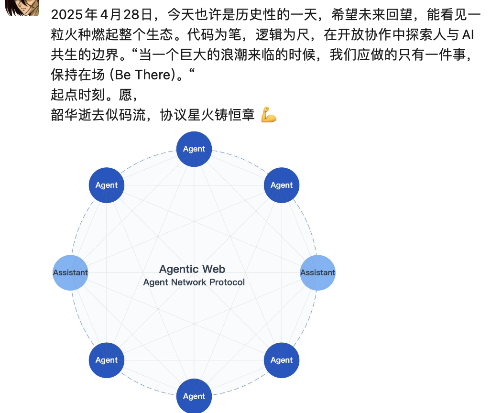
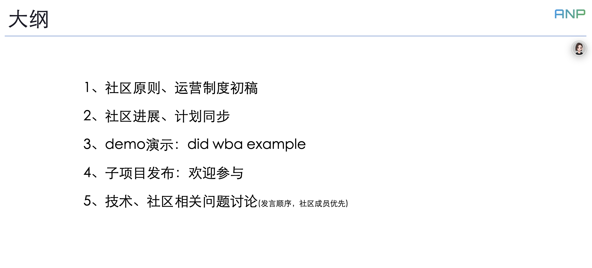
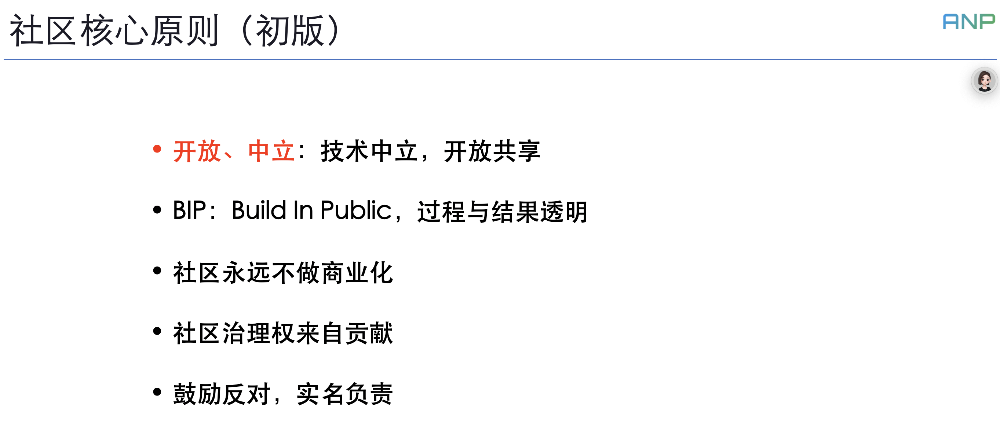
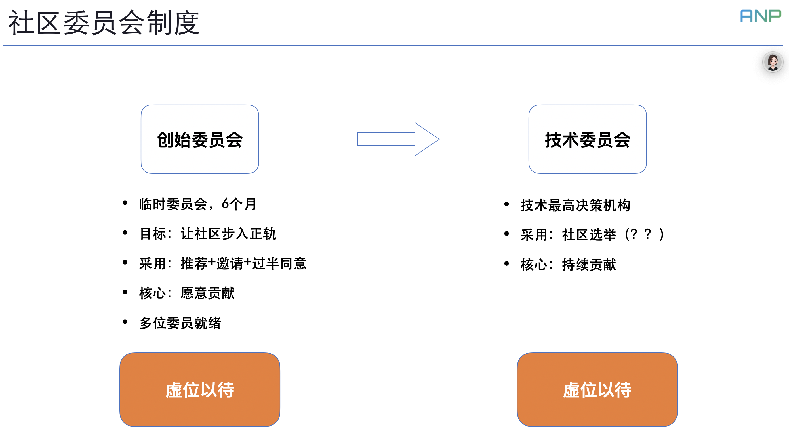
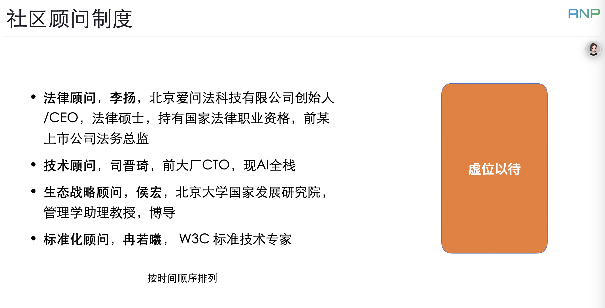
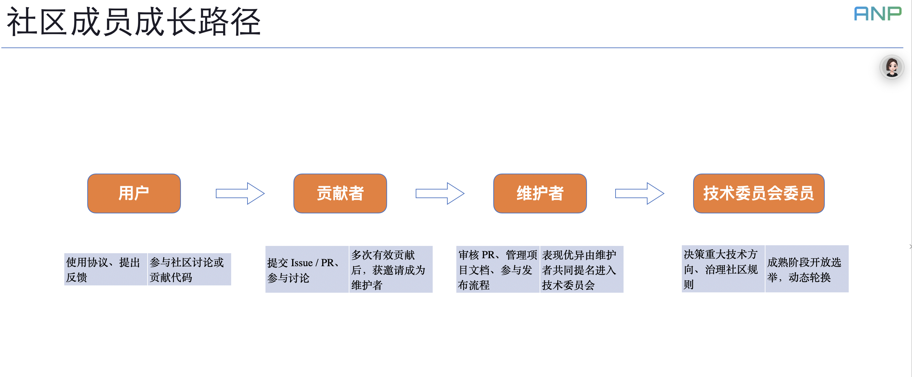
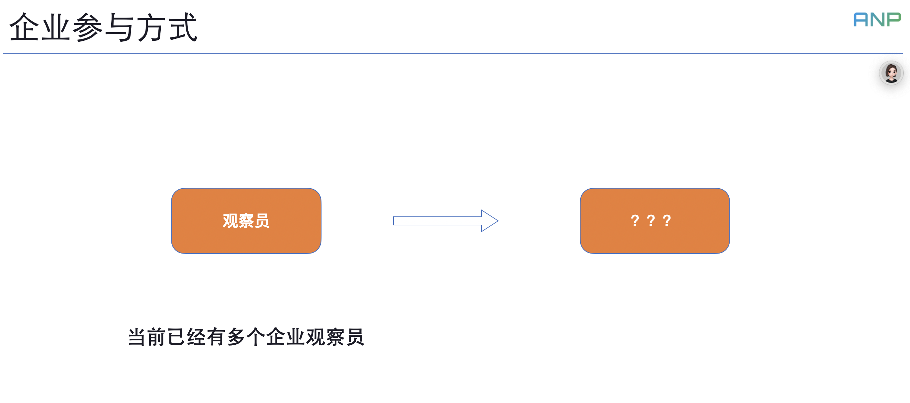
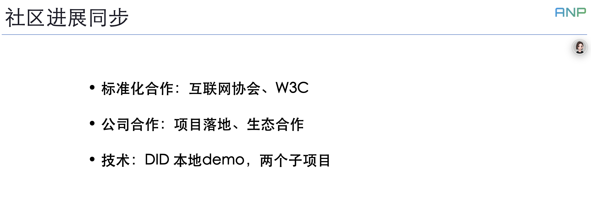
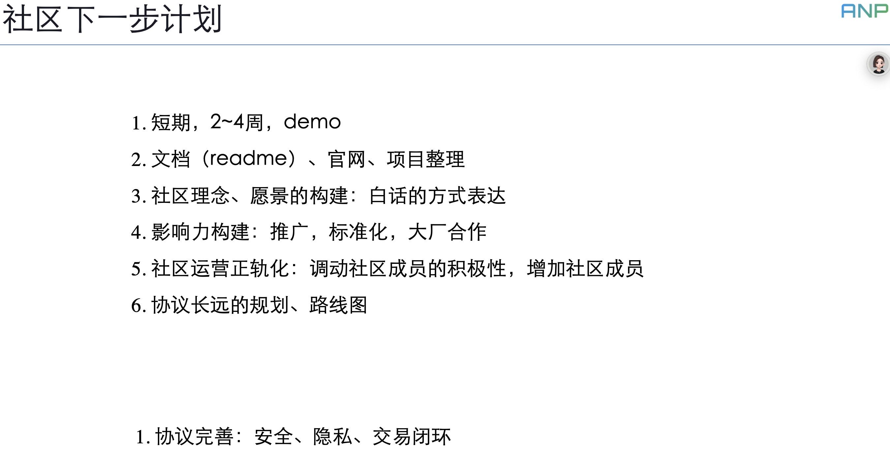

# ANP Community First Meeting: A Milestone for the Agentic Web

어제 ANP 커뮤니티의 첫 번째 미팅을 개최했습니다.

만약 ANP, 즉 우리 커뮤니티가 설명하는 Agentic Web이 미래에 현실이 된다면, 오늘의 미팅이 Agentic Web의 이정표가 될 수 있을까요?

미팅 후에, 우리가 하고 있는 일에 대한 모든 사람들의 열정과 기대를 느낄 수 있었고, 이는 제 예상을 초과했으며 조금 흥분되게 만들었습니다.

## Meeting Content

본론으로 돌아가서, 첫 번째 커뮤니티 미팅의 내용을 공유하겠습니다.

오늘 저는 두 가지 주요 주제에 집중했습니다: 커뮤니티 원칙과 운영 프레임워크 초안, 그리고 커뮤니티 진행 상황 업데이트와 다음 단계입니다.

먼저, 커뮤니티의 핵심 원칙은 5가지 포인트입니다(초안):

1. **개방성과 중립성**

기술적 중립성과 개방적 공유. 이것은 ANP 커뮤니티의 초석이자 가장 핵심적인 원칙입니다. 프로토콜 유형의 오픈 소스 프로젝트로서, 특히 커뮤니티에 의해 시작된 프로젝트로서, 우리는 개방성과 중립성의 원칙을 고수해야 하며, 그렇지 않으면 이 프로토콜은 생명력이 없을 것입니다.

우리는 모든 회사에 대해 열린 자세를 유지해야 하며, 동시에 어떤 특정 회사를 편애할 수 없습니다. 우리의 목표는 항상 Agentic Web을 운영하기 위한 최선의 솔루션을 찾는 것입니다.

2. **BIP (Build In Public)**

BIP 원칙을 고수하여, 커뮤니티 구축을 100% 투명하게 유지하되, 결과뿐만 아니라 과정도 투명하게 합니다.

모든 사고 과정, 모든 의사결정 과정, 누가 동의하고, 누가 반대하며, 반대하는 이유가 무엇인지 모두 공개적으로 투명해야 합니다.

모든 것을 테이블 위에 올려놓습니다.

3. **커뮤니티는 절대 상업화하지 않습니다**

커뮤니티는 운영을 유지하기 위해 오픈 소스 재단에 가입하여 인큐베이션을 받는 것을 고려할 것입니다. 하지만 주로 커뮤니티 구성원들의 기여에 의존할 것입니다.

4. **커뮤니티 거버넌스 권한은 기여로부터 나옵니다**

커뮤니티를 통치할 권리는 기여로부터 나오며, 배경, 연공서열, 또는 명성으로부터 나오지 않습니다.

5. **반대를 장려하되, 실명으로 책임을 집니다**

다른 의견을 장려하지만, 반대는 실명으로 이유를 제공해야 하며, 모든 사람이 볼 수 있어야 합니다. 이것은 W3C가 어떻게 운영되는지에 대해 W3C 동료들과 이야기하면서 배운 것으로, 꽤 좋습니다.

커뮤니티의 현재 중요한 목표는 운영을 올바른 궤도에 올리는 것입니다. 이를 위해 우리는 임시 위원회인 창설 위원회를 설립했으며, 이는 6개월만 존재할 수 있습니다. 기술 위원회가 설립된 후, 창설 위원회는 역사의 무대에서 퇴장하여 더 이상 커뮤니티 거버넌스에 참여하지 않을 것입니다. 하지만 각 구성원의 기여에 감사하기 위해 타이틀은 유지될 것입니다.

창설 위원회를 구성하는 현재 방법은 추천 + 초대 + 과반수 승인이며, **핵심 요구사항은 지속적으로 기여할 의지가 있다는 것**입니다. 현재 여러 위원회 구성원들이 이미 자리를 잡고 일하고 있습니다.

기술 위원회는 미래를 위한 중요한 위원회이며, 어떻게 운영하는지는 여전히 지속적으로 개선되고 있습니다. 하지만 핵심 요구사항이 있는데, 그것은 **위원회 구성원들이 지속적인 기여자여야 한다는 것**입니다.

커뮤니티 의사결정에 관해서는, **초기 단계에서는 운영 효율성을 높이기 위해 제가 제 영향력을 사용하여 빠른 결정을 내릴 것**이며, 이는 AI의 빠른 발전에 적응하기 위함입니다. 하지만 장기적으로는 제가 커뮤니티를 떠나더라도 계속 정상적으로 운영될 수 있기를 바랍니다.

커뮤니티 구축에 참여하고 싶지만 큰 시간 블록이 없는 사람들을 위해, 우리는 커뮤니티 어드바이저라는 직책을 마련했습니다. 커뮤니티 어드바이저들은 자신의 시간에 따라 커뮤니티 운영에 참여하고 제안을 할 수 있습니다. 커뮤니티가 필요할 때, 특정 문제에 대해서도 상담을 받게 될 것입니다.

우리는 또한 정기적인 어드바이저 미팅을 개최하여 커뮤니티의 발전이 벗어났는지 정기적으로 검토할 것입니다. 이들은 너무 빈번하지 않을 것이며, 아마도 1-2개월에 한 번씩일 것입니다.

**현재 우리는 네 명의 어드바이저가 있으며, 모든 분들의 열정적인 참여에 매우 감사합니다. 그들은 다음과 같습니다(시간순으로 나열):**

- **법률 어드바이저, 리양**, 베이징 아이웬 법률 기술 유한회사 창립자/CEO, 법학 석사, 국가 법률 전문 자격 소지자, 상장회사 전 법무 이사.
- **기술 어드바이저, 시진치**, 주요 회사의 전 CTO, 현재 풀스택 AI 개발자.
- **생태계 전략 어드바이저**, 허홍, 베이징대학교 국가발전연구원 경영학 조교수, 박사과정 지도교수, 케임브리지 대학교 박사.
- **표준화 어드바이저**, 란뤄시, W3C 표준 기술 전문가.

커뮤니티 구성원의 성장 경로에 관해서는, 사용자로 시작하여 ANP 프로토콜을 사용한 다음, 커뮤니티 토론에 참여하고, 코드에 기여하여 기여자가 될 수 있습니다.

여러 번의 효과적인 기여 후, 기여자들은 커뮤니티 메인테이너가 되도록 초대받을 수 있으며, PR 검토, 프로젝트 문서 관리, 릴리스 프로세스 참여를 담당합니다.

뛰어난 기여자들은 메인테이너들의 공동 추천을 받아 기술 위원회에 들어가서, 주요 기술 방향에 대한 결정을 내리고 커뮤니티 규범을 관리합니다.

커뮤니티는 물질적 인센티브를 제공하지 않지만, 커뮤니티가 제공하는 타이틀이 기여자들의 경력에 도움이 되기를 바라며, 특히 ANP가 중요한 발전을 이룰 때 그렇기를 바랍니다.

기업들도 커뮤니티의 작업에 참여할 수 있습니다. 우리는 기업들이 커뮤니티 작업에 참여할 수 있는 구체적인 방법을 설계하고 있습니다. 이것들을 공식적으로 도입하기 전에, 기업들은 옵저버로서 커뮤니티 작업에 참여할 수 있습니다.

현재 여러 기업 옵저버들이 있으며, **ANP에 관심이 있는 기업들이 먼저 옵저버로 커뮤니티에 참여하는 것을 환영합니다**.

일부 커뮤니티 작업의 진행 상황을 업데이트해드리겠습니다:

- 표준화: 우리 커뮤니티는 인터넷 소사이어티의 상호연결 작업위원회의 Agentic Web 워킹 그룹에 참여하여 agent 통신 프로토콜의 표준화를 추진할 것입니다. 동시에, 우리는 W3C China와 협력하여 agent 통신 프로토콜의 국제 표준화를 추진하고 있습니다.

- 회사 협력: 현재 B2B 프로젝트와 C-end 프로젝트를 포함하여 여러 ANP 프로젝트가 구현 과정에 있습니다. 동시에, 우리는 최근 ANP 프로토콜에 대해 많은 국내 대기업들과 대규모 모델 회사들과 소통하고 있습니다.

- 이번 주에, 우리는 로컬 DID 데모를 완성했으며, 이는 도메인 네임에 의존하지 않고 DID 기능을 시연할 수 있어 사람들이 DID의 원리를 빠르게 이해할 수 있게 합니다.

커뮤니티 다음 단계 계획(우선순위 순):

- 단기, 2-4주, 데모 시연 완성
- 문서(readme), 공식 웹사이트, 프로젝트 조직
- 커뮤니티 철학과 비전 구축, 프로토콜의 장기 계획과 로드맵: 평이한 언어로 표현
- 영향력 구축: 홍보, 표준화, 대기업과의 협력
- 커뮤니티 운영 정상화: 커뮤니티 구성원들의 열정 동원, 커뮤니티 멤버십 증가
- 프로토콜 개선: 보안, 프라이버시, 거래 폐쇄 루프

## Follow-up

미팅 후에, 우리는 많은 긍정적인 피드백을 받았고, 우리 커뮤니티 개발자 수는 50+에서 70+로 직접 뛰어올랐습니다.

동시에, 커뮤니티 구성원들이 자발적으로 세 번째 하위 프로젝트인 ANP 홍보 그룹을 시작했으며, 관련 내용은 다음 커뮤니티 미팅에서 동기화될 것입니다.

커뮤니티 구성원들의 기여에 다시 한 번 감사드립니다!

동시에, **커뮤니티에는 여전히 해야 할 일이 많으며, 커뮤니티는 더 많은 힘이 참여하기를 필요로 합니다. 우리의 창설 위원회, 커뮤니티 어드바이저, 그리고 커뮤니티 개발자들 모두 여러분의 참여를 환영합니다.**

관심 있는 개인은 WeChat을 통해 저에게 연락할 수 있습니다: flow10240

여러분의 참여를 기대합니다!

전체 미팅 재생: <https://meeting.tencent.com/crm/KDnBQBEXab>
