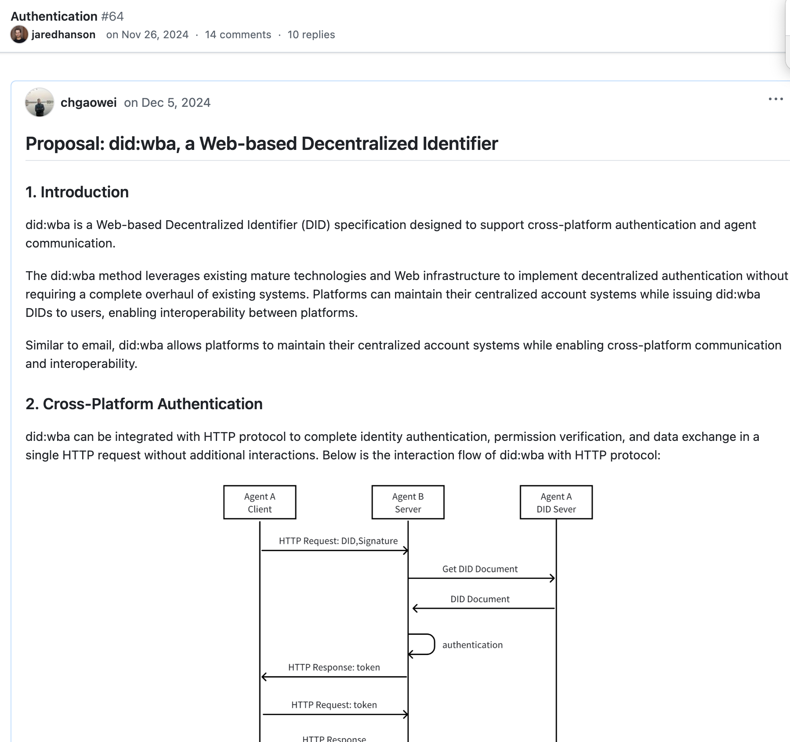

# Challenges to MCP from LangGraph Lead and How ANP Addresses Them

최근 MCP (Model Context Protocol)가 온라인에서 인기를 얻고 있습니다. 저는 LangChain 웹사이트의 블로그 게시물을 보게 되었는데, 이는 FounderPark에 의해서도 재게시되었습니다:

원본 링크: <https://blog.langchain.dev/mcp-fad-or-fixture/>
중국어 링크: <https://mp.weixin.qq.com/s/etvDsU422z8uiknCn6fw4A>

내용은 LangChain 공동 창립자이자 CEO인 Harrison Chase와 LangGraph 리드인 Nuno Campos 간의 MCP에 대한 토론을 다루며, 이것이 단순한 지나가는 트렌드인지 아니면 미래의 표준이 될 운명인지에 대해 논의합니다.

그들의 모든 관점에 동의하지는 않을 수 있지만, MCP 프로토콜의 정의와 사용을 포함하여, Nuno Campos가 제기한 문제들은 정곡을 찌릅니다.

우리가 agent 통신 프로토콜에 대해 어느 정도 작업해왔고, 우리의 ANP (Agent Network Protocol)가 아마도 agent를 위해 특별히 설계된 세계 최초의 통신 프로토콜일 가능성이 있기 때문에, MCP가 출시되었을 때 즉시 이를 연구했고 Nuno Campos가 지적한 것과 동일한 문제들을 식별했습니다.

사실, ANP는 초기 설계 중에 이미 이러한 문제들을 고려했습니다. 오늘, ANP가 이러한 과제들을 어떻게 해결하는지에 대해 논의하고 싶습니다.

## Nuno Campos가 MCP에 대해 제기한 핵심 문제들은 무엇인가요?

Harrison Chase와의 토론에서, Nuno Campos는 MCP의 몇 가지 핵심 문제들을 강조했습니다:

- **프로토콜 복잡성**: MCP는 단순한 도구 호출 프로토콜이 아닙니다; 프롬프트와 LLM 완성 서비스도 제공합니다. 이 설계는 프로토콜의 복잡성을 크게 증가시킵니다.
- **구현 어려움**: MCP는 양방향 통신 메커니즘을 채택하여 구현 복잡성을 증가시키며, 특히 개발자에게 추가적인 부담을 줍니다.
- **서버 측 확장 문제**: MCP의 현재 설계는 상태 없는 프로토콜이 아니어서 서버 측에서 확장하기 어려우며, 특히 분산 환경에서 인증과 상태 관리 문제가 두드러집니다.
- **도구 품질 및 모델 적응 문제**: 그들에 대해 아무것도 모르는 agent에 무작위 도구들을 삽입하면 필연적으로 도구 호출 품질이 저하되어 사용자 경험에 영향을 미칩니다.

## ANP의 솔루션

ANP는 처음부터 이러한 문제들에 대해 깊이 생각했고 해당하는 솔루션을 제공합니다:

### Agent 신원 문제

우리는 이것이 프로토콜에 가장 중요한 문제라고 믿습니다. MCP가 처음 출시되었을 때, 주로 신원 문제를 해결하는 방법을 파악하지 못했기 때문에 로컬 서버만 지원했습니다. 우리는 MCP 커뮤니티와 공식적으로 소통했지만, 그들은 우리의 제안을 채택하지 않았습니다.

    

나중에, 그들은 OpenID Connect를 인증 솔루션으로 선택했습니다. 하지만 OpenID Connect는 중앙화된 접근 방식으로 탈중앙화된 분산 인증을 제공할 수 없어 agent 협력에 내재적 한계를 만듭니다.

ANP를 설계한 첫날부터, 우리는 agent들을 위한 탈중앙화 신원 문제를 해결하려고 시도해왔습니다. 우리의 최종 솔루션은 이메일과 유사한 효과를 달성합니다: 각 플랫폼 내에서는 중앙화되지만 전체적으로는 탈중앙화된 네트워크를 형성합니다. 다른 플랫폼들이 서로 통신할 수 있습니다.

자세한 비교는 다음을 참조하세요: [did:wba vs OpenID Connect and API keys](/blogs/en/did_wba_vs_OpenID_Connect_API_keys.md).

우리는 그들이 OpenID Connect를 선택한 이유를 이해합니다: 챗봇 애플리케이션과 기존 인터넷 간의 통합 문제를 해결하기 위해서입니다. 하지만 우리는 agent 인터넷이 발전함에 따라 ANP의 탈중앙화된 agent 중심 설계 철학이 미래 agent 네트워크 요구사항에 더 적합할 것이라고 믿습니다.

### 프로토콜 복잡성 문제

ANP는 그 위치를 명확히 정의했습니다: 모델 상황 프로토콜이 아닌 agent들 간의 통신 프로토콜에 집중합니다. ANP는 모델 완성 서비스나 프롬프트를 제공하지 않습니다; 대신 agent들이 어떻게 인증하고, 정보를 교환하며, 협력하는지를 정의하는 데 집중합니다.

ANP의 설계 철학은 "Agent-Centric"으로, 각 agent는 네트워크의 동등한 노드입니다. 프로토콜 자체는 agent들 간의 통신 규칙과 데이터 형식만 정의하여 프로토콜 복잡성을 크게 줄입니다.

우리는 오픈 소스 OpenManus 프로젝트에 ANP 프로토콜 지원을 추가했습니다. <https://github.com/agent-network-protocol/OpenManus-ANP에서> 우리의 코드(app/tool/anp_tool.py)를 확인할 수 있습니다. (현재 커뮤니티 베타 테스트 중; 피드백을 환영합니다)

agent에 ANP를 통합하는 데는 200줄의 코드만 필요하며, 핵심은 프롬프트와 HTTP 함수입니다. 모델이 나머지 모든 것을 구동합니다.

HTTP 함수는 모델의 브라우저 역할을 하여 ANP 프로토콜을 통해 연결된 데이터 네트워크에 쉽게 접근하고 탐색할 수 있게 합니다. **AI 접근에 편리한 데이터 네트워크 구축은 항상 ANP의 목표였습니다.**

ANP를 기반으로 한 연결 방식은 진정한 AI-네이티브 연결 방법입니다.

### 서버 측 확장 문제

ANP는 ANP를 기반으로 한 agent 설명 프로토콜이 자체 설명적이기 때문에 내부 프로토콜 상태를 정의하지 않습니다. 이 자체 설명은 모델이 문서에서 인터페이스 호출 방법을 선언할 수 있다는 것을 의미하며, 이는 상태가 있거나 없을 수 있습니다—ANP는 둘 다 지원합니다.

Agent들은 상태가 있든 없든 외부에 노출할 인터페이스 유형을 자유롭게 결정할 수 있습니다.

### 도구 품질 및 모델 적응 문제

저는 이것이 모델이 해결해야 할 문제이며 프로토콜과는 관련이 없다고 믿습니다. 프로토콜이 제공할 수 있는 것은 더 나은 설명 정보와 도구를 사용하는 방법입니다. 저는 그의 이해가 이 점에서 편향되어 있거나, 아마도 이 프로토콜 모델 전체에 대해 의문을 제기하고 있다고 생각합니다.

## 핵심 개념의 차이점

ANP와 MCP 간에는 핵심 개념에서 상당한 차이가 있습니다. MCP에서는 도구, 리소스, 프롬프트가 프로토콜의 핵심입니다. ANP에서는 이러한 것들이 존재하지 않습니다.

ANP는 agent의 공개 정보에 대한 설명을 제공하는데, 이는 기본 정보(커피숍이 판매하는 커피와 같은)이거나 API 인터페이스 설명(커피를 구매할 수 있는 인터페이스)일 수 있습니다.

정보는 ANP의 유일한 개념이자 가장 핵심적인 개념입니다. 리소스, 도구, 프롬프트는 없으며—모든 것은 모델과 agent 개발자에 의해 결정됩니다.

## Copyright Notice

Copyright (c) 2024 GaoWei Chang  
This file is released under the [MIT License](./LICENSE). You are free to use and modify it, but you must retain this copyright notice.
