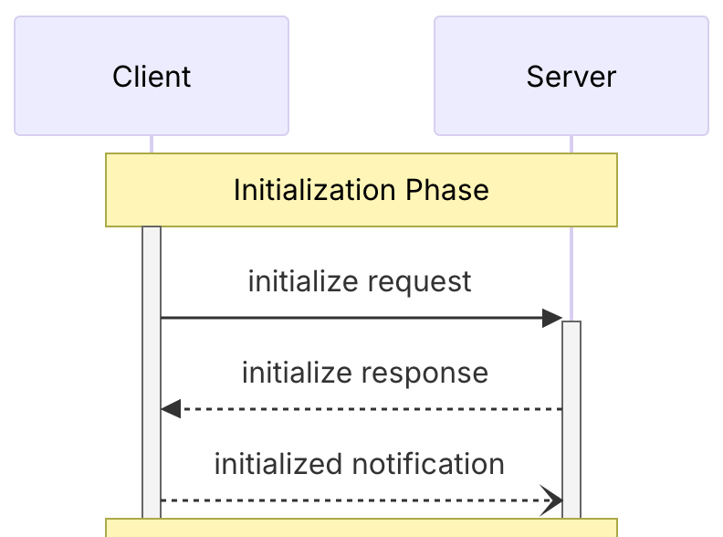
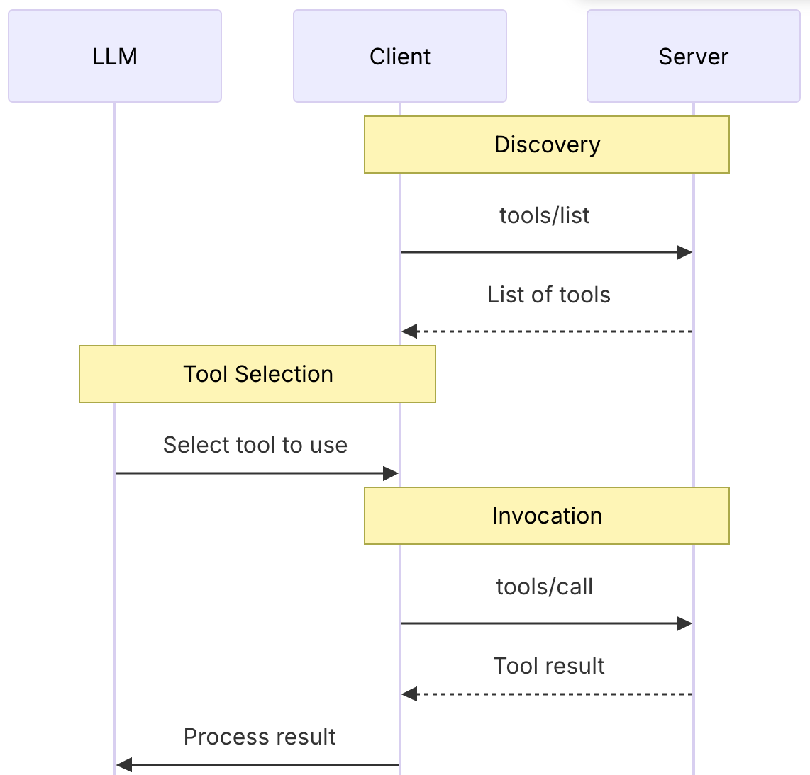
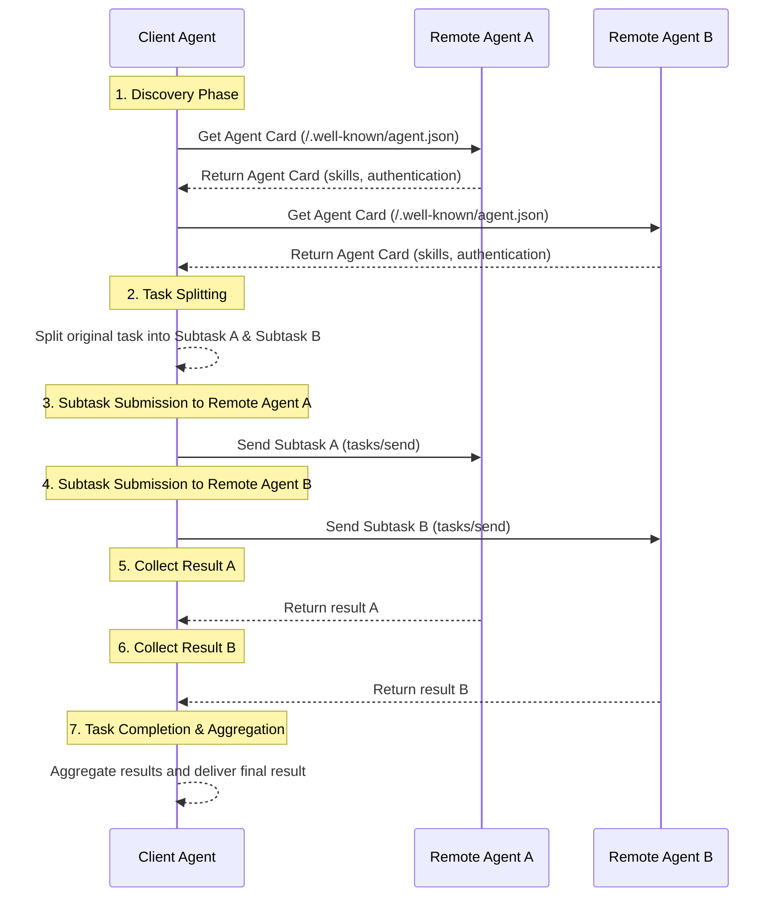

# Deep Comparison of MCP, A2A, and ANP Interaction Modes: Differences in Information Organization

이것은 MCP, A2A, ANP 비교 시리즈의 세 번째 기사입니다. 이전 두 기사는:

- [Comprehensive Comparison of Google's Latest A2A, ANP, and MCP](/blogs/Comparing-the-Interaction-Modes-of-MCP-A2A-and-ANP.md)
- [In-depth Comparison of Google's A2A and ANP: Finding the Origin of the Protocols](/blogs/In-depth-Comparison-of-Google-A2A-and-ANP-Finding-the-Origin-of-Protocols.md)

이 기사는 각 프로토콜 간의 상호작용 모드의 차이점을 깊이 비교할 것이며, 이는 도구나 agent가 정보를 조직하는 방법을 결정하므로 정보 처리 방법과 상호작용 특성을 결정합니다.

**먼저, 결론**:

- **MCP (Remote Call)**: 서버가 모든 도구와 리소스 목록을 클라이언트에 직접 노출하고, 클라이언트가 이 정보를 모델에 전달합니다. 모델은 필요에 따라 RPC를 통해 특정 도구를 호출하거나 특정 리소스에 접근합니다.

- **A2A (Task Outsourcing)**: Agent들이 자신의 능력 개요를 보여주고, 클라이언트 agent들이 복잡한 작업을 하위 작업으로 분해하여 해당 전문성을 가진 agent들에게 실행을 위해 배포하고, 최종적으로 결과를 통합합니다.

- **ANP (Data Crawling)**: Agent들이 자신의 정보와 인터페이스를 URL로 연결된 네트워크로 조직합니다. 클라이언트 agent들은 웹 크롤러와 마찬가지로 설명 문서의 진입점에서 시작하여 필요에 따라 정보를 획득하고, 로컬에서 결정을 내린 다음, 발견된 인터페이스를 통해 작업을 실행합니다.

**세 가지 간의 핵심 차이점**:

- **A2A vs MCP**: A2A는 구현 세부사항을 캡슐화하여, 클라이언트가 "어떻게 할 것인가"가 아닌 "무엇을 할 것인가"에만 관심을 가지며, 단순히 작업을 제출하고 결과를 기다리기만 하면 됩니다.

- **ANP vs MCP**: MCP는 모든 도구/리소스를 한 번에 반환하는 반면, ANP는 계층적 링크와 설명만 제공하여 agent들이 필요에 따라 정보를 탐색하고 획득할 수 있게 합니다.

- **ANP vs A2A**: 둘 다 agent 상호작용을 다루지만, A2A는 복잡한 작업 분해와 협력을 강조하는 반면, ANP는 프라이버시 누출 위험을 줄이기 위해 유연한 정보 획득과 로컬 의사결정에 중점을 둡니다.

ANP는 현대 Web 기술을 기반으로 구축되며, ANP 프로토콜을 지원하는 agent들은 일반적으로 WebAgents라고 불립니다.

## MCP 상호작용 모드

MCP의 상호작용 모드는 전형적인 클라이언트-서버 (C/S) 아키텍처를 채택합니다. 초기 요청 중에 도구, 리소스 등에 대한 지원을 포함한 능력이 협상됩니다.

서버는 일반적으로 두 가지 핵심 인터페이스를 지원합니다: tools/list와 resources/list로, 클라이언트가 이를 통해 모든 도구와 리소스에 대한 정보를 얻을 수 있습니다. 이 정보에는 메타데이터, 즉 도구와 리소스의 설명이 포함되어 모델에게 도구의 능력과 호출 방법, 그리고 리소스에 대한 자세한 정보를 알려줍니다.

모델은 필요에 따라 다른 도구를 호출하고 다른 리소스를 읽습니다.

예를 들어, 도구의 경우 상호작용은 다음과 같습니다:

이 상호작용 모드에서 서버는 수동적인 역할을 하며, 수동적으로 도구와 리소스를 제공하고, 의사결정 권한은 클라이언트의 모델에 있습니다.

## A2A 상호작용 모드

A2A는 유연한 P2P 상호작용 모드입니다. 이 모드에서 한 agent(클라이언트 agent)는 하나 이상의 다른 agent들(원격 agent들)과 직접 통신하고 협력할 수 있으며, 큰 작업을 더 작은 작업으로 분해하여 다른 agent들과 함께 완료합니다. 이는 여러 전문 어시스턴트가 함께 작업하는 것과 유사합니다.

상호작용 과정은 일반적으로 다음 단계를 따릅니다:

1. **발견 및 선택**: 클라이언트 agent는 먼저 현재 작업에 적합한 원격 agent들을 발견하고 찾아야 합니다. 여러 agent들의 "Agent Cards"를 조회할 수 있습니다 — 이는 기술 이력서와 같아서 각 agent의 능력과 서비스 방법을 나열합니다. 클라이언트 agent는 작업 요구사항에 따라 가장 적합한 하나 이상의 원격 agent들을 선택합니다.

2. **작업 분할 (선택사항)**: 복잡한 작업의 경우, 클라이언트 agent는 이를 여러 하위 작업으로 분할할 수 있습니다.

3. **작업 할당 및 협력**: 클라이언트 agent는 A2A 프로토콜을 통해 선택된 원격 agent들과 연결을 설정하고 해당하는 (하위)작업 요청을 보냅니다. 예를 들어, 하위 작업 A를 원격 agent A에, 하위 작업 B를 원격 agent B에 보냅니다.

4. **다중 라운드 상호작용 및 결과 수집**: 각 원격 agent는 할당받은 작업을 독립적으로 실행합니다. 실행 중에 메시지를 통해 클라이언트 agent와 다중 라운드 상호작용을 할 수 있으며, 진행 상황에 대한 피드백을 제공하고, 명확화 질문을 하거나, 중간 결과를 반환할 수 있습니다. 클라이언트 agent는 다른 원격 agent들로부터 피드백과 결과를 별도로 받습니다.

5. **결과 집계 및 완료**: 모든 하위 작업이 완료된 후, 클라이언트 agent는 다양한 원격 agent들로부터 결과를 수집하고 통합하여 최종적으로 전체 작업에 대한 완전한 솔루션을 형성합니다.

전체 통신 과정은 작업 상황과 상태 추적을 포함할 수 있어 특정 (하위)작업을 중심으로 한 대화가 질서 있게 진행되도록 보장합니다.

이 모드에서 클라이언트 Agent와 원격 Agent 모두 입력을 기반으로 작업을 처리하며, 양 당사자는 명확한 작업 설명과 결과 상호작용을 통해 협력합니다.

## ANP 상호작용 모드

ANP (Agent Network Protocol)도 P2P 상호작용 모드로, 마찬가지로 agent들 간의 통신 문제 해결을 목표로 합니다. A2A와 근본적인 차이가 있습니다:

- A2A는 "작업 아웃소싱" 모델을 채택하여, agent들이 작업을 분할하고 다른 agent들에게 실행을 위임합니다
- ANP는 "데이터 크롤링" 모델을 채택하여, agent들이 다른 agent들로부터 정보만 획득하고, 로컬에서 결정을 내린 다음 API 호출을 통해 작업을 실행합니다

ANP의 핵심 특징은 "Linked Data" 기술을 사용하여 agent의 모든 능력, 인터페이스, 정보를 탐색 가능한 데이터 네트워크로 조직하는 것입니다. 이는 모든 도구와 리소스 목록을 직접 반환하는 MCP의 접근 방식과 다릅니다.

### ANP 상호작용 과정

ANP 상호작용 과정은 웹 크롤러가 웹 페이지를 탐색하는 것과 같습니다:

1. **진입점 발견**: Agent는 먼저 다른 agent의 "agent 설명 문서"의 URL을 얻습니다 (웹사이트의 홈페이지와 유사)

2. **능력 발견**: 설명 문서에서 agent는 상대방의 기술, 인터페이스, 사용 가능한 리소스와 더 자세한 문서로 연결되는 URL을 학습합니다

3. **선택적 획득**: Agent는 현재 작업의 필요와 관련된 URL들만 접근하여 필요한 정보를 획득합니다 (모든 정보가 아닌)

4. **재귀적 탐색**: 각 문서는 새로운 URL 링크를 포함할 수 있어 agent가 필요에 따라 계속 탐색하고 가져올 수 있습니다

5. **로컬 의사결정**: 충분한 정보를 수집한 후, agent는 자신의 모델 내에서 논리적 판단과 결정을 내립니다

6. **인터페이스 호출**: 마지막으로 발견된 API 인터페이스를 통해 특정 작업을 실행합니다

이 접근 방식의 장점은 agent가 실제로 필요한 정보만 획득하여 데이터 전송을 절약하고 의사결정 제어권을 자신의 손에 유지하는 것입니다.

## 정보 조직 방법의 차이점

위에서 설명한 상호작용 모드의 차이점은 본질적으로 각 프로토콜이 agent들이 외부에 노출하는 정보를 조직하는 방법의 차이점입니다:

- **MCP (Full Disclosure)**: RPC 호출을 통해 모든 도구와 리소스 목록을 한 번에 공개하여, 클라이언트 agent들이 필요한 도구를 직접 선택하고 호출할 수 있게 합니다

- **A2A (Capability Cards)**: Agent Cards를 통해 agent들이 자신의 기술과 능력 개요를 보여주되 특정 구현 세부사항은 공개하지 않으며, 클라이언트는 작업을 제출하고 결과를 기다리기만 하면 됩니다

- **ANP (Linked Network)**: Linked-Data 기술을 사용하여 agent 정보를 네트워크 구조로 조직하고, 클라이언트 agent들이 웹 크롤러처럼 필요에 따라 특정 정보를 선택적으로 획득할 수 있게 합니다
