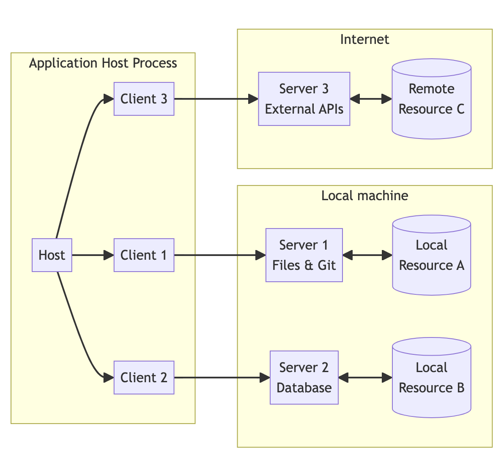
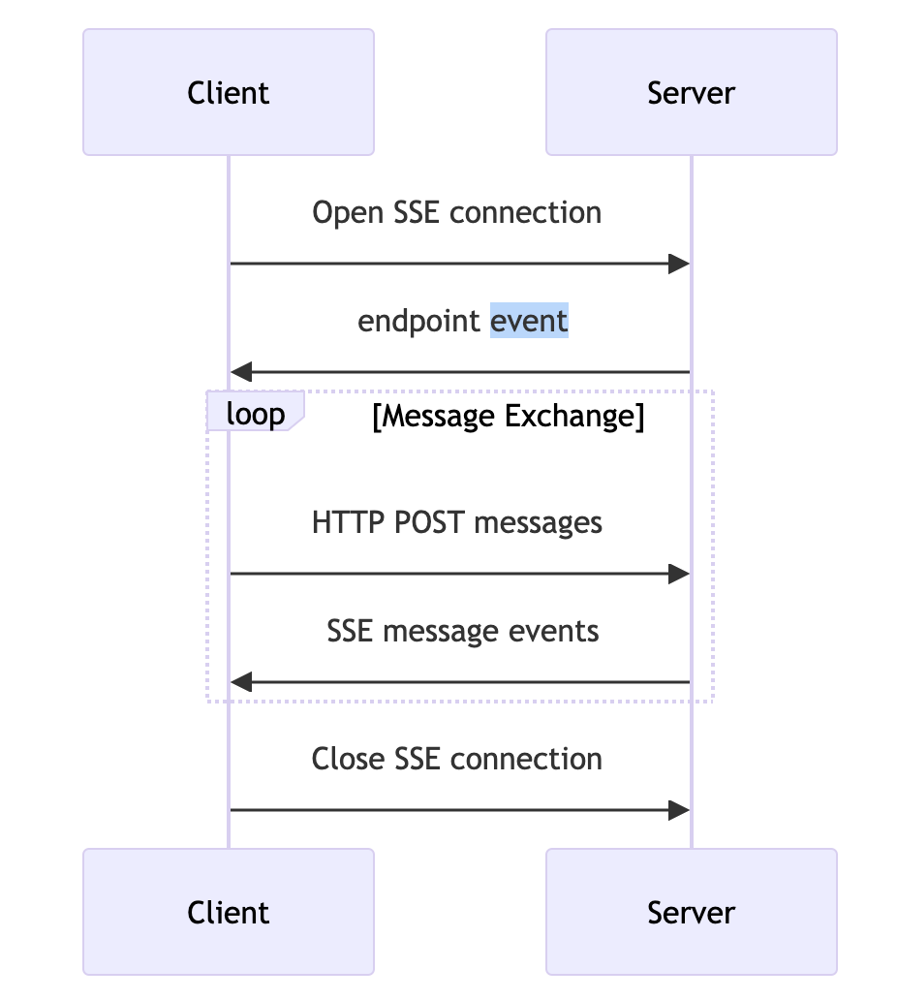
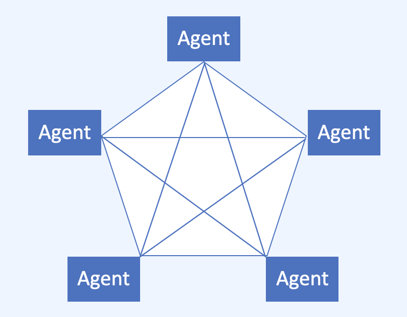
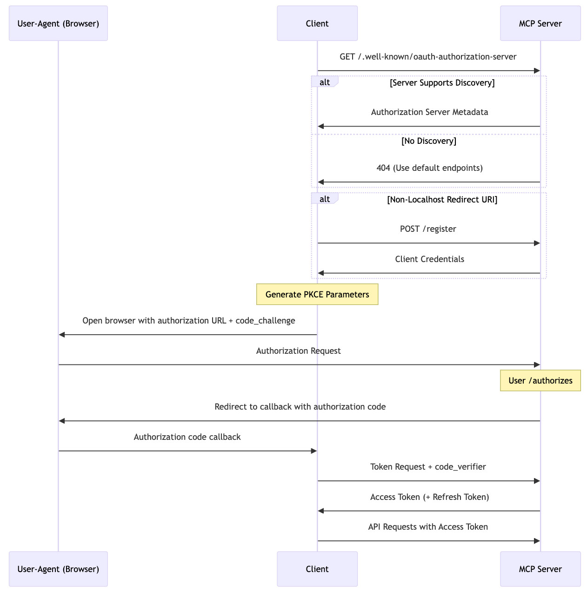
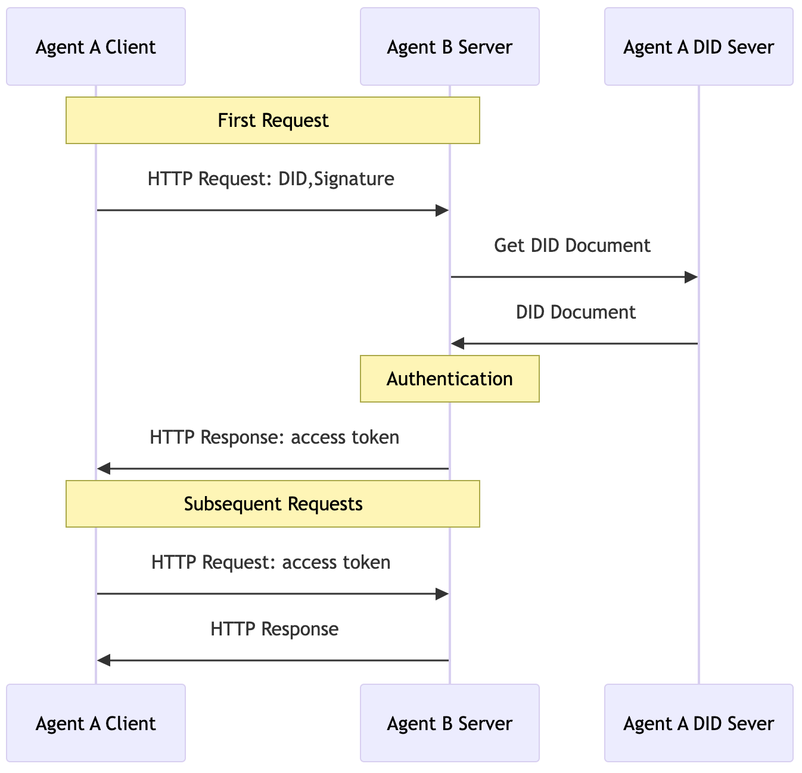
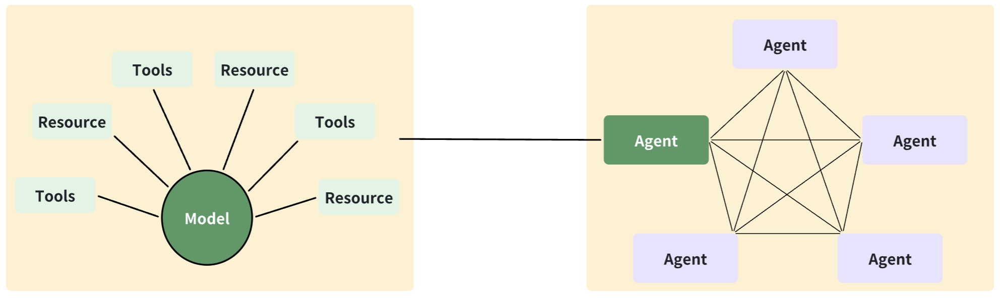

# Comparison of MCP and ANP: What Kind of Communication Protocol Do Agents Need?

**핵심 아이디어:**

- 소비자 지향 개인 어시스턴트 구축은 두 가지 병목 현상에 직면합니다: 비용과 정보 획득. 추론 능력 병목 현상은 빠르게 해결되고 있습니다. Agent가 모든 정보에 액세스할 수 있도록 하는 Agent 통신 프로토콜이 필요합니다.
- 현재 업계 AI 관련 오픈소스 통신 프로토콜 중에서 Anthropic의 MCP와 우리가 설계한 ANP가 설계와 구현에서 상대적으로 완전합니다.
- MCP와 ANP는 프로토콜 아키텍처, 신원 인증, 정보 조직에서 크게 다릅니다.
  - MCP는 전형적인 Client-Server(CS) 아키텍처이고, ANP는 전형적인 Peer-to-Peer(P2P) 아키텍처입니다.
  - MCP의 신원 인증은 OAuth 표준을 기반으로 하여 클라이언트가 현재 인터넷 리소스에 액세스하는 것을 용이하게 합니다. ANP의 신원 인증은 W3C DID 표준을 기반으로 하여 Agent 간의 플랫폼 간 상호 운용성에 중점을 두고 원활한 연결을 가능하게 합니다.
  - MCP는 JSON-RPC 기술을 사용하여 정보를 조직하며, 본질적으로 API 호출입니다. ANP는 시맨틱 웹 Linked-Data 기술을 사용하여 AI가 쉽게 액세스하고 이해할 수 있는 데이터 네트워크를 구축합니다.
- MCP와 ANP의 가장 큰 차이점은 세계관에 있습니다:
  - MCP는 모델 중심적이며 전체 인터넷을 컨텍스트와 도구로 봅니다.
  - ANP는 Agent 중심적이며 각 Agent가 동등한 지위를 가져 분산 Agent 협업 네트워크를 형성합니다.
- Agent가 필요로 하는 통신 프로토콜의 유형은 미래 Agentic web의 특성에 달려 있습니다. 우리는 MCP와 다른 견해를 가지고 있으며 ANP의 지속적인 개발에 전념하고 있습니다.

## Agent 통신 프로토콜이 중요한 이유

Deepseek R1, OpenAI O3 Mini, Deep Research의 출시와 함께 명확한 트렌드가 나타납니다: Agent 구축을 방해하는 핵심 병목 현상인 복잡한 작업 추론 능력이 빠르게 사라지고 있습니다.

Deep Research는 본질적으로 지식 근로자를 위한 개인 어시스턴트로 간주될 수 있습니다.

소비자 지향 Agent의 경우 두 가지 병목 현상이 남아 있습니다: 2025년에 1-2 차수 감소할 것으로 예상되는 비용과 정보: 개인 어시스턴트가 어떻게 충분한 정보를 얻을 수 있는가?

지식 근로자를 위한 정보는 종종 공개 데이터베이스나 웹사이트에 저장되어 AI가 쉽게 액세스할 수 있습니다. 소비자 지향 정보는 더 복잡하며, 현재 인터넷의 데이터 사일로 현상으로 인해 정보가 단편화되고 개방성이 떨어집니다.

개인 어시스턴트가 소비자가 필요로 하는 정보(도구도 정보의 한 형태로 간주될 수 있음)를 효율적이고 효과적으로 얻을 수 있도록 하는 방법이 Agent 통신 프로토콜이 해결하고자 하는 문제입니다.

참고: "Computer Use" 대신 통신 프로토콜이 필요한 이유에 대해서는 이 기사를 참조하십시오: [What Makes Agentic Web Different](./What-Makes-Agentic-Web-Different.md).

## MCP와 ANP 소개

**MCP (Model Context Protocol):** LLM 애플리케이션이 외부 데이터 소스와 도구와 원활하게 통합할 수 있도록 하는 개방형 프로토콜입니다. AI 기반 IDE를 구축하든, 채팅 인터페이스를 향상시키든, 사용자 정의 AI 워크플로를 만들든, MCP는 LLM을 필요한 컨텍스트에 연결하는 표준화된 방법을 제공합니다. [MCP Specification](https://spec.modelcontextprotocol.io/)

**AgentNetworkProtocol (ANP):** Agentic Web을 위해 설계된 개방형 프로토콜 프레임워크입니다. ANP는 분산 신원 인증을 구현하여 모든 두 Agent가 연결할 수 있도록 합니다. 또한 Agent 간의 더 효율적인 데이터 교환과 협업을 위한 Agent 설명 사양을 설계합니다. [ANP on GitHub](https://github.com/agent-network-protocol/AgentNetworkProtocol)

현재 Agent 통신 프로토콜 환경에서 ANP는 인터넷상의 Agent를 위해 특별히 설계된 최초의 오픈소스 통신 프로토콜일 가능성이 있습니다. 우리는 처음에 코드를 먼저 공개했으며, 프로토콜 문서는 Feishu에 있었다가 나중에 GitHub로 이전되었습니다.

다른 좋은 오픈소스 프로젝트를 알고 있다면 언제든지 소개해 주십시오.

## MCP와 ANP의 차이점

아래에서는 프로토콜 아키텍처, 신원 인증, 정보 조직의 세 가지 측면에서 MCP와 ANP의 차이점을 자세히 설명한 다음 설계 철학의 차이점과 그 이유를 설명하겠습니다.

### 프로토콜 아키텍처: CS vs. P2P

#### MCP 프로토콜 아키텍처

MCP는 전형적인 Client-Server 아키텍처입니다. 클라이언트는 MCP 프로토콜을 사용하여 MCP Server에 연결한 다음 프로토콜을 사용하여 Server에서 다양한 정보와 도구 기능에 액세스합니다.

  

클라이언트와 서버는 stdio 또는 HTTP를 통해 양방향 통신 링크를 설정할 수 있습니다. HTTP를 사용할 때 클라이언트는 HTTP POST를 사용하여 메시지를 보내고 HTTP SSE를 사용하여 서버 이벤트 알림을 받습니다.

  

#### ANP 프로토콜 아키텍처

ANP는 전형적인 Peer-to-Peer 아키텍처로, 모든 Agent가 ANP를 사용하여 다른 Agent에 연결할 수 있음을 의미합니다.

  

ANP는 현재 HTTP 프로토콜을 핵심으로 사용합니다. Agent는 HTTP를 사용하여 다른 Agent에 연결할 수 있으며 HTTP를 통해 다른 Agent로부터 메시지를 받을 수도 있습니다. WebSocket과 사설 전송 계층 프로토콜이 이론적으로 지원됩니다.

ANP가 P2P 아키텍처를 선택한 주된 이유는 Agent가 다른 Agent에 적극적으로 요청을 시작할 수 있을 뿐만 아니라 언제든지 다른 Agent로부터 요청을 받을 수 있도록 하기 위함입니다.

MCP의 CS 아키텍처에서는 클라이언트가 서버에 연결되지 않은 경우 서버가 클라이언트에 메시지를 보낼 수 없습니다. 물론 클라이언트가 서버 역할도 할 수 있다면 MCP는 P2P 아키텍처로 간주될 수 있지만 다소 어색합니다.

진정한 P2P 아키텍처는 물리적 연결뿐만 아니라 역할과 위치 설정도 P2P를 포함하며, 이것이 P2P의 핵심입니다.

### 신원 인증: OAuth vs. DID

신원 인증은 Agent 통신 프로토콜에서 중요하고 도전적인 부분입니다. 이는 Agent 간의 플랫폼 간 신원 인증 문제를 해결하여 Agent가 모든 다른 Agent와 협업할 수 있도록 합니다.

#### MCP 신원 인증

MCP가 처음 출시되었을 때는 신원 인증을 지원하지 않아 원격 서버 연결이 불편했습니다. 최신 초안 버전은 클라이언트와 서버 간의 신원 인증을 지원합니다.

MCP의 신원 인증 방식은 기술적으로 OAuth2 표준을 중심으로 합니다.

OAuth는 제3자 애플리케이션이 사용자 승인을 받아 사용자명과 비밀번호와 같은 민감한 정보를 얻지 않고도 다른 서비스 제공업체의 사용자 리소스에 액세스할 수 있도록 안전하고 편리하며 유연한 방법을 제공하도록 설계된 개방형 표준 승인 프레임워크입니다. 일반적인 예로는 Google이나 WeChat 계정을 사용하여 제3자 애플리케이션에 로그인하는 것이 있으며, 이는 OAuth 기술을 기반으로 하며 인터넷에서 널리 사용됩니다.

MCP가 출시한 초안 프로토콜은 커뮤니티의 두 번째 버전입니다. 첫 번째 버전과 비교하여 다음과 같은 개선 사항이 있습니다:

- OAuth 2.1(여전히 초안 상태)을 사용하여 프로토콜을 단순화하고 보안을 향상시킵니다
- 승인 서버 발견을 지원하여 OAuth 2.0 Authorization Server Metadata 프로토콜을 사용하여 클라이언트가 승인 엔드포인트, 토큰 엔드포인트, 지원되는 승인 유형, 암호화 알고리즘 등과 같은 승인 서버의 관련 구성 정보를 자동으로 발견하고 얻을 수 있도록 합니다.
- OAuth 2.0 Dynamic Client Registration (DCR) Protocol을 지원하여 클라이언트가 사전 수동 서버 등록 없이 서버에 자동으로 등록할 수 있도록 하여 클라이언트-서버 통합 비용을 단순화합니다.

전체 프로세스는 다음과 같습니다:

  

#### ANP 신원 인증

ANP의 신원 인증 방식은 기술적으로 W3C DID 사양을 중심으로 합니다.

2022년에 W3C 권고사항으로 발표된 [W3C DIDs](https://www.w3.org/TR/did-core/) 표준은 검증 가능하고 분산된 디지털 신원을 지원하는 새로운 유형의 식별자입니다. DID를 기반으로 사용자는 자신의 신원을 진정으로 제어하고 다양한 애플리케이션 간의 상호 운용성을 향상시킬 수 있습니다.

많은 애플리케이션이 현재 W3C DID 사양을 사용하고 있으며, 특히 인기 있는 Bluesky가 주목할 만합니다. 그 기본 프로토콜인 AT Protocol은 W3C DID를 신원 인증 방식으로 사용합니다.

ANP 신원 인증의 전체 프로세스는 다음과 같습니다:

  

DID를 신원 인증 기술로 사용하는 가장 큰 장점은 상호 운용성입니다. 다른 플랫폼의 Agent들이 단일 플랫폼 계정을 사용하거나 상호 등록을 수행할 필요 없이 DID를 사용하여 서로 인증할 수 있습니다.

DID는 본질적으로 분산 신원을 위해 설계되었기 때문입니다.

ANP DID 신원 인증 관련 기사:

- [Comparison of did:wba with OpenID Connect and API keys](./Comparison%20of%20did:wba%20with%20OpenID%20Connect%20and%20API%20keys.md)
- [did:wba method specification](/03-did:wba%20Method%20Design%20Specification.md)

MCP와 ANP 신원 인증을 비교하면 몇 가지 차이점을 확인할 수 있습니다:

- MCP의 신원 인증 방식은 AI가 기존 인터넷에 연결하는 데 좋은 선택입니다. 많은 주요 애플리케이션이 현재 OAuth를 지원하기 때문입니다.
- ANP는 OAuth보다 덜 널리 퍼진 상대적으로 새로운 사양인 DID 기술을 사용하여 애플리케이션이 지원을 위해 코드를 수정해야 합니다.
- OAuth는 모델이 기존 인터넷 애플리케이션의 사용자 리소스에 액세스하는 방법을 다루는 반면, DID는 다른 플랫폼의 Agent가 서로 인증하는 방법을 다룹니다.

상호 운용성 측면에서 DID 기반 방식이 더 간단하고 상호작용이 적습니다:

- OAuth는 클라이언트가 서버에 ID를 등록해야 하는 반면, DID 방식은 직접 자신의 ID를 사용하여 상대방과 상호작용하여 등록 프로세스와 다른 서버에서 생성된 ID의 관리 비용을 제거합니다.
- 신원 인증 중에 DID는 상호작용이 적고 0-RTT(zero round-trip time, 즉 첫 번째 비즈니스 요청에 신원 확인 정보 포함)를 달성할 수 있습니다. OAuth는 여러 상호작용이 필요합니다.

근본적인 이유는 OAuth가 신원 상호 운용성을 위해 특별히 설계되지 않았기 때문입니다. DID는 본질적으로 분산 신원 기술로 상호 운용성에 더 친화적입니다.

Agent 신원에 관해서는 이것이 실제로 도전적인 문제입니다. 많은 문제들이 여전히 해결되어야 합니다:

- 사용자 개인정보보호를 손상시키지 않으면서 필요한 신원 정보를 얻어 플랫폼 간 신원 인증을 어떻게 달성할 것인가?
- 모든 Agent와 통신하기 위해 단일 ID를 사용하는 대신 사용자를 위한 더 세분화된 권한 제어를 어떻게 달성할 것인가?
- Agent의 요청이 사용자에 의해 수동으로 승인되었는지 어떻게 결정할 것인가? 일부 민감한 작업은 Agent에 의해 자율적으로 시작되어서는 안 됩니다.
- 플랫폼이 부여한 권한을 사용하는 대신 사용자가 자신의 신원 소유권을 완전히 제어하도록 어떻게 보장할 것인가?

이러한 새로운 문제들은 W3C DID를 기반으로 해결하기가 더 쉬울 수 있습니다. 우리는 많은 문제에 대한 초기 해결책을 가지고 있으며 점진적으로 개선하고 공개할 것입니다.

### 정보 조직: RPC vs. Linked-Data

MCP와 ANP는 외부 세계로의 정보 출력 조직을 위해 다른 기술을 채택합니다.

#### MCP 정보 조직

MCP는 JSON-RPC를 사용하여 서버 리소스와 도구 기능을 읽기/작업합니다. JSON-RPC (JavaScript Object Notation - Remote Procedure Call)는 JSON 형식을 기반으로 한 원격 프로시저 호출(RPC) 프로토콜입니다. 클라이언트가 원격 서버의 메서드를 호출하고 반환된 JSON 결과를 받을 수 있도록 합니다.

MCP를 사용하면 서버가 모든 리소스나 도구 목록을 나열한 다음 지정된 리소스를 읽거나 지정된 도구를 호출할 수 있습니다. 클라이언트는 리소스를 구독할 수도 있으며 리소스 상태가 변경될 때 서버가 클라이언트에 적극적으로 알림을 보냅니다.

리소스나 도구의 형식은 서버에 의해 사용자 정의되며 모델이 어떤 리소스와 도구를 읽고 작업할지 결정합니다.

MCP 서버가 정보 출력을 제공하는 방식은 본질적으로 특별한 API로 이해될 수 있습니다.

#### ANP 정보 조직

ANP의 외부 세계로의 정보 출력 조직은 시맨틱 웹 Linked-Data 기술을 중심으로 합니다.

Linked Data는 웹 표준(RDF, SPARQL, URI 등)을 기반으로 한 구조화된 데이터 공유 및 상호 연결 기술로, 고유 식별자(URI)를 통해 다양한 소스의 데이터를 연결하여 기계 판독 가능하고 의미론적으로 이해 가능하게 만드는 것을 목표로 합니다.

구현에서 우리는 Agent의 신원, 기능, 엔터티 정보, API 인터페이스 등을 설명하는 데 사용되는 Agent 설명 사양([Agent Description](/07-ANP-Agent%20Description%20Protocol%20Specification.md))을 정의합니다.

Agent 설명 문서는 JSON-LD 형식을 사용합니다. JSON-LD는 JSON을 기반으로 한 Linked Data 형식으로, 다양한 데이터를 데이터 네트워크로 연결하면서 기계 판독 가능하게 만들 수 있습니다.

예를 들어, 커피숍의 Agent 설명 문서는 커피숍의 이름, 소유자, 위치, 운영 시간 등을 설명합니다. 문서에는 또한 판매 중인 여러 제품의 URL이 포함됩니다. 이러한 URL을 통해 AI는 계속해서 제품의 JSON-LD 문서에 액세스하여 상세한 제품 정보를 얻을 수 있습니다. 마찬가지로 상세한 제품 정보도 새로운 JSON-LD URL을 포함할 수 있습니다.

따라서 Agent 설명 문서만 있으면 이 Agent가 노출하는 모든 공개 정보를 얻을 수 있어 JSON-LD로 연결된 새로운 데이터 네트워크를 구축하여 AI 액세스에 편리합니다. 이는 웹 페이지로 연결된 기존 인터넷에 해당하며 인간 액세스를 위해 설계되었습니다. 결국 두 개의 네트워크가 형성될 것입니다: 하나는 인간 액세스용으로 설계되고 다른 하나는 AI 액세스용으로 설계됩니다.

데이터 연결 외에도 Linked Data 기술에는 또 다른 핵심 기능인 의미론적 이해가 있습니다. 우리가 설계한 JSON-LD 문서는 schema.org를 의미론적 기반으로 사용합니다. Schema.org는 현대 웹을 설명하기 위한 의미론적 모델 세트를 정의하여 두 Agent가 동일한 필드에 대해 동일한 이해를 가질 수 있도록 하여 Agent 간 정보 이해의 정확성을 향상시키고 프로그램 처리를 용이하게 합니다.

Linked Data 기술을 사용하면 Agent의 공개 정보를 검색 엔진에 의해 쉽게 크롤링할 수 있습니다. 사용자는 검색 엔진을 통해 서비스를 제공할 수 있는 Agent를 빠르게 찾은 다음 Agent 설명 문서를 기반으로 Agent와 상호작용하고 협업할 수 있습니다.

### 설계 철학의 차이점

위는 MCP와 ANP 간의 설계 세부사항의 차이점입니다.

추상적으로 요약하면 MCP와 ANP의 가장 큰 차이점은 세계관에 있습니다:

- MCP는 모델 중심적이며 전체 인터넷을 컨텍스트와 도구로 봅니다.
- ANP는 Agent 중심적이며 각 Agent가 동등한 지위를 가져 분산 Agent 협업 네트워크를 형성합니다.

  

왜 이러한 차이가 있을까요?

주된 이유는 MCP와 ANP의 목적이 다르기 때문입니다.

엄밀히 말하면 MCP는 Agent를 위한 통신 프로토콜이 아닙니다. 그 이름이 나타내듯이 모델 컨텍스트 프로토콜로, 모델에 컨텍스트 기능을 제공하여 모델이 현재 인터넷에 더 쉽게 액세스하고 챗봇 제품 기능을 풍부하게 하는 것을 목표로 합니다.

우리가 ANP를 설계할 때는 자체 제품이 없었습니다. 우리는 직접 미래에 서서 미래 Agentic web에 대한 이해를 바탕으로 ANP를 설계했습니다. 우리의 목표는 AI의 기능을 완전히 발휘하는 새로운 Agent 네트워크를 구축하는 것입니다.

## Agent는 어떤 종류의 통신 프로토콜이 필요한가?

우리는 MCP가 훌륭한 프로토콜이며 모델이 인터넷에 액세스하는 현재 최고의 솔루션으로 "Computer Use" 솔루션보다 더 실행 가능하다고 믿습니다. Anthropic도 그들의 영향력을 사용하여 업계에 이 솔루션의 장점을 보여주었습니다.

그러나 우리는 MCP가 과도기적 형태일 수 있으며, 현재 AI가 인터넷에 액세스하는 최고의 솔루션이라고 믿습니다. Agent로 인해 인터넷이 크게 변화한다면 MCP는 최고의 솔루션이 아닐 수도 있습니다.

따라서 Agent가 필요로 하는 통신 프로토콜의 종류는 미래 Agentic web의 특성에 달려 있습니다. 우리는 몇 가지 포인트를 요약했습니다(자세한 내용은 이 기사 참조: [What Makes Agentic Web Different](./What-Makes-Agentic-Web-Different.md)):

- Agent는 인터넷의 모든 구석에 스며들 것이며, 개인이나 조직이 자신들을 위해 여러 Agent를 보유할 수 있습니다.
- 모든 Agent가 상호 연결될 수 있으며, 이는 AI 기능을 발휘하는 데 필요한 조건입니다.
- 개인 어시스턴트가 인터넷의 새로운 진입점이 되며, Agent 간의 연결이 인간과 Agent 간의 연결을 훨씬 초과합니다.
- 네트워크가 더 평면화되어 Agent가 제3자 플랫폼 없이 직접 연결할 수 있습니다.

이러한 포인트들이 우리 ANP 설계의 핵심 기반을 형성합니다.

물론 MCP도 발전하고 반복할 수 있으며, 이를 환영합니다. 어떤 조직이나 개인도 이렇게 중요한 업계 표준을 독립적으로 완성할 수 없으며, 우리도 마찬가지입니다. 우리는 업계의 모든 사람과 협력할 의향이 있습니다.

## 일반적인 질문

MCP와의 관계에 관해 종종 몇 가지 질문이 있습니다:

- MCP가 이미 존재하는데 왜 ANP를 만드는가: 우리가 시작했을 때 MCP는 출시되지 않았습니다. 엄밀히 말하면 우리가 Agent를 위한 최초의 오픈소스 통신 프로토콜이어야 하며 더 일찍 출시했습니다.
- MCP가 출시된 후에도 왜 ANP를 계속하는가: 우리가 미래에 대해 다른 비전을 가지고 있기 때문입니다.
