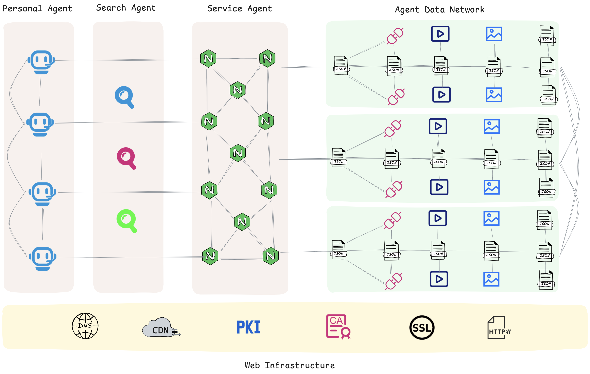

# Comprehensive Comparison of Google's Latest A2A, ANP, and MCP

Google이 A2A(Agent to Agent)라는 새로운 Agent 통신 프로토콜을 발표했습니다. 이 기사에서는 A2A, ANP, MCP를 여러 관점에서 포괄적으로 비교하겠습니다.

## 해결하고자 하는 문제

ANP와 A2A 모두 Agent 간의 통신 문제를 해결하는 것을 목표로 하며, 둘 다 Agent 통신에서 MCP의 한계를 인식합니다: MCP는 모델을 도구와 리소스에 연결하는 데 더 능숙합니다.

동시에 ANP와 A2A 모두 자신들을 MCP의 보완재로 간주합니다. ANP와 A2A 사이에는 일부 중복이 있습니다. "일부 중복"이라고 하는 이유는 제가 볼 수 있는 바로는 A2A가 기업 내부 Agent 협업을 해결하도록 설계된 것 같기 때문입니다. 비록 그들의 공식 웹사이트에서 이를 명시적으로 언급하지는 않지만요. 특히 Tasks의 설계에서 이를 감지할 수 있습니다.

## 설계 원칙

설계 원칙 측면에서 ANP와 A2A는 많은 유사점이 있습니다:

- 단순성과 기존 프로토콜의 재사용 강조.
- 신원 강조, Agent 신원이 ANP의 핵심 모듈입니다.
- 디커플링(불투명성): Agent는 자신의 사고 과정, 계획 또는 도구를 공유할 필요가 없습니다. 이것이 ANP, A2A와 MCP의 설계 세부사항에서 가장 큰 차이점입니다.

A2A는 또한 MCP의 복잡성을 인식하고 Task를 핵심 개념으로 선택한 것 같습니다. Task는 실제로 Tools와 Resources보다 더 추상적이고 고수준의 개념입니다.

MCP의 Tools와 Resources도 MCP에 매우 적합한 개념이지만, sampling과 root의 설계는 재고되어야 한다고 생각합니다.

## 프로토콜 아키텍처

ANP와 A2A 모두 P2P 아키텍처로 간주될 수 있습니다. MCP는 연결뿐만 아니라 프로토콜 개념과 역할 설정 측면에서도 전형적인 C/S 아키텍처입니다.

의심할 여지없이 P2P 아키텍처가 Agent 네트워크에 더 적합합니다.

## 전송 계층

모두 HTTP를 지원합니다. 또한 MCP는 로컬 리소스에 액세스해야 하므로 편의를 위해 stdio도 지원합니다.

## 핵심 개념

MCP의 핵심 개념은 Tools, Resources, Sampling, Root, Prompts입니다.

A2A의 핵심 개념은 Task, Artifact, Message, Part입니다.

ANP의 핵심 개념은 NaturalLanguageInterface와 StructuredInterface를 포함한 Interface입니다.

ANP는 Agent 상호작용 방법의 정의를 Interface에 위임합니다. 예를 들어, Interface는 결과를 직접 반환하는 호텔 예약 API일 수 있습니다. A2A의 Task와 유사하게 Interface에서 Task의 상태를 정의할 수도 있습니다. 그러나 프로토콜 계층에서는 Tasks와 상태를 직접적이고 명시적으로 정의하지 않습니다.

불투명성 관점에서:

- MCP는 화이트 박스로, 상대방의 내부 파일, 도구, 리소스 및 기타 정보를 볼 수 있습니다.
- A2A는 그레이 박스입니다. Agent의 사고 과정, 계획 또는 도구를 공유하지는 않지만 Agent 간의 작업과 작업 상태를 여전히 정의합니다.
- ANP는 블랙 박스입니다. 두 Agent는 완전히 불투명하며 유연성을 유지하면서 최종 결과만 전달합니다.

## Agent 신원

이 영역에서는 매우 중요한 차이점이 있습니다.

**ANP**

프로토콜 자체가 신원 정보와 신원 확인 정보를 전달하며, 현재 주로 W3C DID 방식을 사용합니다. Agent는 다른 Agent 플랫폼에서 계정을 신청할 필요 없이 자신의 신원 정보를 사용하여 모든 다른 Agent와 상호작용할 수 있습니다.

우리는 DID가 특히 인터넷 시나리오에서 Agent에게 가장 적합한 신원 방식이라고 믿습니다. 물론 다른 인증 방법으로 확장할 수도 있습니다.

**A2A**

A2A는 HTTP 인증(Basic, Bearer 등), API Key(요청 헤더, 쿼리 매개변수 또는 쿠키에 배치 가능), Cookie 인증, OAuth 2.0, OpenID Connect를 포함하여 OpenAPI에서 지원하는 인증 방법을 채택합니다.

A2A 프로토콜 자체는 신원 정보를 전달하지 않고 신원 확인 정보만 전달합니다. 신원 확인 정보는 대역 외(out-of-band)로 얻어집니다. 즉, OAuth와 같은 A2A 프로토콜 외부의 다른 수단을 통해 얻어집니다.

A2A의 설계는 기존 기업 신원 시스템을 완전히 활용할 수 있게 합니다. 그러나 Agent 인터넷 시나리오에서 모든 Agent 간의 연결을 달성하려면 A2A가 더 번거롭게 사용될 것입니다.

**MCP**

MCP는 신원 확인을 위해 OAuth를 사용하며, 이 역시 중앙집중식 솔루션으로 도구와 리소스 연결 시나리오에 적합합니다.

## Agent 설명

ANP와 A2A는 상당히 유사하며 둘 다 JSON을 사용합니다.

A2A의 Agent 설명 문서는 Agent Card라고 명명되며, 본질적으로 JSON 문서입니다.

ANP의 Agent 설명은 JSON-LD와 schema.org를 기반으로 하며, 이는 두 Agent 간의 정보 이해 일관성을 향상시키는 것을 목표로 하는 시맨틱 웹 기술입니다.

## Agent 발견

아직 MCP의 발견 사양을 보지 못했지만, ANP와 A2A와 유사한 발견 메커니즘을 사용할 가능성이 높습니다.

ANP와 A2A 모두 RFC 8615를 기반으로 하며, 이는 도메인의 .well-known 디렉토리에 메타데이터 문서를 추가하는 것을 포함합니다. A2A의 파일 이름은 agent.json이고 ANP의 파일 이름은 agent-descriptions입니다.

이 접근 방식을 사용하면 둘 다 검색 엔진에 의해 매우 쉽게 크롤링될 수 있습니다.

## Agent 정보 조직

Agent나 MCP 서버가 정보를 외부적으로 조직하는 방법 측면에서 A2A와 MCP 모두 원격 호출 기술의 일종인 JSON-RPC를 사용합니다.

ANP는 여기서 상당히 독특합니다. ANP는 시맨틱 웹의 Linked-Data 기술을 채택하여 AI가 쉽게 액세스하고 이해할 수 있는 AI 네이티브 데이터 네트워크를 구축하는 것을 목표로 합니다.

이 관점에서 ANP의 기술 경로는 Web에 더 가깝습니다. 우리는 미래 Agent 인터넷이 매우 개방적인 네트워크가 될 것이며, 오직 이런 방식으로만 정보가 자유롭게 흐를 수 있어 AI의 능력을 발휘할 수 있다고 믿습니다.

## 오픈소스 라이선스

ANP의 라이선스는 MIT이고, Google-A2A의 라이선스는 Apache 2.0입니다.

이를 신중히 연구한 결과, 대기업에게 추진하고, 표준화에 참여하며, 국제적으로 나아가고자 한다면 Apache 2.0이 기업 법무팀이 우선시할 프로토콜이 될 것입니다. MIT는 간단하지만, 잠재적인 특허 위험과 상업화 경로가 있는 여러분과 같은 프로토콜 프로젝트에서는 기업 법무팀에 의해 쉽게 차단될 수 있습니다.

ANP는 오픈소스 라이선스를 Apache 2.0으로 수정할 것입니다.

## 트렌드

A2A가 MCP의 보완재라고 주장하지만, 문서를 읽으면서 가능성을 어렴풋이 봅니다: **도구가 Agent가 되고, Agent가 도구가 되는 것**.

기존 도구가 Agent로 진화할 수 있을까요? 미래의 Agent도 도구가 될까요?

이 관점에서 MCP, A2A, ANP는 일부 중복이 있어야 합니다.

## 업계 Agent 프로토콜에 미치는 영향

MCP는 이미 모델을 도구와 리소스에 연결하는 사실상의 표준이 되었으며, A2A가 단기적으로 도전하기는 어렵습니다. 그러나 ANP에는 상당한 영향을 미칩니다.

긍정적인 영향은 Agent 통신과 협업을 더 많은 사람들에게 보이게 만든다는 것입니다. 이전에 MCP가 인기를 끌고 우리가 ANP에 대해 이야기할 때 많은 사람들이 이해하지 못했습니다. 이제 우리는 더 이상 Agent 통신과 협업의 중요성을 강조할 필요가 없습니다.

부정적인 영향은 A2A와 ANP가 기능에서 큰 중복을 가진다는 것입니다. A2A는 Google의 지원을 받고 매우 큰 영향력을 가지는 반면, ANP는 주로 오픈소스 커뮤니티에 의존하며 영향력 측면에서 비교할 수 없습니다. 이는 ANP의 발전에 불리합니다.

## 결론

ANP의 가장 가치 있는 부분은 실제로 미래 Agent 인터넷에 대한 커뮤니티의 비전, 커뮤니티의 독특한 인터넷 철학(연결이 힘), 그리고 DID + 시맨틱 웹의 기술 경로입니다.

우리의 철학과 미래 Agent 인터넷에 대한 비전에 동의한다면, 개인이든 회사 이름으로든 우리와 함께해 주시기 바랍니다. **우리에게는 여러분의 지원이 필요합니다**.

우리는 ANP 오픈소스 기술 커뮤니티 창립 위원회를 준비하고 있습니다. 이는 커뮤니티를 올바른 궤도에 올리고 더 개방적인 커뮤니티로 성장시키는 것을 목표로 하는 임시 위원회입니다. 관심이 있으시면 저에게 연락해 주십시오.
