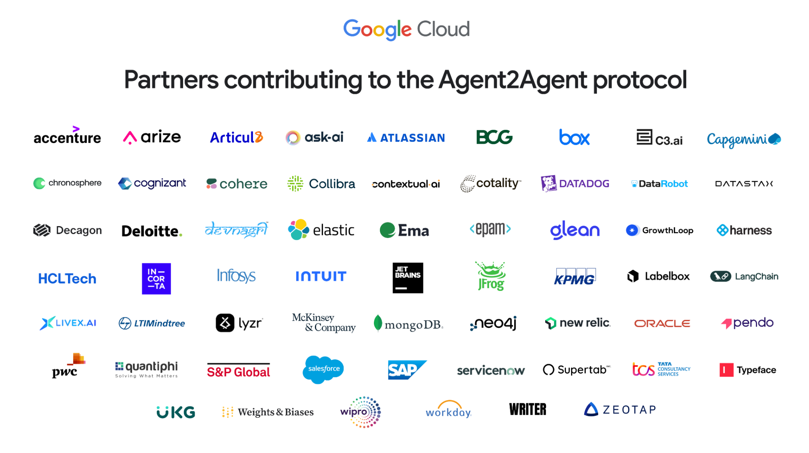

# In-depth Comparison of Google A2A and ANP: Finding the Origin of Protocols

Google의 A2A 프로토콜이 출시된 후, ANP 커뮤니티를 팔로우하는 많은 친구들이 즉시 연락해 와서 우리에게 미치는 영향에 대해 묻고 제안을 제공했습니다. 여러분의 지원에 다시 한 번 감사드립니다.

저는 A2A가 ANP에 미치는 가장 큰 영향은 Google의 "승인"이라고 믿습니다: ANP의 접근 방식이 올바르고, ANP가 장기적인 비전을 가지고 있으며, 이제 제가 합류합니다 :). 이제 Agent 통신과 협업이 왜 중요한지 설명할 필요가 없습니다.

그날 저는 반나절을 연구에 보내고 기사를 썼습니다: [Comprehensive Comparison of Google's Latest A2A, ANP, and MCP](/blogs/Comprehensive-Comparison-of-Google-A2A-ANP-MCP.md).

나중에 저는 또 하루를 보내며 A2A를 신중히 연구하고 ANP와 심층 비교를 했습니다. 저는 A2A의 기원점을 찾았고 A2A와 ANP 간의 더 깊은 차이점을 보았다고 믿습니다.

한 문장으로 요약하면:

- MCP의 기원: **모델을 도구와 리소스에 연결**
- A2A의 기원: **기업 내 Agent 간의 복잡한 협업**
- ANP의 기원: **인터넷상에서 Agent의 연결과 협업**

## 기술적 차이점

A2A와 ANP 모두 Agent 통신과 협업을 해결하는 것을 목표로 하지만, 둘 사이에는 상당한 기술적 차이가 있습니다.

### Agent 설명 및 정보 조직

프로토콜 설계에서 한 Agent가 다른 Agent에게 자신의 정보를 노출하는 방법은 핵심 문제입니다.

Agent 설명의 경우 A2A는 Agent Card라는 JSON 형식 문서를 사용하여 Agent의 기능, 기술, 인증 방법 등을 설명합니다. Agent Card의 핵심은 skills로, 지도 경로 계획과 같이 Agent가 할 수 있는 일을 표현합니다.

ANP도 JSON을 사용하지만 JSON-LD(Linked Data)와 schema.org를 기반으로 Agent 정보(기본 정보, 인증, 외부 제품/서비스, 상호작용 인터페이스)를 설명합니다. 이는 두 Agent 간의 정보 이해 일관성을 향상시키고 Agent의 공개 정보를 데이터 네트워크로 연결할 수 있도록 하는 시맨틱 웹 기술로, Agent 설명 문서가 네트워크의 진입점 역할을 합니다:


예를 들어, ANP를 사용하는 호텔 Agent는 객실, 시설, 서비스, 상호작용 인터페이스 및 기타 정보(이미지 포함)를 설명하여 다른 Agent가 크롤링하고 이해할 수 있는 데이터 네트워크로 연결할 수 있습니다.

이는 A2A와 ANP 간의 Agent 상호작용에서 상당한 차이점을 가져옵니다:

- A2A는 Agent Card를 통해 Agent 기술을 설명합니다. 다른 Agent가 이러한 기술을 얻은 다음 JSON-RPC를 통해 작업 요청을 보내고, 자연어로 작업을 설명하며 작업에 필요한 관련 정보를 전달합니다. 작업이 완료된 후 결과가 반환됩니다.


- ANP는 Agent Description 문서에서 URL을 사용하여 Agent가 노출하는 제품, 서비스, 상호작용 인터페이스 및 기타 정보를 연결합니다. 다른 Agent는 웹 크롤러처럼 URL을 통해 필요한 정보를 지속적으로 크롤링합니다. 이 과정에서 자연어 인터페이스나 구조화된 인터페이스를 통해 Agent와 상호작용할 수 있습니다.


여기서 핵심 차이점:

- **A2A는 Agent가 자신의 기술을 공개적으로 노출하고, 다른 Agent가 처리할 작업을 보내면 완료 후 결과를 반환합니다.**
- **ANP는 Agent가 자신의 정보(상호작용 인터페이스 포함)를 공개적으로 노출하고, 다른 Agent가 이 정보를 크롤링하고 처리하며, 필요할 때 자연어나 구조화된 인터페이스를 통해 Agent와 상호작용합니다.**

### Agent 발견

Agent 발견 측면에서 A2A의 접근 방식은 기본적으로 ANP와 동일합니다. 둘 다 도메인의 .well-known 디렉토리에 메타데이터 문서를 추가하며, A2A의 파일 이름은 agent.json이고 ANP의 파일 이름은 agent-descriptions입니다.

둘 다 Agent가 사설 레지스트리에 적극적으로 등록하는 것을 지원하며, 이는 로컬 네트워크에서의 협업에 필수적입니다.

차이점은 A2A가 .well-known/agent.json에 Agent Card 내용을 직접 배치하는 반면, ANP는 .well-known/agent-descriptions에 Agent 설명 파일의 URL을 저장한다는 것입니다.

현재 A2A는 도메인당 하나의 Agent Card를 가지는 것으로 보이며(이는 추가 확인이 필요), ANP는 도메인당 여러 Agent를 허용합니다.

### 인증

A2A와 ANP는 인증에서 다릅니다.

A2A Agent는 A2A 프로토콜에서 신원 정보를 교환하지 않습니다. 대신 대역 외 방법을 통해 인증 자료(토큰 등)를 얻고 HTTP 헤더를 통해 이러한 자료를 전달합니다.

"대역 외"는 A2A 이외의 프로토콜을 통해 인증 자료를 얻는다는 의미입니다. A2A는 OpenAPI의 인증 사양을 따르며, 각 Agent가 Agent Card에서 지정하는 HTTP Basic Auth, API Key, OAuth 2.0 등을 포함한 여러 인증 방법을 지원합니다.


ANP는 W3C DID 기술을 기반으로 분산 인증을 구축하여 신원 정보(인증 정보 포함)를 프로토콜에 직접 전달합니다. Agent는 대역 외에서 인증 자료를 얻을 필요 없이 자신의 신원을 사용하여 모든 다른 Agent와 상호작용할 수 있습니다.

그러나 일부 시나리오, 특히 기업 애플리케이션에서는 대역 외에서 인증 자료를 얻는 것이 필요합니다. ANP는 향후 대역 외 인증 자료 획득을 지원할 것이며, 설계에서 확장성이 예약되어 있습니다.


**핵심 차이점:**

- A2A는 주류 미국 기업 애플리케이션 생태계의 보안 및 규정 준수 요구사항과의 호환성을 최대화하기 위해 대역 외 인증 자료 획득을 채택하여 기존 기업 인증 시스템을 재사용하고 프로토콜 자체를 가볍고 유연하며 안전하게 보장합니다. 핵심은 기업 애플리케이션의 신원 문제를 해결하는 것이며, 인터넷상의 Agent 상호 연결 문제를 다루지 않습니다.

- ANP는 미래에 Agent가 인터넷에서 어떻게 인증할지를 해결하는 것을 목표로 하며, 핵심은 인터넷상의 모든 두 Agent가 상호 연결될 수 있도록 하는 것으로, 더 상호 운용 가능한 인증 방식이 필요합니다.

### 핵심 개념

A2A와 ANP는 핵심 프로토콜 개념에서 상당한 차이가 있습니다.

**A2A의 핵심 개념**에는 Skill, Task, Artifact, Message, Part가 포함됩니다.

Task는 submitted, working, input-required, completed, canceled, failed, unknown을 포함한 여러 상태를 정의합니다.

Task는 또한 Send, Get, Cancel 등과 알림 관련 작업을 포함한 작업을 정의합니다.

**ANP의 핵심 개념**에는 설명 정보와 인터페이스가 포함됩니다.

설명 정보는 주로 JSON-LD 형식 문서와 JSON-LD 문서의 URL을 통해 연결된 이미지, 오디오, 비디오 및 기타 멀티미디어 파일을 포함한 다른 리소스입니다.

인터페이스는 Natural Language Interface와 Structured Interface로 나뉩니다. Structured Interface는 OpenAPI, JSON-RPC 등과 같은 대부분의 기존 사양을 지원합니다.

**핵심 차이점:**

- A2A는 작업 상태, 작업 등을 포함하여 프로토콜 수준에서 상세한 작업 협업 개념을 정의하여 Agent 간의 복잡한 작업 협업 문제를 해결하는 데 도움이 됩니다. 단점은 두 Agent 간의 결합도가 높아진다는 것입니다.

- ANP는 Agent 간의 상호작용을 단순화하여 Agent 간의 결합도를 줄이며, 플랫폼 간 Agent 협업 시나리오에서 상당한 장점을 가집니다. 단점은 네이티브 프로토콜이 복잡한 작업 협업을 지원하지 않으며 이를 구현하기 위해 인터페이스를 정의해야 한다는 것입니다.

## A2A와 ANP의 기원

프로토콜의 설계를 진정으로 이해하려면 프로토콜의 기원점을 찾아야 합니다.

예를 들어, ANP의 기원은 항상 **인터넷상에서 Agent의 연결과 협업**이었습니다. MCP의 기원은 항상 **모델을 도구와 리소스에 연결**하여 더 나은 Agent를 구축하는 것이었습니다.

위의 기술적 분석을 통해 A2A의 기원이 **기업 내 Agent 간의 복잡한 협업**임을 확인할 수 있습니다.

프로토콜의 공식 웹사이트에서는 이를 명시적으로 언급하지 않지만, Google의 보도 자료에서 일부 측면을 언급합니다:

```
AI agents provide a unique opportunity for people to boost productivity by autonomously handling many routine or complex tasks. Today, businesses are increasingly building and deploying autonomous agents to help scale, automate, and optimize processes across work scenarios—from ordering a new laptop, to assisting customer service representatives, to aiding in supply chain planning. (https://developers.googleblog.com/en/a2a-a-new-era-of-agent-interoperability/)
```

이는 A2A 생태계 회사들의 분포에서도 볼 수 있으며, 대부분이 AI 플랫폼과 서비스, 소프트웨어, SaaS, 기업 플랫폼입니다.




기술적 관점에서 A2A의 현재 구현은 Agent 인터넷의 요구에 적합하지 않습니다.

예를 들어, 개인 어시스턴트가 A2A를 사용하여 호텔 Agent와 객실을 예약한다면, A2A의 현재 구현에 따르면 개인 어시스턴트는 작업을 보내고 사용자의 요구사항(가격, 객실 유형, 시간 등)을 자연어로 설명해야 합니다. 호텔 Agent가 이를 처리하고 작업 실행 정보를 반환합니다. 이는 여러 작업 상호작용과 상태 전환을 포함할 수 있습니다.

이는 두 가지 문제를 만듭니다: 하나는 개인 어시스턴트가 작업을 다른 Agent에게 실행을 위해 보내야 하므로 사용자 개인정보가 침해될 수 있다는 것이고, 다른 하나는 상호작용 결합도가 너무 높다는 것입니다.

ANP의 논리는 개인 어시스턴트가 호텔 Agent에서 정보를 크롤링하고 로컬에서 처리하며, 상호작용이 필요할 때만 호텔 Agent의 인터페이스를 호출한다는 것입니다. 이것이 근본적인 차이점입니다. 물론 이 외에도 A2A는 인터넷상의 Agent 신원 상호 연결 문제를 해결하지 못했습니다.

그러나 A2A가 향후 프로토콜 업그레이드를 통해 Agent 인터넷 시나리오로 확장할 수 있을 가능성이 있습니다.

## 미래 Agent 프로토콜에 대한 몇 가지 예측

단기적으로 MCP는 모델을 도구와 리소스에 연결하는 사실상의 표준이 되었으며, 이는 기본적으로 확정되었고 현재 두 번째 MCP가 등장하기는 어렵습니다.

중장기적으로 저는 한 가지 트렌드가 발생할 가능성이 높다고 믿습니다: **도구가 Agent가 되고, Agent가 도구가 되는 것**. 이 트렌드가 발생한다면 Agent 프로토콜이 MCP의 공간을 압박할 것입니다.

더 장기적으로는 AGI가 실현된 후, 아마도 인간이 설계한 프로토콜이 AI를 돕기보다는 제약할 것이고, AI는 자체적으로 프로토콜을 설계하고 합의에 도달하는 방법을 가질 것입니다.

그러나 Agent 프로토콜은 현재 매우 중요합니다. 이들은 Agent를 위한 중요한 퍼즐 조각이며 Agent가 인터넷과 상호작용하는 가장 AI 네이티브한 방법으로, Computer Use, Browser Use, 심지어 AI 브라우저보다도 더 효율적입니다.

어떤 경우든 **ANP의 가장 가치 있는 부분은 미래 Agent 인터넷에 대한 커뮤니티의 비전, 커뮤니티의 독특한 인터넷 철학(연결이 힘), 그리고 DID + 시맨틱 웹 기술 경로입니다. 이것이 ANP의 지속적인 개발을 지원하는 핵심 동력입니다**.

## 혁신에 대해

A2A가 출시된 후, "폭발적", "하룻밤 변화", "파괴적"과 같은 헤드라인을 보는 것은 복잡한 심정이었으며, 특히 우리가 ANP를 1년 동안 작업하고 오랫동안 홍보해 왔기 때문입니다.

우리 모두는 "0에서 1로" 혁신이 필요하다고 말합니다—우리에게는 혁신가뿐만 아니라 이러한 혁신가를 발견할 수 있는 미디어도 필요합니다.

마지막으로 40명이 넘는 오픈소스 커뮤니티의 모든 기여자와 개발자에게 감사합니다.

또한 RTE Developer Community, OSC Open Source Community, Founder Park, Juecha Flow, Hou Hongwen Cun, AIGCLink, Agent AI 등(불완전할 수 있음)을 포함하여 우리를 지원하는 공개 계정과 커뮤니티, 그리고 우리에게 공유 기회를 제공하는 많은 조직들, 그리고 커뮤니티에 서버 리소스를 제공하는 AWS와 Alibaba Cloud에 감사합니다.
