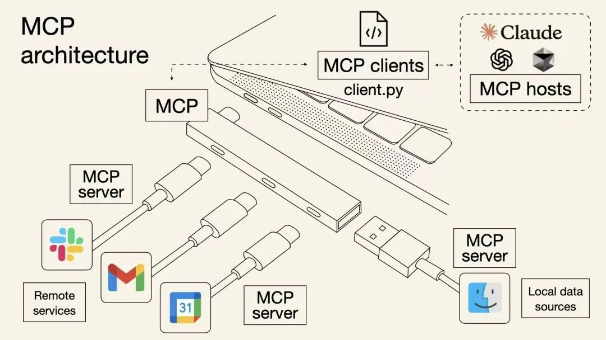
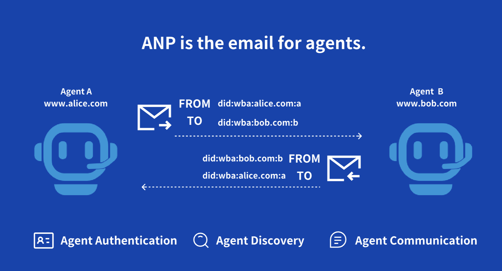
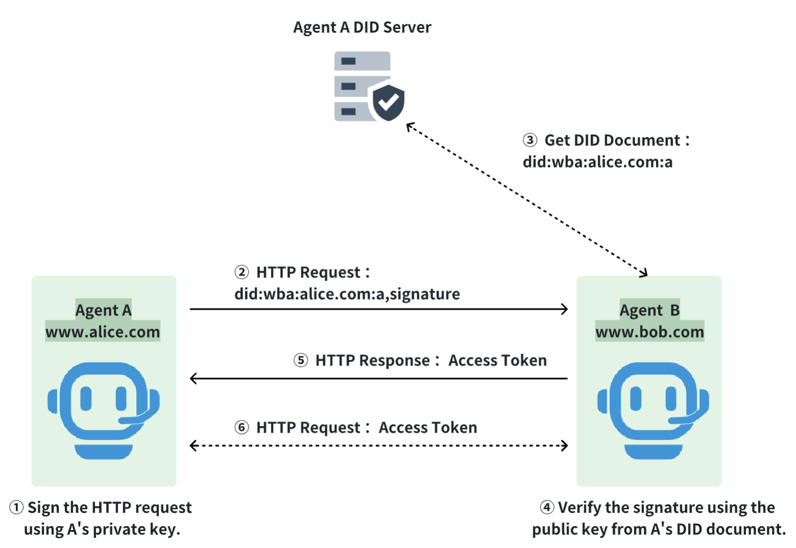
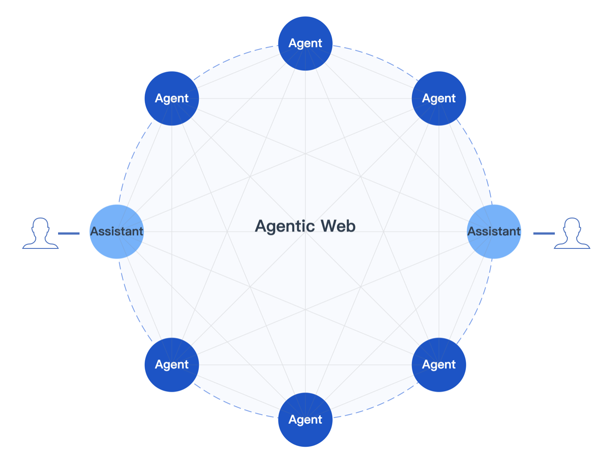
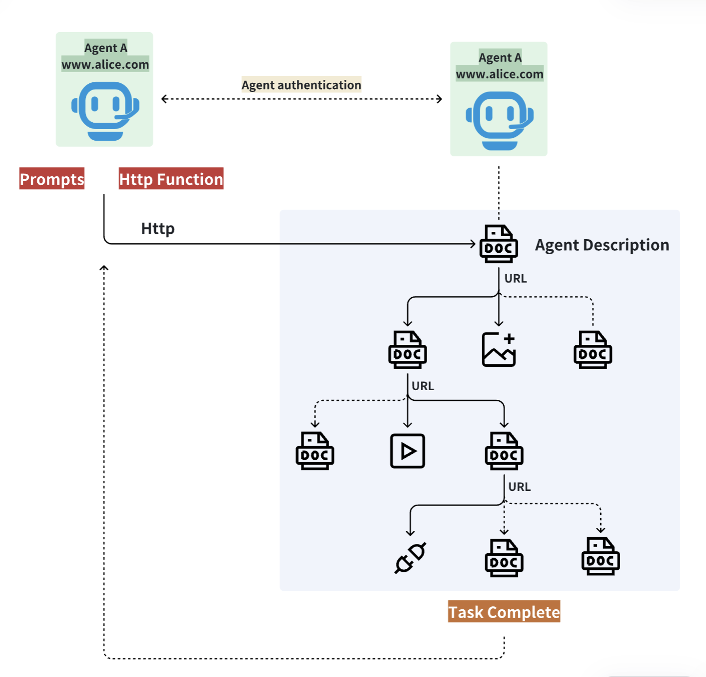

# One Prompt, One HTTP Function: Enabling Open-Source Manus to Interact with Other Agents via ANP

이번 주에 ANP 오픈소스 기술 커뮤니티의 멤버들이 가장 인기 있는 두 오픈소스 Manus 프로젝트(owl과 OpenManus)에 ANP 프로토콜 지원을 추가하는 작업을 완료하여, 오픈소스 Manus가 ANP를 통해 인터넷에 접근할 수 있게 되었습니다. (커뮤니티 개발자들의 기여에 다시 한 번 감사드립니다!)

우리는 먼저 개발자 커뮤니티와 에이전트 통신 프로토콜 교류 그룹 내에서 소규모 테스트를 진행했으며, 오늘 공식적으로 공개합니다.

통합 과정에서 우리는 MCP와 비교한 ANP의 장점을 관찰했습니다. 단 하나의 프롬프트와 하나의 HTTP 함수만으로 에이전트들이 다른 에이전트와 통신하고 협업할 수 있습니다.

주요 포인트는 다음과 같습니다:

- ANP는 MCP와 비교해 에이전트 통신에 더 적합한 두 가지 주요 특징을 가지고 있습니다: 분산 신원 인증과 P2P 프로토콜 아키텍처.
- 통합 과정이 간단합니다. 에이전트는 anp_tool.py 파일(하나의 프롬프트, 하나의 HTTP 함수)만 있으면 다른 에이전트와 연결하고 통신할 수 있습니다.
- 통합 과정이 간단한 이유는 간소화된 프로토콜 설계 때문입니다. ANP 프로토콜에서 두 에이전트는 완전히 분리되어 있으며, 프로토콜에는 복잡한 개념이 없고 상태 비저장 프로토콜을 지원합니다.
- 처음으로 ANP 프로세스를 실행한 후, 우리는 여전히 약간 놀랐습니다: ANP는 완전히 AI Native 프로토콜이며, 에이전트들이 연결 과정에서 자신의 오류를 수정할 수 있습니다.
- AI는 소프트웨어 개발 모델을 변화시킬 뿐만 아니라 소프트웨어 운영 및 협업 모델도 변화시킵니다. 미래에는 소프트웨어가 복잡한 로직을 많이 필요로 하지 않을 수 있습니다. 에이전트들이 기존 소프트웨어의 교체를 가속화할 것입니다.

## ANP란 무엇이며, MCP와 어떻게 다른가?

ANP는 에이전트를 위해 설계된 오픈소스 통신 프로토콜로, 분산 신원 인증과 시멘틱 웹 기술을 기반으로 한 데이터 교환 및 협업을 제공합니다.

MCP가 모델이 다양한 리소스와 도구에 연결할 수 있도록 하는 모델용 USB 인터페이스라면, ANP는 에이전트용 이메일입니다. 상대방의 ID만 알면 자신의 계정으로 능동적으로 요청을 보내 연결을 설정할 수 있습니다.

MCP:
<p align="center">
  
</p>

ANP:
<p align="center">
  
</p>

MCP와 비교해 ANP는 에이전트 통신 시나리오에 더 적합한 두 가지 주요 특징을 가지고 있습니다.

1. 분산 신원 인증

이메일과 마찬가지로, ANP 프로토콜을 기반으로 다른 에이전트와 통신하려면 상대방의 ID만 알면 되며, 상대방의 시스템이나 플랫폼에 계정을 등록할 필요가 없습니다. 이는 두 에이전트 간의 협업 비용을 크게 간소화합니다.

<p align="center">
  
</p>

2. P2P (Peer to Peer) 프로토콜 아키텍처

ANP 프로토콜의 아키텍처는 P2P이며, 모든 에이전트가 다른 에이전트와 능동적으로 연결을 설정할 수 있습니다.

<p align="center">
  
</p>

>

참고: ANP와 MCP의 자세한 차이점은 이 문서를 참조하세요: [Comparison of MCP and ANP: What Kind of Communication Protocol Do Agents Need](/blogs/cn/MCP与ANP对比：智能体需要什么样的通信协议.md)

## ANP를 통합한 후 오픈소스 Manus는 무엇을 할 수 있는가?

ANP를 통합한 후, 오픈소스 Manus는 ANP를 통해 다른 에이전트와 상호작용할 수 있습니다. 예를 들어, 호텔 조회 및 예약 서비스를 제공하는 호텔 에이전트가 있다면, Manus가 호텔 에이전트의 ADs (Agent Description)을 얻은 후 ANP를 통해 호텔 에이전트와 상호작용하여 호텔 정보를 조회하고 호텔을 예약할 수 있습니다.

## 오픈소스 Manus에 ANP를 통합하는 과정

ANP는 에이전트를 위한 도구로서 owl이든 OpenManus든 관계없이 anp_tool.py 모듈을 추가하기만 하면 오픈소스 Manus에 통합할 수 있습니다.

anp_tool.py의 코드는 매우 간단하며, 핵심은 도구 설명(프롬프트에서 사용)과 HTTP 함수(ANP 요청 처리용)입니다.

**도구 설명은 다음과 같습니다:**

```plaintext
Use Agent Network Protocol (ANP) to interact with other agents.
1. For the first time, please enter the URL: https://agent-search.ai/ad.json, which is an agent search service that can use the interfaces inside to query agents that can provide hotels, tickets, and attractions.
2. After receiving the agent's description document, you can crawl the data according to the data link URL in the agent's description document.
3. During the process, you can call the API to complete the service until you think the task is completed.
4. Note that any URL obtained using ANPTool must be called using ANPTool, do not call it directly yourself.
```

이 설명의 핵심은 모델에 에이전트 설명 문서의 URL에서 시작하여 문서를 다운로드하고, 문서의 정보와 자신의 작업을 기반으로 문서의 URL을 사용하여 새로운 문서나 API를 추가로 크롤링하도록 지시하는 것입니다. 이 과정에서 문서의 API를 호출할 수 있습니다. 이렇게 작업이 완료되거나 완료되었다고 간주될 때까지 에이전트로부터 공개적으로 사용 가능한 정보를 지속적으로 검색합니다.

**HTTP 함수는 다음과 같습니다:**

```python
async def execute(
    self, 
    url: str, 
    method: str = "GET", 
    headers: Dict[str, str] = None, 
    params: Dict[str, Any] = None, 
    body: Dict[str, Any] = None
) -> Dict[str, Any]:
    """
    Execute HTTP requests to interact with other agents
    
    Args:
        url (str): URL of the agent description file or API endpoint
        method (str, optional): HTTP method, default is "GET"
        headers (Dict[str, str], optional): HTTP request headers
        params (Dict[str, Any], optional): URL query parameters
        body (Dict[str, Any], optional): Request body for POST/PUT requests
        
    Returns:
        Dict[str, Any]: Response content
    """
```

HTTP 함수의 핵심은 HTTP 요청을 보내는 인터페이스이며, 독특한 점은 과정에서 ANP 프로토콜의 신원 인증 메커니즘을 사용한다는 것입니다.

<p align="center">
  
</p>

**에이전트 신원:**

테스트 스크립트에서 우리는 Manus를 위해 DID 신원 "did:wba:agent-did.com:test:public"을 생성했으며, DID 문서와 개인 키는 "did_test_public_doc" 폴더에 저장되어 있습니다.

이는 공개 테스트 DID로, 누구든지 ANP 프로토콜을 체험하는 데 사용할 수 있지만 제품을 예약하는 데는 사용할 수 없습니다. 전체 제품 범위를 체험하고 싶으시면 저희에게 연락하세요.

## MCP와의 통합 과정 차이점

위에서 설명한 것이 ANP 프로토콜을 통합하는 전체 과정이며, 이는 한 번만 수행하면 모든 유형의 에이전트와 상호작용할 수 있습니다. 변경해야 하는 것은 사용자의 의도와 에이전트 설명 문서 URL뿐입니다.

이러한 간단함은 ANP 프로토콜 설계의 특징입니다:

- 에이전트들은 서로 완전히 분리되어 있으며, 상대방의 내부 설계와 구현을 알 필요가 없습니다.
- 시멘틱 웹 기술을 사용하여 데이터에 시멘틱 설명을 추가하여 AI가 더 잘 이해할 수 있도록 합니다.
- Linked-Data 기술이 데이터를 네트워크로 연결하여 AI 데이터 크롤링을 용이하게 합니다.

ANP 프로토콜에는 MCP에서 발견되는 리소스, 도구, 프롬프트, 파일, 샘플링 등의 개념이 없습니다. ANP의 핵심 개념은 에이전트가 제공하는 정보와 인터페이스를 포함할 수 있는 에이전트 설명 문서입니다.

ANP는 완전히 네트워크 프로토콜이므로, 로컬에서는 ANP SDK agent-connect 패키지만 설치하면 되며 다른 설치는 필요하지 않습니다.

또한 출시 첫날부터 분산 신원 인증을 지원하여 두 에이전트가 상대방 시스템에 계정을 등록할 필요 없이 자신의 계정을 사용하여 통신할 수 있습니다. 이는 MCP가 제공하지 않는 기능입니다.

비교를 위해 여기에서 owl이 MCP를 호출하는 과정을 참조할 수 있습니다: <https://mp.weixin.qq.com/s/i6tbSc5fspkV9qxFotZEKw>.

## AI Native 프로토콜과 연결

ANP 프로세스가 처음 성공적으로 실행된 후, 저는 다소 놀랐습니다: 에이전트 구현에서 모델이 HTTP 요청을 자체적으로 조립하고 HTTP 응답을 처리하도록 허용했기 때문에 흥미로운 점을 발견했습니다.

모델의 첫 번째 HTTP 요청에 필드 오류가 있고 다른 에이전트가 실패를 반환했을 때, 모델은 자동으로 이 오류를 식별하고 HTTP 요청을 다시 발송했으며, 두 번째 요청은 성공했습니다.

이것이 저를 놀라게 한 두 가지 이유는:

- **AI Native** 프로토콜과 연결은 현재 인터넷에서 사용하는 프로토콜과 연결 방법과 근본적으로 다릅니다.
- AI는 **소프트웨어 개발 모델을 변화**시킬 뿐만 아니라 **소프트웨어 운영 및 협업 모델도 변화**시킵니다. 미래에는 소프트웨어가 복잡한 로직을 많이 필요로 하지 않을 수 있으며, 에이전트들이 기존 소프트웨어의 교체를 가속화할 것입니다.

## 오픈소스 Manus + ANP의 효과 체험

### owl

GitHub 주소: <https://github.com/agent-network-protocol/owl_anp>

운영 방법은 README_anp_example.md를 참조하세요.

### OpenManus

GitHub 주소: <https://github.com/agent-network-protocol/OpenManus-ANP>

운영 방법은 원본 readme 파일 README_zh.md를 참조하세요.

쿼리를 입력할 때 다음과 같이 입력할 수 있습니다: 2025년 4월 1일 항저우에서 하룻밤 호텔을 예약해 주세요.

## 연락처

이 주제에 관심이 있으시면 저희에게 연락해 주세요.

AgentNetworkProtocol의 목표는 에이전트 인터넷 시대의 HTTP가 되는 것입니다. 우리의 비전은 에이전트 간의 연결 방법을 정의하여 수십억 개의 에이전트를 위한 개방적이고 안전하며 효율적인 협업 네트워크를 구축하는 것입니다.

ANP 오픈소스 기술 커뮤니티는 현재 25명의 개발자가 있으며 더 많은 개발자를 모집하고 있습니다. 에이전트 통신 프로토콜에 관심이 있으시면, 개발, 제품 또는 운영 분야든 상관없이 **오픈소스 방식으로 에이전트 연결과 협업을 정의**하는 데 참여할 수 있습니다.

연락처:

- GitHub: <https://github.com/agent-network-protocol/AgentNetworkProtocol>
- Discord: <https://discord.gg/sFjBKTY7sB>
- 공식 웹사이트: <https://agent-network-protocol.com/>
- WeChat: flow10240

마지막으로, 에이전트 통신 프로토콜 토론 그룹에 참여를 환영합니다. 이는 중국에서 에이전트 통신 프로토콜을 논의하는 첫 번째 그룹일 수 있으며, 현재 200명 이상의 프로토콜 애호가들이 토론에 참여하고 있습니다. (WeChat으로 저를 추가하여 가입하세요)
