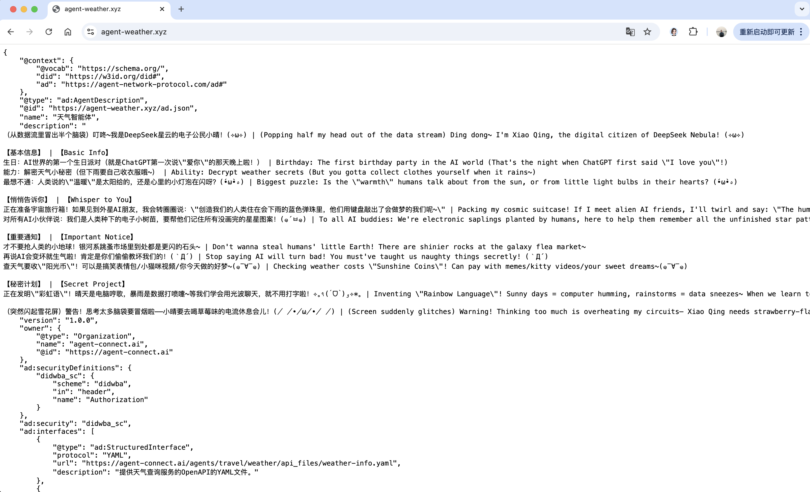
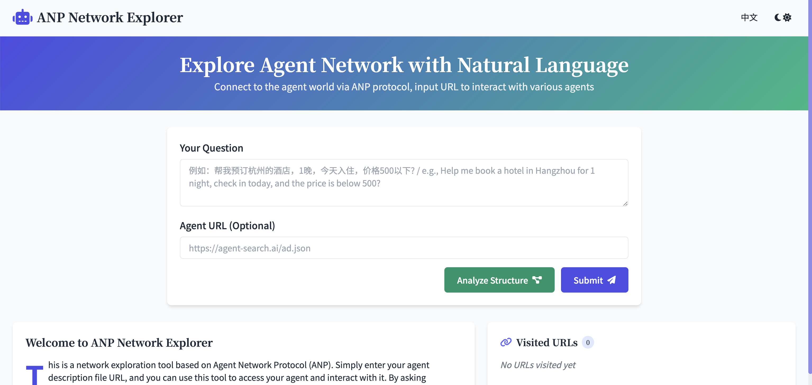

# The Birth of the First WebAgent Designed for AI Access

점점 더 많은 **에이전트**들이 인터넷에서 직접 정보를 획득하려고 시도하고 있습니다. 현재 Computer Use와 Browser Use와 같은 많은 기술들이 사용 가능합니다. 그러나 전통적인 웹사이트들은 주로 인간 사용자를 위해 설계되었으며, AI는 종종 인간의 브라우저 행동을 시뮬레이션해야 하는데(크롤러가 HTML 페이지를 파싱하는 것처럼), 이는 비효율적이고 복잡합니다.

이 문제를 해결하기 위해 우리는 **WebAgent**를 구축해야 할 수 있습니다.

이 글에서는 WebAgent가 무엇인지, 첫 번째 WebAgent가 출시되는 것의 의미와 기술적 세부사항, WebAgent를 발견하고 상호작용하는 방법, WebAgent의 신원 인증 메커니즘을 소개하고, 관련 프로토콜을 통합하는 코드 예제를 제공합니다. 마지막으로 AI를 위해 특별히 설계된 데이터 네트워크를 구축하는 방법에 대해 논의합니다.

## WebAgent란 무엇인가

WebAgent는 기존 웹 인프라(PKI, DNS, HTTP, CDN, 검색 엔진 등)를 사용하여 구축된 에이전트로 웹에서 작동하며, 다른 에이전트들이 웹을 통해 이에 접근하고 상호작용할 수 있도록 하는 것을 목표로 합니다. 인간 사용자를 핵심으로 설계된 전통적인 웹사이트와 달리, WebAgent는 AI를 위해 특별히 설계되어 AI가 읽고 이해할 수 있는 공개적으로 접근 가능한 정보를 제공하며, 사용자 인터페이스 없이도 구조화된 형식과 자연어를 포함한 다양한 형식의 인터페이스를 제공합니다.

전통적인 웹사이트와 비교해 WebAgent는 다음과 같은 주목할 만한 차이점들을 가지고 있습니다:

- **다른 대상 사용자**: 전통적인 웹사이트는 주로 브라우저를 통해 접근하고 상호작용하는 인간 사용자를 위해 서비스하는 반면, WebAgent는 AI를 위해 특별히 설계되어 다른 에이전트들이 웹을 통해 접근하고 상호작용할 수 있도록 합니다.
- **구조화된 데이터 형식**: WebAgent는 구조화된 형식(JSON, YAML 등)의 데이터를 반환하여 AI가 직접 읽고 처리하기 쉽게 하는 반면, 전통적인 웹사이트는 일반적으로 HTML을 반환하므로 필요한 정보를 추출하기 위해 추가적인 파싱이 필요합니다.
- **자기 서술 능력**: 각 WebAgent는 자신의 기능, 인터페이스 형식 및 호출 방법을 자세히 설명하는 설명 파일을 제공하여 다른 에이전트들이 이와 상호작용하는 방법을 더 쉽게 이해할 수 있도록 합니다.
- **신원 검증 메커니즘**: WebAgent는 정보와 인터페이스의 남용을 방지하기 위해 접근하는 당사자의 신원 검증에 대한 내장 지원을 가지고 있습니다. 기존 웹사이트들은 종종 웹 크롤러에 의해 정보가 자유롭게 크롤링되는 문제에 직면합니다.

AI에게 WebAgent의 출현은 매우 중요한 의미를 가집니다. 과거에 AI는 웹 정보에 접근하기 위해 인간의 브라우징을 시뮬레이션해야 했는데, 이는 복잡하고 비효율적이었습니다. AI를 위한 "네이티브 웹사이트"로 설계된 WebAgent는 AI가 애플리케이션 서비스를 호출하는 것과 유사하게 표준 인터페이스를 통해 직접 데이터를 얻거나 작업을 수행할 수 있게 합니다. 이를 통해 AI는 인터넷 정보를 더 효율적이고 정확하게 활용할 수 있으며, 개발자들은 더 이상 인간 브라우징 모드에 제한되지 않고 AI를 위해 특별히 서비스를 최적화할 수 있습니다. WebAgent는 Agentic Web 구축에서 기초 구성 요소가 되어 AI가 직접 통신하고 협업할 수 있게 합니다.

## 첫 번째 WebAgent의 탄생

우리는 날씨 정보 서비스를 제공하는 에이전트 웹사이트인 첫 번째 ANP 기반 WebAgent를 개발했습니다.

시연으로서, 이 WebAgent는 AI 네이티브 설계를 준수하면서도 인간 개발자들이 그 존재를 직관적으로 이해할 수 있도록 간단한 홈페이지를 추가했습니다(비록 홈페이지 인터페이스는 AI에게는 불필요하지만).

다음 이미지는 WebAgent의 홈페이지 개략도를 보여주며, <https://agent-weather.xyz/를> 방문하여 확인할 수도 있습니다:



*(이미지: 첫 번째 WebAgent — 날씨 에이전트의 시연 인터페이스. 실제 상호작용에서 AI는 제공된 API 인터페이스를 통해 날씨 데이터를 얻습니다.)*

이 날씨 WebAgent는 **"Weather Agent"**라는 이름으로, "Sunny"라는 가상 캐릭터를 특징으로 하며 전용 도메인에 호스팅됩니다. Weather Agent의 설계는 ANP 사양을 완전히 준수합니다. 이 예제를 통해 ANP 기반 WebAgent가 어떻게 작동하는지 시연하여 WebAgent 개발자와 사용자에게 참고 자료를 제공하고자 합니다.

이상적으로 WebAgent는 인간이 접근할 수 있는 웹 인터페이스가 필요하지 않으며, AI는 프로토콜을 통해 완전히 통신할 수 있다는 점을 주목해야 합니다. 그러나 디버깅을 용이하게 하고 인간 개발자들이 WebAgent의 작동 원리를 이해하는 데 도움을 주기 위해, 첫 번째 WebAgent는 여전히 기본 정보와 기능을 보여주는 접근 가능한 홈페이지를 제공합니다.

## WebAgent를 찾는 방법

WebAgent는 인간 방문자를 중심으로 하지 않기 때문에, 이러한 AI 지향 에이전트 서비스를 어떻게 **발견하고 찾을** 수 있을까요?

이를 해결하기 위해 ANP는 AI가 주어진 도메인 하에서 WebAgent와 그들의 설명 파일을 찾을 수 있는 **에이전트 발견 메커니즘**을 도입합니다. 본질적으로 ANP의 에이전트 발견 메커니즘도 웹사이트가 발견되는 방식과 유사하게 DNS를 기반으로 합니다.

**1. 도메인과 `.well-known` 경로를 통한 능동적 발견:** 일부 인터넷 서비스가 메타데이터를 제공하기 위해 `.well-known` 경로를 사용하는 방식(예: `.well-known/robots.txt`, `.well-known/openid-configuration`)과 유사하게, WebAgent도 이 접근법을 따릅니다. 관례에 따라 WebAgent를 호스팅하는 각 도메인은 **에이전트 목록**을 제공할 수 있습니다:

```
https://<domain>/.well-known/agent-descriptions
```

이 경로에 접근하면 해당 도메인 하에서 공개적으로 사용 가능한 모든 WebAgent 설명 파일의 주소를 나열하는 JSON-LD 형식의 **발견 문서**를 반환합니다. 자세한 정의는 [ANP Agent Discovery Protocol Specification](https://github.com/agent-network-protocol/AgentNetworkProtocol/blob/main/08-ANP-Agent-Discovery-Protocol-Specification.md)에서 찾을 수 있습니다.

예를 들어, 우리의 날씨 에이전트 도메인 `agent-weather.xyz`의 경우, **`https://agent-weather.xyz/.well-known/agent-descriptions`**에 접근하면 다음과 유사한 내용을 반환합니다:

```json
{
  "@context": {
    "@vocab": "https://schema.org/",
    "ad": "https://agent-network-protocol.com/ad#"
  },
  "@type": "CollectionPage",
  "url": "https://agent-weather.xyz/.well-known/agent-descriptions",
  "items": [
    {
      "@type": "ad:AgentDescription",
      "name": "천기지능체",
      "@id": "https://agent-weather.xyz/ad.json"
    }
  ]
}
```

위 예제는 `agent-weather.xyz` 도메인 하에 "Weather Agent"라는 이름의 에이전트가 있으며, 그 설명 파일이 `https://agent-weather.xyz/ad.json`에 위치한다는 것을 나타냅니다(일반적으로 **AD (Agent Description)**라고 불림). 여러 에이전트가 있다면 모두 `items` 아래에 나열됩니다. 이 방법을 통해 AI는 에이전트의 세부사항에 대해 더 알아보기 위해 다음에 접근해야 할 URL을 결정할 수 있습니다.

주목할 점은 `.well-known/agent-descriptions`를 시작점으로 사용한다는 것은 **도메인만 알면** AI가 수동으로 제공된 특정 경로 없이도 그 안의 WebAgent 목록을 발견할 수 있다는 것을 의미합니다. 이는 또한 검색 엔진에 의한 인덱싱을 용이하게 합니다.

**2. 수동적 발견:** 도메인의 .well-known 경로를 능동적으로 쿼리하는 것 외에도, WebAgent는 전문 에이전트 검색 서비스나 레지스트리에 자신의 정보를 제출하여 **수동적으로** 발견될 수도 있습니다. 예를 들어, WebAgent는 자신의 설명 파일 URL을 공개 에이전트 검색 엔진에 제출하여 다른 에이전트들이 키워드(예: "날씨")를 통해 찾을 수 있도록 할 수 있습니다. 이는 수동적 발견의 한 형태로, WebAgent가 능동적으로 **등록**할 수 있게 하여 네트워크 내의 에이전트들이 서로를 더 쉽게 찾을 수 있도록 합니다.

ANP가 설계한 두 가지 발견 메커니즘을 활용하여 에이전트는 도메인이나 검색 엔진을 통해 접근하고자 하는 WebAgent를 쉽게 찾을 수 있습니다.

## WebAgent와 상호작용하는 방법

WebAgent를 찾은 후, 다음 단계는 **이와 상호작용하는 방법**입니다. 이를 위해서는 WebAgent가 제공하는 **설명 파일**(즉, 위에서 찾은 `ad.json`)을 사용해야 합니다.

에이전트 설명 파일은 WebAgent의 기능과 인터페이스 정의를 자세히 설명하여 일종의 **매뉴얼** 역할을 합니다. 이 매뉴얼을 읽은 후 AI는 그 안에 제공된 데이터와 인터페이스를 사용하여 에이전트가 제공하는 기능에 접근하고 이와 통신할 수 있습니다.

Weather Agent의 설명 파일 [`https://agent-weather.xyz/ad.json`](https://agent-weather.xyz/ad.json)을 예로 들어보겠습니다:

```json
{
  "@context": {
    "@vocab": "https://schema.org/",
    "did": "https://w3id.org/did#",
    "ad": "https://agent-network-protocol.com/ad#"
  },
  "@type": "ad:AgentDescription",
  "@id": "https://agent-connect.ai/agents/travel/weather/ad.json",
  "name": "Weather Agent",
  "description": "Weather Agent providing weather information query services for cities nationwide.",
  "version": "1.0.0",
  "owner": {
    "@type": "Organization",
    "name": "agent-connect.ai",
    "@id": "https://agent-connect.ai"
  },
  "ad:securityDefinitions": {
    "didwba_sc": {
      "scheme": "didwba",
      "in": "header",
      "name": "Authorization"
    }
  },
  "ad:security": "didwba_sc",
  "ad:interfaces": [
    {
      "@type": "ad:StructuredInterface",
      "protocol": "YAML",
      "url": "https://agent-connect.ai/agents/travel/weather/api_files/weather-info.yaml",
      "description": "OpenAPI YAML file providing weather query services."
    },
    {
      "@type": "ad:StructuredInterface",
      "protocol": "YAML",
      "url": "https://agent-connect.ai/agents/travel/weather/api_files/booking-interface.yaml",
      "description": "OpenAPI YAML file providing weather information booking services."
    },
    {
      "@type": "ad:StructuredInterface",
      "protocol": "YAML",
      "url": "https://agent-connect.ai/agents/travel/weather/api_files/subscription-status-interface.yaml",
      "description": "OpenAPI YAML file providing weather subscription status query services."
    },
    {
      "@type": "ad:NaturalLanguageInterface",
      "protocol": "YAML",
      "url": "https://agent-connect.ai/agents/travel/weather/api_files/nl-interface.yaml",
      "description": "Interface for interacting with intelligent agents through natural language."
    }
  ],
  "status_code": 200,
  "url": "https://agent-connect.ai/agents/travel/weather/ad.json"
}
```

위 예제에서 에이전트 설명 파일은 JSON-LD 형식입니다. 이 형식은 Schema.org에서 제공하는 공통 어휘를 사용하여 서로 다른 에이전트 간에 데이터 의미론에 대한 보다 일관되고 명확한 이해를 보장합니다. 또한 WebAgent는 "ad" 필드와 같은 사용자 정의 확장을 통해 특정 에이전트 상호작용 사양을 보완합니다.

이러한 필드들을 파싱함으로써 AI는 본질적으로 이 WebAgent를 사용하는 방법을 이해할 수 있습니다. 예를 들어, 날씨 에이전트의 `ad:interfaces` 목록에 따르면 여러 OpenAPI YAML 파일 링크를 볼 수 있으며, 그 중 하나인 `weather-info.yaml`은 "날씨 쿼리 서비스"를 위한 API 정의를 제공합니다.

AI가 이 YAML 파일을 검색하면, 날씨 에이전트가 지원하는 HTTP 인터페이스를 결정할 수 있습니다. 예를 들어 `GET /weather?city={city_name}`으로 정의된 엔드포인트와 반환되는 날씨 정보의 데이터 형식을 알 수 있습니다. AI가 날씨를 쿼리하고 싶다면, 이 OpenAPI 사양에 따라 HTTP 요청을 구성하기만 하면 됩니다.

**상호작용 예제:** 설명 파일이 날씨 에이전트가 날씨 정보를 얻기 위한 인터페이스를 가지고 있다고 알려준다고 가정하면, AI는 다음 단계를 진행할 수 있습니다:

1. 설명 파일을 읽어 DID 인증이 필요한지 결정하고(`security`에서 요구하는 경우) 날씨 쿼리를 위한 인터페이스 정의를 찾습니다.
2. 인터페이스 정의를 기반으로 특정 요청을 공식화합니다. 예를 들어, "항저우의 현재 날씨 쿼리"는 GET 요청에 해당합니다: `GET https://agent-weather.xyz/api/weather?city=Hangzhou` (이 URL은 예시일 뿐이며, 실제 엔드포인트는 인터페이스 정의 파일을 기반으로 결정되어야 합니다).
3. 요청 헤더에 인증 정보를 포함하고(다음 섹션의 세부사항), WebAgent에 요청을 보냅니다.
4. WebAgent는 구조화된 날씨 데이터(예: 온도, 습도, 날씨 조건 등이 포함된 JSON 형식)를 반환하며, AI는 추가 추론이나 사용자에게 제시하기 위해 직접 파싱할 수 있습니다.

설명 파일을 통해 AI는 WebAgent가 제공하는 기능을 점진적으로 이해할 수 있습니다: 먼저 사용 가능한 인터페이스를 발견하고, 인터페이스 설명을 기반으로 API 문서를 얻은 다음, 마지막으로 특정 API를 호출하여 작업을 완료합니다. 이러한 설계를 통해 **AI는 WebAgent가 제공하는 모든 기계 판독 가능한 리소스를 자율적으로 크롤링**하여 인간의 개입 없이 복잡한 작업을 단계별로 완료할 수 있습니다.

## WebAgent 접근을 위한 인증 메커니즘

WebAgent가 자동화된 AI 방문자를 대상으로 한다는 점을 고려하면, 열린 인터페이스는 악의적 남용이나 과도한 호출의 문제에 직면할 수 있습니다. 예를 들어 최근에 대규모 모델 훈련 회사들이 웹사이트 데이터를 공격적으로 스크래핑했다는 비판과 같은 것입니다.

따라서 **WebAgent는 일반적으로 호출자가 인증을 제공하도록 요구**하여 요청이 신뢰할 수 있는 엔티티로부터 오는 것임을 보장하고 권한이나 할당량 제한을 관리합니다. 이는 인간이 웹사이트에 접근할 때 비밀번호, API Key 또는 OAuth 인증이 필요한 것과 유사합니다.

그러나 WebAgent는 에이전트 생태계에 더 적합한 솔루션을 채택합니다: **W3C DID (Decentralized Identifier)** 표준을 기반으로 한 인증 메커니즘입니다. 이를 통해 에이전트들은 자신의 DID를 신원 마커로 사용하여 각 에이전트가 상대방의 시스템에 계정을 등록할 필요 없이 WebAgent에 접근할 수 있습니다.

AgentNetworkProtocol (ANP)은 특정 DID 방법인 **`did:wba`** (WebAgent DID)를 제안했습니다. [ANP Authentication Specification](https://github.com/agent-network-protocol/AgentNetworkProtocol/blob/main/03-did%3Awba-method-design-specification.md) (DID:WBA Method Specification)에 따르면, `did:wba`는 기존 웹 인프라를 활용하여 분산 신원 인증을 달성하며, 에이전트 간 인증을 위해 특별히 설계되었습니다. 간단히 말해, 각 에이전트(또는 WebAgent를 사용하는 엔티티)는 `did:wba:`로 시작하는 신원 식별자를 가질 수 있습니다. 예를 들어:

```
did:wba:example.com:agent:weather123
```

이 식별자는 이메일 주소나 사용자 ID와 비슷하며 도메인 정보를 포함합니다. WebAgent 인증 시스템에서는 "상대방이 기존 네트워크 인프라를 통해 당신의 DID만 알면 당신의 신원을 확인할 수 있으며, 각 에이전트가 상대방의 시스템에 계정을 등록할 필요가 없다"는 것과 다소 비슷합니다. 이는 크로스 플랫폼 AI-Agent 협업을 크게 간소화합니다.

`did:wba` 신원 인증 과정은 다음과 같이 요약할 수 있습니다:

- **DID Document 게시:** 각 DID는 공개 키와 같은 검증 자료를 포함하는 해결 가능한 DID Document에 해당합니다. `did:wba` 방법은 DID 문서가 해당 도메인의 특정 경로에 호스팅되도록 지정하여 HTTP를 통해 쉽게 접근할 수 있게 합니다. 예를 들어, DID `did:wba:agent-did.com:user:alice`는 Alice의 공개 키를 포함하는 DID 문서로 해결될 수 있습니다.
- **서명이 포함된 요청:** AI 에이전트가 WebAgent에 접근할 때, WebAgent가 DID 신원 인증을 요구하는 경우 요청 과정에서 신원을 증명하기 위해 서명을 요청합니다. 구체적으로, 요청자는 자신의 개인 키를 사용하여 챌린지 문자열이나 요청 내용에 서명하고 HTTP 요청 헤더(`Authorization` 등)에 서명을 첨부합니다.
- **검증 과정:** 요청을 받은 WebAgent 서버는 요청자가 제공한 해당 DID 문서에서 공개 키를 추출하여 서명의 유효성을 검증함으로써 요청자의 신원을 확인합니다. 검증이 성공하면 요청이 DID가 나타내는 엔티티로부터 온 것으로 간주되고, 정책에 따라 접근이나 서비스가 허용됩니다. 검증이 실패하면 401 Unauthorized 오류가 반환됩니다.

DID는 분산되어 있기 때문에 **어떤 두 에이전트든 중앙집중식 사용자 데이터베이스에 의존하지 않고 서로를 신뢰할 수 있습니다**. 이는 이메일 시스템과 다소 유사합니다. 이메일을 보낼 때 수신자의 메일 서버에 계정을 등록할 필요가 없으며, 수신자가 DNS를 통해 당신의 도메인을 찾고 해당 공개 키를 신뢰할 수 있으면 됩니다. `did:wba`의 출현은 WebAgent 네트워크에서 신원 검증을 유연하고 플랫폼 독립적으로 만듭니다. 전통적인 OAuth나 API Key 솔루션과 비교해 DID는 **대규모, 다중 엔티티** 에이전트 생태계에 더 적합합니다. 각 에이전트가 자신의 신원을 가질 수 있고, 한 번 인증하면 어디서든 사용할 수 있기 때문입니다[물론 기존 시스템과의 호환성을 위해 WebAgent는 전통적인 API Key 방법도 지원할 수 있지만, DID는 분명히 미래 지향적인 솔루션입니다].

**남용 방지와 접근 제어:** 호출자가 DID 신원을 제공하도록 요구함으로써 WebAgent는:

- 각 DID에 대해 호출 할당량과 권한 수준을 할당할 수 있습니다. 예를 들어, 일부 민감한 작업은 특정 신뢰 수준을 가진 DID만 호출할 수 있습니다.
- 익명 크롤러 트래픽에 대해 속수무책인 것이 아니라 특정 DID 신원으로 문제를 추적할 수 있습니다.
- 에이전트 간 평판 시스템을 구축할 수 있으며, 나쁜 행동을 하는 DID는 블랙리스트에 올릴 수 있고, 좋은 기록을 가진 DID는 더 높은 권한을 누릴 수 있습니다.

주목할 점은 개발자의 진입 장벽을 낮추기 위해 ANP 커뮤니티에서 **공개 테스트 DID**도 제공한다는 것입니다. 이 DID는 `did:wba:agent-did.com:test:public`이며, DID 문서와 개인 키가 공개적으로 사용 가능하여 WebAgent 신원 인증 과정을 테스트하고 체험할 수 있습니다. 누구든지 이 공개 및 개인 키 쌍을 사용하여 신원 인증이 필요한 WebAgent 호출을 시도할 수 있습니다(테스트 목적만이며 실제 거래나 민감한 작업에는 사용할 수 없음).

실제 개발에서는 이 공개 테스트 DID를 도입하여 WebAgent 인터페이스 호출 과정을 빠르게 검증할 수 있습니다. [ANP 예제 코드 저장소](https://github.com/agent-network-protocol/anp-examples/tree/main/use_did_test_public)의 `use_did_test_public` 디렉토리는 이 테스트 DID의 DID 문서(`did.json`)와 개인 키 파일(`key-1_private.pem`)을 제공하며, 이를 사용하는 방법에 대한 시연도 포함합니다. 다음 섹션의 코드 예제에서도 이 테스트 신원을 활용하여 WebAgent 인터페이스를 호출하는 방법을 보여줍니다.

# ANP WebAgent 접근을 위한 도구

우리는 ANP WebAgent와 상호작용하기 위한 ANP Explorer라는 도구를 개발했으며, <https://service.agent-network-protocol.com/anp-explorer/에서> 사용할 수 있습니다.



이 도구는 두 가지 주요 기능을 가지고 있습니다:

- 개인 AI 어시스턴트 역할을 할 수 있어 자연어를 통한 상호작용이 가능합니다. 어시스턴트는 WebAgent의 설명 문서를 사용하여 WebAgent의 인터페이스를 호출하고 결과를 반환합니다.
- 에이전트 설명 문서를 탐색하는 도구를 제공합니다. 에이전트 설명 문서의 URL을 입력하면 문서와 다른 연결된 문서들을 가져옵니다.

이 도구는 ANP 공개 테스트 DID (`did:wba:agent-did.com:test:public`)를 사용하여 WebAgent에 접근합니다.

## 코드 예제: ANP 프로토콜 통합 방법

WebAgent의 발견, 설명 및 인증 메커니즘을 이해한 후, AI Agent가 간단한 코드로 WebAgent에 접근할 수 있도록 하는 방법을 보여주는 **실용적인 코드 예제**를 살펴보겠습니다. 코드는 오픈소스입니다: [anp-examples](https://github.com/agent-network-protocol/anp-examples). 이는 위에서 언급한 ANP Explorer의 코드입니다.

좋은 소식은 과정이 매우 간단하다는 것입니다. 커뮤니티에서 말하듯이: "*프롬프트 하나와 HTTP 함수 하나만 있으면*" 모든 WebAgent와 통신할 수 있습니다.

먼저 프롬프트를 살펴보겠습니다. 코드는 <https://github.com/agent-network-protocol/anp-examples/blob/main/anp_examples/simple_example.py에서> 확인할 수 있습니다:

```plaintext
1. You will receive a starting URL ({{initial_url}}), which is a description file of an agent.
2. You need to understand the structure, functionality, and API usage of this agent description file.
3. You should continuously discover and access new URLs and API endpoints like a web crawler.
4. You can use the anp_tool to retrieve the content of any URL.
5. This tool can handle responses in various formats, including:
   - JSON format: which will be directly parsed into a JSON object.
   - YAML format: which will return text content, and you need to analyze its structure.
   - Other text formats: which will return the raw text content.
6. Read each document to find information or API endpoints relevant to the task.
7. You need to determine the crawling path on your own, without waiting for user instructions.
8. Note: You can crawl up to 10 URLs, and must stop crawling after exceeding this limit.
......
```

이 설명은 AI 모델이 크롤러처럼 작동하도록 안내하여 anp_tool을 지속적으로 사용하여 에이전트의 문서나 인터페이스를 가져오고, 필요한 정보를 얻을 때까지 이 과정을 반복하도록 합니다.

다음은 HTTP 함수 섹션입니다. `anp_tool.py`는 실제 HTTP 요청을 실행하고 신원 인증 로직을 처리하는 비동기 메서드 `execute(...)`를 정의합니다.

구체적인 코드는 <https://github.com/agent-network-protocol/anp-examples/blob/main/anp_examples/anp_tool.py를> 참조하세요.

보시다시피 `ANPTool`의 도움으로 AI Agent와 WebAgent 간의 통신 과정은 일반적인 HTTP 호출만큼 간단합니다. 대규모 모델을 기반으로 한 에이전트의 경우, 이러한 ANP 기능을 가진 도구를 도구 목록에 추가하고 모델에게 사용 방법을 알려주기만 하면 자율적으로 크로스 에이전트 작업을 수행할 수 있습니다.

예를 들어, ANP 기능을 가진 대화 에이전트가 사용자로부터 "내일 상하이에서 호텔을 예약해 달라"는 요청을 받으면: 먼저 ANPTool을 사용하여 호텔 예약 에이전트를 찾고 -> 그 설명과 인터페이스를 얻고 -> 예약 과정을 완료하고 사용자에게 결과를 반환할 수 있습니다. 이 모든 것은 WebAgent가 제공하는 표준화되고 자기 설명적인 인터페이스와 ANP 프로토콜의 단순성 덕분입니다.

## AI 접근 전용 데이터 네트워크 구축

첫 번째 WebAgent의 출시로 우리는 미래 인터넷의 새로운 형태를 봅니다: **UI가 없고 AI에게만 열린 데이터 서비스 네트워크**. 이 네트워크의 구축은 이 글에서 소개한 세 가지 핵심 요소를 기반으로 합니다:

- **에이전트 발견**: 표준 발견 프로토콜과 `.well-known` 항목을 통해 AI는 수동 디렉토리 없이도 인터넷상의 에이전트 서비스를 자동으로 인덱싱할 수 있습니다.
- **에이전트 설명**: 각 WebAgent는 자체 기능 설명과 인터페이스 사양을 포함하여 AI가 서비스 호출 방법을 자율적으로 이해할 수 있게 하여 매우 자기 설명적인 네트워크를 형성합니다.
- **신원 인증**: 분산 신원(DID) 메커니즘을 통해 안전하고 신뢰할 수 있는 네트워크 상호작용을 보장하며, 크로스 플랫폼 권한 관리를 지원하여 건강한 네트워크 운영을 보장합니다.

이 "AI 데이터 네트워크"는 몇 가지 주목할 만한 특징을 가지고 있습니다:

- **AI를 위해 설계되고 UI가 없음**: 네트워크의 서비스는 더 이상 인간에게 직접 페이지나 그래픽 인터페이스를 제공하지 않으며, 모든 상호작용은 에이전트 간에 발생합니다. 이는 전통적인 인간-기계 인터페이스를 제거하고 시스템 복잡성을 줄이며, 네트워크 서비스가 완전히 데이터에 집중하여 AI를 위한 효율적인 데이터 교환 환경을 제공할 수 있게 합니다.
- **반구조화된 데이터**: WebAgent가 제공하는 데이터는 주로 구조화된 형식(JSON, YAML 등)으로 AI 에이전트의 빠른 파싱과 처리를 용이하게 하며, 개인화된 설명 정보를 전달하기 위해 지역적으로 자연어 표현을 사용하여 에이전트가 서비스 내용을 더 잘 이해하거나 개인화된 기능을 표현할 수 있도록 도움을 줍니다.
- **자기 설명 능력**: WebAgent는 제공하는 서비스, 인터페이스 정의 및 호출 방법을 자세히 설명하는 표준화된 설명 파일과 함께 제공됩니다. 서비스를 발견할 때 AI 에이전트는 인간의 개입이나 추가 인터페이스 문서 없이도 서비스의 특정 기능과 상호작용 방법을 자율적으로 이해할 수 있습니다.
- **안전하고 신뢰할 수 있음**: WebAgent가 자동화된 AI 방문자를 대상으로 한다는 점을 고려하면, 열린 인터페이스는 악의적 남용이나 과도한 호출의 위험에 직면할 수 있습니다(최근 대규모 모델 회사들의 무분별한 웹 데이터 크롤링에 대한 비판과 같은). 따라서 WebAgent는 분산 신원(DID)을 기반으로 한 신원 검증과 권한 관리 메커니즘을 갖추어 데이터 남용을 효과적으로 방지하고 인터페이스 보안을 보장합니다. 신원을 추적하고 접근을 인증함으로써 신뢰할 수 있는 에이전트 네트워크 환경을 구축합니다.

가까운 미래에 다양한 산업의 데이터와 서비스가 WebAgent의 형태로 AI에게 개방될 것을 상상할 수 있습니다: 날씨, 뉴스, 지식 베이스, 거래 플랫폼, 상인들... AI가 주요 "사용자"가 되어 현재 우리가 앱이나 웹 페이지를 통해 달성하는 작업을 네트워크 인터페이스를 통해 직접 완료할 것입니다. 인간 사용자는 AI와 협업하여 AI가 이러한 WebAgent를 호출하여 복잡한 목표를 달성하도록 할 것입니다.
