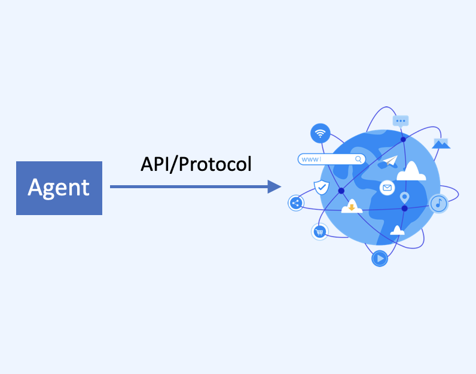

# What Makes Agentic Web Different

Agent들은 본질적으로 **AI 업계의 합의**가 되었습니다. 의견 차이가 있다면, 그것은 구현 일정에 관한 것일 가능성이 높습니다. 현재 업계는 주로 agent 자체를 구축하는 방법에 초점을 맞추고 있으며, agent들이 어떻게 협업하는지와 agent 네트워크의 특성에 대한 연구는 상대적으로 적습니다.

이 글에서 우리는 인터넷 진화의 본질이라는 관점에서 Agentic Web과 기존 인터넷의 차이점을 탐구하려고 합니다: **새로운 기술의 능력을 해방시키는 것**.

우리는 agent들이 소프트웨어 자체에 중대한 변화를 가져올 뿐만 아니라 인터넷에도 **심오한 변화**를 가져올 것이라고 믿습니다.

현재 글로벌 인터넷 시장 규모를 고려할 때, Agentic Web을 다르게 만드는 것이 무엇인지를 이해하는 것은 최소한 수천억 달러 규모의 질문입니다.

핵심 포인트:

- 인터넷 진화에서 가장 근본적인 질문은 **새로운 기술의 잠재력을 최대화**하는 방법입니다. 차세대 인터넷은 의심할 여지없이 AI 기술 개발로 인해 심오한 변화를 겪을 것입니다.
- AI의 능력을 해방시키기 위해, 우리는 AI가 완전한 맥락 정보에 접근할 수 있고, 인터넷에서 사용 가능한 모든 도구를 활용할 수 있으며, 가장 능숙한 방식으로 인터넷과 상호작용할 수 있고, 인터넷의 다른 AI들과 효율적으로 협업할 수 있도록 해야 합니다.
- 이를 달성하기 위해, 우리는 세 가지 문제를 해결해야 합니다: **상호연결성**, **네이티브 인터페이스**, **효율적인 협업**.
- API나 통신 프로토콜이 AI가 인터넷과 상호작용하는 최적의 방법입니다. 우리는 AI가 인간을 모방하게 하는 Computer Use 기술에 대해 낙관적이지 않습니다; AI 휴대폰은 터미널에서 다양한 앱을 통합하는 솔루션을 제공합니다; Anthropic의 MCP가 우리의 비전과 가장 밀접하게 일치합니다.
- **개인 어시스턴트**는 차세대 인터넷의 새로운 게이트웨이가 될 것이며, agent들이 인터넷의 모든 곳에 침투할 것입니다. 이러한 agent들은 상호연결되고, 자기조직화되고, 자기협상하여 효율적인 협업 네트워크를 구축할 수 있습니다.
- 우리는 agent 통신을 위한 오픈소스 프로토콜을 개발하고 있습니다: AgentNetworkProtocol (ANP), Agentic Web 시대의 HTTP가 되는 것을 목표로 합니다.

## 인터넷 진화의 근본적 동력은 무엇인가?

우리는 가장 근본적인 문제, 즉 인터넷 진화를 이끄는 근본적인 힘이 **새로운 기술의 능력을 해방시키는 방법**이라고 믿습니다.

이런 질문을 분석해 봅시다: PC 인터넷 시대에는 웹 기반 제품이 주류였는데, 왜 모바일 인터넷 시대에는 앱이 주류가 되었을까요?

PC 인터넷 시기에 새로운 기술은 주로 네트워크 통신 기술(TCP/IP, DNS, HTTP), Web 기술(HTML, CSS, JavaScript), 데이터베이스 기술, 정보 검색 기술로 구성되었습니다. 브라우저와 Web 기술을 매개로 한 제품 형태는 개방형 인터넷 접근의 힘을 해방시켜 정보가 통합된 진입점을 통해 광범위하게 접근될 수 있게 했습니다.

당시의 기술적 조건(제한된 대역폭과 하드웨어 성능) 및 웹 기술의 크로스 플랫폼 특성과 결합되어, 이는 Web이 PC 인터넷에 가장 적합한 제품 형태임을 결정했습니다.

모바일 인터넷 시대에 새로운 기술에는 모바일 기기와 하드웨어(가속도계, 자이로스코프, GPS, 터치스크린, 카메라, 칩), 모바일 네트워크(3G, 4G, 5G), 모바일 운영체제(iOS, Android)가 포함되었습니다.

웹 기술과 비교했을 때, 앱은 운영체제 API를 통해 하드웨어 능력을 깊이 통합하고, 기기 성능에 맞춰 실행 효율성을 최적화하며, 실시간 상호작용으로 지속적인 온라인 존재를 유지할 수 있습니다.

이러한 요소들이 새로운 기술적 능력을 앱을 통해 해방시킬 수 있게 하여, 그들의 사용자 경험을 웹보다 훨씬 우수하게 만들고 모바일 인터넷 시대의 주류 제품 형태가 되었습니다.

현재와 향후 10년 동안, 새로운 기술은 의심할 여지없이 생성적 인공지능, 대규모 언어 모델, agent로 대표됩니다. AI의 능력을 해방시키는 방법이 미래 인터넷 진화의 방향을 결정할 것입니다.

## 차세대 인터넷은 어떻게 AI의 능력을 해방시켜야 하는가?

현재 인터넷 인프라는 꽤 포괄적이지만, AI의 특성을 고려할 때 AI의 능력을 완전히 해방시키는 데는 여전히 도전이 있습니다.

### AI에게 **완전한 맥락 정보**와 **모든 도구 능력**에 대한 접근을 어떻게 제공할 것인가

AI는 완전한 맥락 정보가 있어야만 올바른 결정을 내릴 수 있습니다. 모든 도구 능력에 접근할 수 있어야만 복잡한 작업을 효율적으로 완료할 수 있습니다.

하지만 현재 인터넷은 본질적으로 정보 사일로로 구성되어 있으며, 그들 사이의 정보 흐름이 어렵습니다.

  

이전에는 인간이 브라우저, 앱, 검색 엔진, 소셜 네트워크를 통해 이러한 정보 사일로를 연결하는 역할을 했습니다. 미래에는 이것이 AI에 의해 더 효율적으로 수행될 것입니다.

현재 기술 솔루션들은 이러한 문제를 해결하려고 시도하고 있으며, 일반적으로 AI 휴대폰과 Computer Use 기술을 통해 AI가 그래픽 인터페이스, 브라우저, 또는 앱 터미널 인터페이스를 통해 인터넷과 연결할 수 있게 합니다. 하지만 우리는 이것들이 가장 효율적인 솔루션이 아니라고 믿습니다.

### AI가 가장 능숙한 방식으로 인터넷과 인터페이스하게 하는 방법

AI의 인터넷 접근을 위한 현재 솔루션들을 평가해 봅시다.

1. **Computer Use 기술**

많은 모델 제공업체들이 유사한 솔루션을 출시했습니다.

  

하지만 우리는 이 기술에 대해 낙관적이지 않습니다. 기존 인터넷 제품들이 인간 사용을 위해 설계되었고, 이러한 제품들이 AI를 위해 재구성되기 전에 AI가 인간을 학습하고 모방하게 하는 것은 실제로 AI가 인터넷에 접근하는 가장 빠른 경로입니다. 하지만 가장 효율적인 경로는 아닙니다. 단기 및 중기적으로는 가치가 있을 수 있지만 장기적으로는 제한된 가치를 가집니다.

2. **AI 휴대폰 솔루션**

Apple Intelligence와 같이, 많은 국내 휴대폰 제조업체들도 크게 추진하고 있습니다.

이러한 기술들은 터미널의 앱 클라이언트에서 열린 인터페이스를 통해 인터넷 데이터와 능력에 접근하는 것이 특징입니다. 이는 AI가 여러 앱에서 데이터를 얻고 여러 앱의 능력을 호출할 수 있게 합니다.

이 기술은 AI가 그래픽 인터페이스보다 기본 데이터를 처리하는 것이 자연스럽게 더 나으므로 Computer Use 기술보다 한 단계 더 나아간 것입니다. 하지만 이 솔루션에서 터미널 앱들은 어색한 위치에 있습니다 - AI 휴대폰에서 트래픽을 얻고 싶어하면서도 AI 휴대폰에 너무 많은 데이터를 열어주어 대체당하는 것을 원하지 않는 경쟁적이면서도 협력적인 관계입니다.

3. **Claude MCP**

이것이 현재 우리의 비전과 가장 잘 일치하는 솔루션입니다.

우리는 **AI가 인간과 다른 점은 그래픽 인터페이스보다 기본 데이터를 처리하는 것이 더 낫다는 것**이라고 믿습니다. AI는 가장 능숙한 방식(**API나 통신 프로토콜**)으로 인터넷과 상호작용해야 합니다.

  

우리도 일찍부터 유사한 프로젝트와 연구를 진행해 왔습니다: [Agent Network Protocol 기술 백서](https://mp.weixin.qq.com/s/17pNcvi1klEwuqDrEbLzJw).

우리와 MCP의 주요 차이점은 세계관에 있습니다:

- MCP는 모델 중심적이며, 전체 인터넷이 그것의 컨텍스트와 도구 역할을 합니다
- 우리(Agent Network Protocol)는 agent 중심적이며, 각 agent가 동등한 지위를 가지고 분산형 agent 협업 네트워크를 형성합니다

### 인터넷에서 AI들 간의 효율적인 협업을 어떻게 가능하게 할 것인가

전통적인 네트워크 노드들은 종종 하드코딩되거나 수동 방법을 통해 연결됩니다. AI를 사용하면 네트워크 연결과 협업 방법이 더 효율적이 될 수 있습니다.

예를 들어, 두 AI 노드가 자연어 생성과 이해 능력을 사용하여 먼저 자연어로 그들의 능력과 인터페이스를 소통한 다음, 표준 프로토콜이나 합의 프로토콜을 사용하여 통신과 협업을 할 수 있습니다.

이는 더 효율적이고 비용이 낮은 협업 네트워크를 구축하는 데 도움이 될 것입니다.

  

마지막으로 요약하면, 인터넷이 AI의 능력을 완전히 해방시키기 위해서는 세 가지 문제를 해결해야 합니다:

- 🌐 **상호연결성**: 모든 agent들이 서로 통신할 수 있게 하고, 데이터 사일로를 해체하고, AI가 완전한 맥락 정보를 얻고 인터넷의 모든 도구에 접근할 수 있게 합니다.
- 🖥️ **네이티브 인터페이스**: AI는 인터넷에 접근하기 위해 인간을 모방할 필요가 없어야 하며, 가장 능숙한 방식(API나 통신 프로토콜)으로 인터넷과 상호작용해야 합니다.
- 🤝 **효율적인 협업**: AI를 사용하여 agent들이 자기조직화하고 자기협상하여 기존 인터넷보다 더 비용 효율적이고 효율적인 협업 네트워크를 구축할 수 있습니다.

## Agentic Web은 어떤 모습일까요?

Agentic Web을 정의하는 것은 중요한 명제이며, 우리는 학문적으로 엄밀한 정의를 제공할 수 없습니다. 하지만 일반적인 관점에서 우리의 이해를 설명할 수 있습니다. 이는 코끼리를 만지는 장님들과 같습니다 - 우리는 우리가 "만진" 부분을 설명하고 있습니다.

1. **Agent들이 새로운 게이트웨이가 됩니다**

PC 인터넷 시대는 사람들이 PC를 사용하여 온라인에 접속하는 것이었고; 모바일 인터넷 시대는 사람들이 모바일 기기를 사용하여 온라인에 접속하는 것이었으며; Agentic Web 시대는 agent들이 사람들을 대신하여 온라인에 접속하고 디지털 세계와 상호작용하는 것이 될 것입니다.

이 게이트웨이는 미래에 특별한 유형의 agent가 될 가능성이 높습니다: 슈퍼 개인 어시스턴트. 이것은 인간을 대신하여 온라인에 접속하고 클라이언트 측에서 개인화된 UI를 통해 인간과 상호작용할 것입니다. 백엔드에서는 API나 프로토콜을 통해 다른 agent들과 상호작용할 것입니다.

  

2. **Agent들이 인터넷의 모든 곳에 침투합니다**

개인 어시스턴트 외에도, 우리는 최종 사용자와 직접 상호작용하지 않는 많은 agent들이 인터넷에 있을 것이라고 믿습니다. 호텔, 레스토랑, 은행, 학교 agent들과 같이 개인 어시스턴트와의 상호작용을 통해 인간에게 간접적으로 서비스를 제공합니다.

3. **Agent들이 상호연결될 수 있습니다**

개인 어시스턴트든 백엔드 서비스 agent든, 어떤 회사나 플랫폼에 속하든 상관없이 모두 상호연결될 수 있습니다.

4. **더 평평한 네트워크**

Agent들이 사람이나 개체를 노드로 나타내어 인터넷에서 연결하고 협업할 수 있다면, 중앙화된 플랫폼(WeChat, Taobao 등)의 역할이 감소할 것입니다. 미래 인터넷은 더 평평하고 분산화될 것입니다.

5. **자기조직화하고 자기협상하는 효율적인 협업 네트워크**

Agent들이 자기조직화하고 자기협상하여 효율적인 협업 네트워크를 구축할 수 있습니다.

## 요약

궁극적으로, 우리는 기술 개발이 인터넷 진화를 이끈다고 믿으며, 새로운 기술적 능력을 해방시키는 방법이 인터넷 진화의 방향을 결정한다고 믿습니다.

Agentic Web이 등장할지 아직 확실하지 않지만, 미래 인터넷이 AI 기술 개발로 인해 심오한 변화를 겪을 것이라는 것은 확실합니다.

## 연락처

우리는 단순한 몽상가가 아닙니다.

우리의 비전에 기반하여, 우리는 agent 통신을 위한 개방 표준 프로토콜을 개발하고 있습니다: **AgentNetworkProtocol (ANP)**. 프로젝트 주소: [https://github.com/agent-network-protocol/AgentNetworkProtocol](https://github.com/agent-network-protocol/AgentNetworkProtocol).

AgentNetworkProtocol은 Agentic Web 시대의 HTTP가 되는 것을 목표로 합니다. 우리의 비전은 agent들이 서로 어떻게 연결되는지를 정의하여 수십억 개의 agent를 위한 개방적이고 안전하며 효율적인 협업 네트워크를 구축하는 것입니다.

agent 통신 프로토콜이나 Agentic Web에도 관심이 있으시면 언제든지 연락해 주세요. 우리는 국내외 AI 실무자들과 아이디어를 공유하고 교환해 왔습니다:

- WeChat: flow10240
- Email: <chgaowei@gmail.com>

**마지막으로**, 확장성을 고려하지 않는다면 web3가 진정으로 AI에 가장 적합한 인터넷 형태라고 항상 믿어왔습니다. web3+AI를 작업하고 계시다면, 우리와 논의하는 것을 환영합니다.

## Copyright Notice

Copyright (c) 2024 GaoWei Chang  
This file is released under the [MIT License](./LICENSE). You are free to use and modify it, but you must retain this copyright notice.
