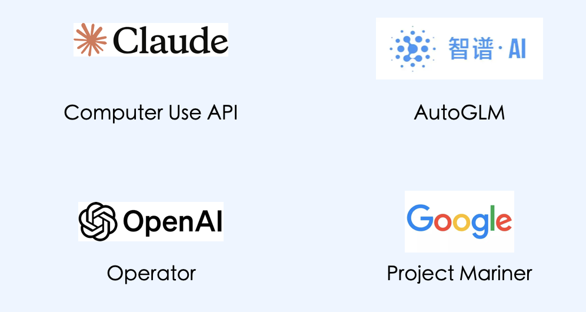
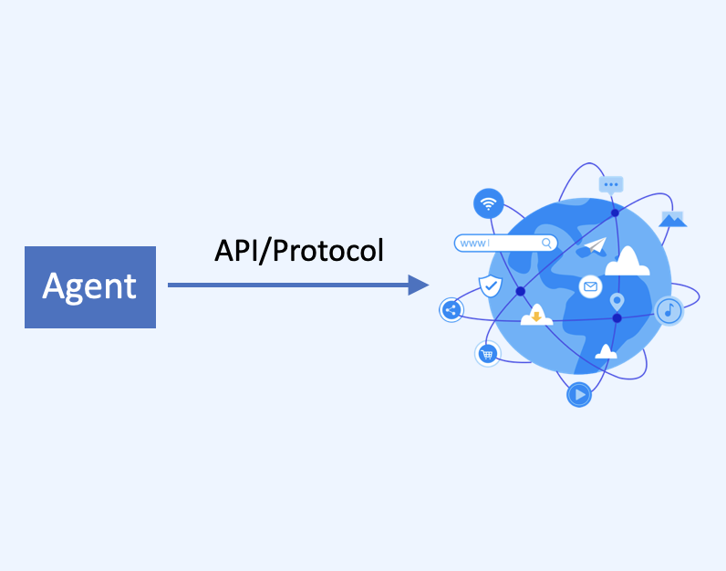
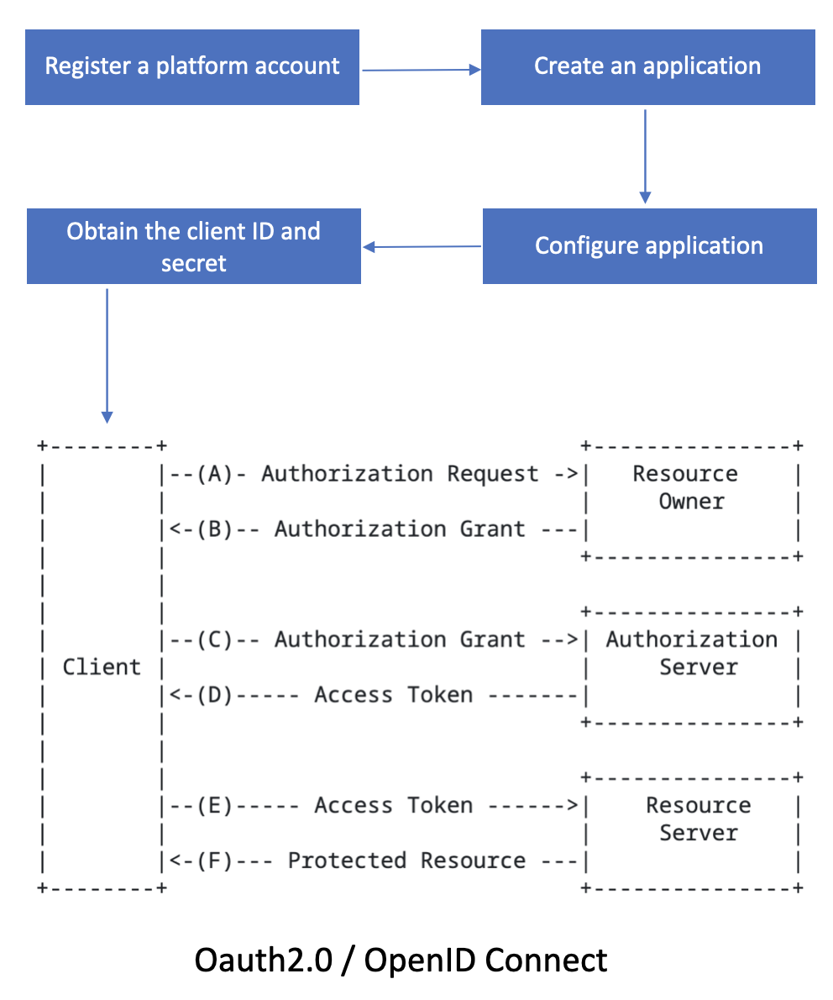
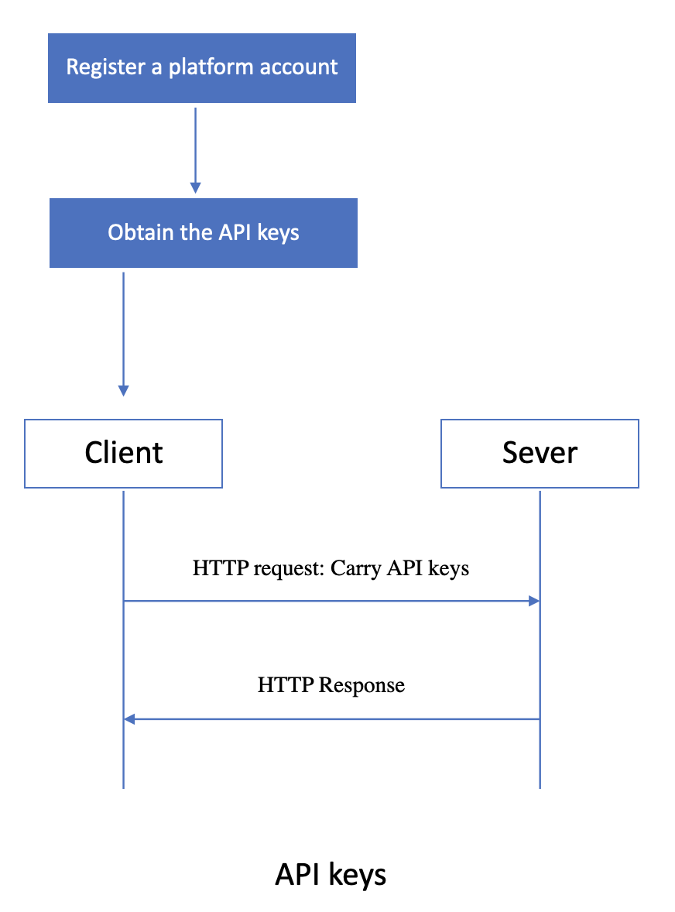
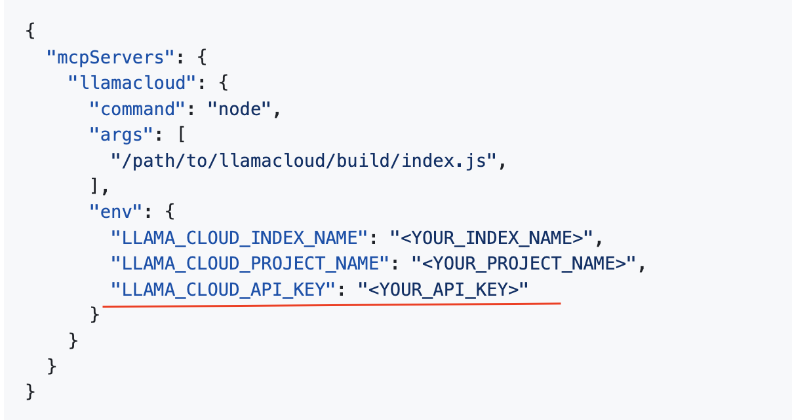
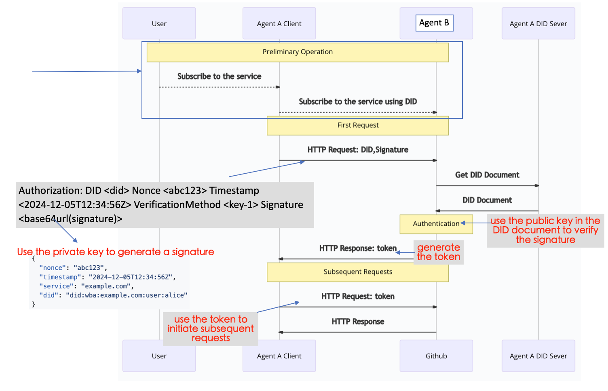

# The Most Suitable Identity Authentication Technology for Agents: Comparing OpenID Connect, API Keys, and did:wba

## Agent는 새로운 신원 인증 기술이 필요합니다

Agent는 신원 인증 기술에 새로운 요구사항을 제시했으며, 그 중 가장 중요한 것은 상호 운용성입니다. 구체적으로는 임의의 두 agent가 서로 연결하고 통신할 수 있도록 하는 것입니다.

원리는 간단합니다: AI는 **완전한 컨텍스트 정보를 얻고 모든 도구에 접근할 수 있는 능력**을 가져야 올바른 결정을 내리고 적절한 행동을 취할 수 있습니다. 많은 벤더들이 현재 Computer Use 솔루션을 사용하여 이 문제를 해결하려고 시도하고 있습니다.

  

하지만 우리는 이것이 AI가 인터넷과 상호작용하는 가장 효율적인 방법이 아니라고 생각합니다. 이 접근법은 AI가 인터넷에 접근하는 인간의 방법을 모방하게 만드는 반면, AI는 가장 능숙한 방법(API나 통신 프로토콜)을 사용하여 디지털 세계와 상호작용해야 합니다.

  

이것은 상호 운용성 문제를 제기합니다: agent가 API나 프로토콜을 사용하여 인터넷이나 다른 agent와 상호작용할 때, 신원 확인은 어떻게 수행되어야 할까요? 특히, 임의의 agent 간 연결을 가능하게 하는 크로스 플랫폼 신원 확인은 어떻게 구현할 수 있을까요?

## 현재 주류 크로스 플랫폼 신원 인증 기술

인터넷에서 우리의 신원 계정은 종종 크로스 플랫폼 호환성이 없습니다. 예를 들어, WeChat 계정은 DingTalk 시스템에서 인식되지 않고, 그 반대도 마찬가지입니다.

하지만 오늘날 인터넷에는 많은 크로스 플랫폼 신원 인증 기술이 있습니다. 예를 들어 흔한 SSO(Single Sign-On)에서는 Google 계정을 사용하여 많은 웹사이트에 로그인할 수 있습니다. 또한 OpenAI가 API 접근을 위해 제공하는 키와 같은 API 키도 있습니다. 이 두 기술을 간단히 소개하고 agent 신원 인증에 적합한지 살펴보겠습니다.

### OpenID Connect (OIDC)

OpenID Connect (OIDC)는 OAuth 2.0을 기반으로 구축된 인증 프로토콜로, 클라이언트 애플리케이션이 사용자 신원을 확인하고 기본 사용자 정보(이름, 이메일 등)를 얻을 수 있게 합니다. OIDC는 OAuth 2.0 위에 표준화된 신원 계층을 추가하여 로그인 및 single sign-on (SSO) 시나리오에 더 적합하게 만듭니다.

[OpenID Connect 공식 사양](https://openid.net/specs/openid-connect-core-1_0.html)

Google 계정으로 제3자 웹사이트에 로그인하는 것을 예로 들어 OIDC 프로세스를 설명해보겠습니다. [Google OIDC 공식 문서](https://developers.google.com/identity/protocols/oauth2/openid-connect).

  

Google 계정을 사용하여 제3자 웹사이트에 로그인하는 과정은 두 부분으로 나뉩니다: 예비 과정과 OAuth 2.0 과정:

- 예비 과정
  - Google 플랫폼 계정 등록
  - 프로젝트/애플리케이션 생성
  - redirect URI를 포함한 프로젝트/애플리케이션 설정
  - OAuth 2.0 client ID와 client secret 획득
- OAuth 2.0 과정 (authorization code flow 예시)
  - authorization code 획득
  - authorization code를 사용하여 access token과 사용자 정보가 포함된 ID token 획득
  - access token과 ID token을 사용하여 상세한 사용자 정보에 접근 (선택사항). OpenID Connect 과정에서 상세한 사용자 정보는 보호된 리소스로 간주됩니다.

OpenID Connect의 장점:

- 사용자 인증 과정 단순화
- 잘 확립된 인프라로 널리 사용됨
- 높은 보안성

agent 상호 운용성 관점에서 OpenID Connect는 몇 가지 제한사항이 있습니다:

- OpenID Connect는 본질적으로 제3자 애플리케이션이 신원 서버(Google 등)를 사용하여 사용자 인증을 할 수 있게 합니다. 두 제3자 애플리케이션은 신원 서버를 사용하여 서로 간에 인증할 수 없습니다.
- OpenID Connect는 사용자가 신원 서버에 등록해야 하는 중앙집중식 솔루션으로, 예비 과정이 복잡합니다.
- 상호작용 과정이 복잡하여 여러 번의 교환이 필요합니다.

### API Keys

API Keys는 Application Programming Interface (API)에 접근하는 애플리케이션이나 사용자를 인증하는 데 사용되는 간단한 자격 증명입니다. 일반적으로 무작위로 생성된 문자와 숫자로 구성된 문자열 기반 신원 식별자로, 비밀번호와 유사하게 작동합니다. 인증, 접근 제어, 사용량 모니터링 및 기타 시나리오에 사용할 수 있습니다.

  

API Keys를 사용한 사용자 인증 과정:

- 예비 과정
  - 플랫폼에 계정 등록
  - API Keys 획득
- API Keys 인증 과정
  - HTTPS와 같은 보안 프로토콜의 요청 헤더에 API 키 추가
  - 서버가 클라이언트의 API 키 검증

API keys의 장점:

- 간단하고 구현하기 쉬우며 최소한의 상호작용
- 크로스 플랫폼 인증 지원; 두 애플리케이션이 서로의 API 키로 신원을 확인할 수 있음
- OpenAI와 국내 모델 API 등 API 서비스에서 널리 사용되며, 대부분 인증에 API 키 사용

agent 상호 운용성 관점에서 API keys는 몇 가지 제한사항이 있습니다:

- 보안성이 낮음. API 키를 인증에 사용하는 많은 MCP 서버들이 종종 사용자가 구성 파일에 API 키를 작성하도록 요구하여 노출 위험이 있습니다.

  

- 여전히 사용자 등록과 로그인을 포함한 예비 과정이 필요합니다.

## W3C DID 기반 인증 기술: did:wba

### W3C DID란 무엇인가

W3C DID (Decentralized Identifier)는 전통적인 중앙집중식 신원 관리 시스템의 의존성을 해결하기 위해 설계된 새로운 탈중앙화 식별자 표준입니다. 2022년에 권장 표준이 되었습니다. 사양: [https://www.w3.org/TR/did-core/](https://www.w3.org/TR/did-core/)

현재 많은 애플리케이션이 W3C DID 사양을 사용하고 있으며, 주목할 만한 예로는 최근 인기를 얻고 있는 탈중앙화 Twitter와 유사한 애플리케이션인 Bluesky가 있습니다.

### did:wba란 무엇인가

did:wba는 [AgentNetworkProtocol (ANP)](https://github.com/agent-network-protocol/AgentNetworkProtocol)에서 정의한 DID 방법 사양입니다. 웹 인프라를 기반으로 한 탈중앙화 인증을 구현하며, 특히 agent 간 인증을 위해 설계되었습니다. 사양: [did:wba Method Specification](https://github.com/agent-network-protocol/AgentNetworkProtocol/blob/main/03-did%3Awba%20Method%20Design%20Specification.md).

did:wba는 기능상 이메일과 매우 유사합니다: 서로 다른 플랫폼이 각각의 계정을 가지고 있지만 서로 다른 플랫폼 간에 쉽게 인증하고 통신할 수 있습니다. 둘 다 웹 인프라를 기반으로 하여 대규모 사용자를 지원하면서 탈중앙화를 달성합니다.

Agent A가 Agent B의 서비스를 구독하고 호출하려고 한다고 가정하면, 인증 및 요청 과정은 다음과 같습니다:

  

- 예비 과정
  - Agent A가 Agent B의 서비스를 구독하고자 할 때, 먼저 Agent A의 DID와 서명으로 Agent B의 서비스 구독 인터페이스를 호출하여 B에게 구독이 Agent A로부터 온 것임을 알립니다. API 구독을 사용하여 복잡한 등록, 로그인, 구성 과정을 제거하고 두 agent 간 연결 비용을 줄일 수 있습니다.
- 인증 과정
  - Agent A는 첫 번째 HTTP 요청에서 HTTP 헤더에 자신의 DID와 서명을 포함합니다.
  - Agent B가 HTTP 요청을 받으면, HTTP 헤더에서 A의 DID와 서명을 추출한 다음 A의 DID를 사용하여 A의 DID 서버에서 A의 DID 문서를 검색합니다.
  - A의 DID 문서를 얻은 후, Agent B는 A의 DID 문서에 있는 공개 키를 사용하여 A의 서명을 검증합니다.
  - 검증 후, Agent B는 A의 비즈니스 요청을 처리하고 비즈니스 데이터와 함께 access token을 반환합니다.
  - Agent A는 후속 요청에서 access token을 포함하고, Agent B는 access token을 검증하여 A를 인증합니다.

did:wba 인증의 장점:

- 높은 보안성
- 웹 인프라를 효과적으로 활용하여 대규모 사용자를 지원하고 강력한 구현 가능성
- 임의의 두 agent나 애플리케이션 간 인증을 가능하게 하는 탈중앙화 설계
- 수동 사용자 등록이나 로그인 구성이 필요 없는 간단한 예비 과정
- 상호작용 빈도를 증가시키지 않는 간단한 인증 과정

물론 did:wba에도 몇 가지 제한사항이 있으며, 주요한 것은 2022년에 발표된 사양으로서 인프라가 아직 완전히 개발되지 않았고 적용 범위가 상대적으로 제한적이라는 점입니다. 하지만 Bluesky와 같은 스타 케이스가 등장하는 것을 볼 수 있습니다.

## 비교: did:wba vs OpenID Connect / API Keys

agent 인증 관점에서 did:wba를 OpenID Connect 및 API keys와 비교하면:

- 보안성: did:wba와 OpenID Connect는 동등한 보안 수준을 가지며, 둘 다 API keys보다 높습니다.
- 복잡성: OpenID Connect가 가장 높은 복잡성을, API keys가 가장 낮은 복잡성을 가지며, did:wba는 중간입니다.
- 상호작용 빈도: did:wba와 API keys는 최소한의 상호작용이 필요하고, OpenID Connect는 가장 많은 상호작용이 필요합니다.
- 예비 과정: did:wba는 수동 사용자 개입 없이 작동할 수 있는 반면, OpenID Connect와 API keys는 수동 사용자 처리가 필요합니다.
- 탈중앙화: did:wba와 API keys는 임의의 agent나 애플리케이션 간 통신을 가능하게 합니다. OpenID Connect는 불가능합니다.
- 적용 범위: OpenID Connect와 API keys는 널리 적용되는 반면, did:wba는 제한된 적용 범위를 가진 새로운 사양입니다.

전체 비교:

| 비교 항목 | did:wba | OpenID Connect | API keys |
|:-------|:--------|:---------------|:---------|
| 보안성 | 높음 | 높음 | 중간 |
| 복잡성 | 중간 | 높음 | 낮음 |
| 상호작용 빈도 | 낮음 | 높음 | 낮음 |
| 예비 과정 | 간단, 수동 작업 없음 | 복잡, 수동 작업 필요 | 중간, 수동 작업 필요 |
| 탈중앙화 | 예 | 아니오 | 예 |
| 적용 범위 | 제한적 | 광범위 | 광범위 |

위의 비교에서 볼 수 있듯이, did:wba는 모든 agent 간의 상호 연결을 지원할 뿐만 아니라 OpenID Connect의 보안성과 API keys의 단순성을 모두 갖추고 있으며, 대규모 사용자 채택을 지원합니다. 전반적으로 did:wba는 agent 간 인증에 가장 적합한 솔루션입니다.

물론 OpenID Connect와 API keys도 여전히 역할이 있습니다. 예를 들어, agent가 기존 인터넷 시스템과 인터페이스할 때는 여전히 OpenID Connect와 API keys를 사용해야 할 수 있습니다.

## Copyright Notice

Copyright (c) 2024 GaoWei Chang  
This file is released under the [MIT License](./LICENSE). You are free to use and modify it, but you must retain this copyright notice.
