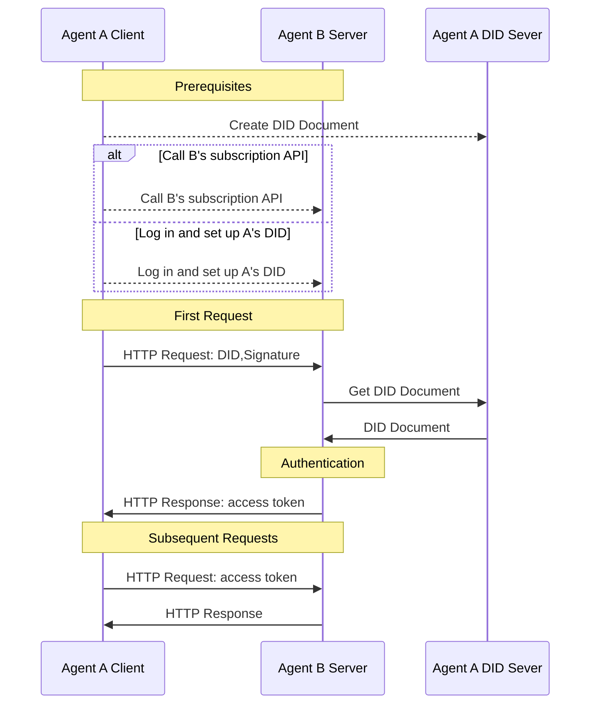

# did:wba - A Web-based Decentralized Identifier

## 1. 소개

did:wba 방법은 W3C Decentralized Identifiers (DIDs) 표준 하의 초안 방법 사양입니다. 2022년에 W3C 권장사항으로 발표된 [W3C DIDs](https://www.w3.org/TR/did-core/) 표준은 검증 가능하고 탈중앙화된 디지털 신원을 가능하게 하는 새로운 유형의 식별자입니다. DID를 기반으로 사용자는 진정으로 자신의 신원을 제어할 수 있으면서 서로 다른 애플리케이션 간의 상호 운용성을 향상시킬 수 있습니다. DID는 Bluesky를 포함한 많은 애플리케이션에서 널리 채택되었습니다.

DID의 핵심 구성 요소는 DID Document로, 특정 DID와 관련된 핵심 정보를 포함합니다. 예를 들어 DID 소유자의 신원을 확인하는 데 사용되는 공개 키 등이 있습니다. DID 방법은 DID 문서를 생성, 저장, 업데이트 및 폐기하는 방법을 정의합니다.

우리는 [did:wba method](/03-did:wba%20Method%20Design%20Specification.md)를 설계했습니다. did:wba 방법은 기존의 성숙한 기술과 웹 인프라를 완전히 활용하여 기존 시스템의 완전한 재구성을 요구하지 않고 탈중앙화 신원 인증을 쉽게 구현할 수 있습니다. 플랫폼은 중앙집중적인 방식으로 계정 시스템을 관리하면서 각 사용자를 위한 did:wba DID를 생성하여 플랫폼 간 상호 연결을 달성할 수 있습니다.

did:wba 방법을 사용하는 신원 시스템은 이메일과 유사한 비즈니스 특성을 달성할 수 있습니다. 각 플랫폼이 중앙집중적인 방식으로 자체 계정 시스템을 구현하면서 플랫폼 간 상호 연결을 가능하게 합니다.

API keys와 비교하면 did:wba 방법은 우수한 보안성을 제공하고, OpenID Connect와 비교하면 did:wba 방법은 더 간단한 상호작용과 더 큰 탈중앙화를 특징으로 합니다. 자세한 비교는 [did:wba vs OpenID Connect and API keys](/blogs/Comparison%20of%20did:wba%20with%20OpenID%20Connect%20and%20API%20keys.md)를 참조하세요.

did:wba 방법은 또한 [did:wba Security Principle Analysis](/blogs/did-wba-security-principles.md)에서 설명한 바와 같이 OpenID Connect와 동등한 보안성을 제공합니다.

## 2. DID Document

did:wba 방법을 사용하여, 기본 DID 문서는 다음과 같습니다:

```json
{
    "@context": [
      "https://www.w3.org/ns/did/v1",
      "https://w3id.org/security/suites/jws-2020/v1",
      "https://w3id.org/security/suites/secp256k1-2019/v1",
      "https://w3id.org/security/suites/ed25519-2020/v1",
      "https://w3id.org/security/suites/x25519-2019/v1"
    ],
    "id": "did:wba:example.com%3A8800:user:alice",
    "verificationMethod": [
      {
        "id": "did:wba:example.com%3A8800:user:alice#WjKgJV7VRw3hmgU6--4v15c0Aewbcvat1BsRFTIqa5Q",
        "type": "EcdsaSecp256k1VerificationKey2019",
        "controller": "did:wba:example.com%3A8800:user:alice",
        "publicKeyJwk": {
          "crv": "secp256k1",
          "x": "NtngWpJUr-rlNNbs0u-Aa8e16OwSJu6UiFf0Rdo1oJ4",
          "y": "qN1jKupJlFsPFc1UkWinqljv4YE0mq_Ickwnjgasvmo",
          "kty": "EC",
          "kid": "WjKgJV7VRw3hmgU6--4v15c0Aewbcvat1BsRFTIqa5Q"
        }
      }
    ],
    "authentication": [
      "did:wba:example.com%3A8800:user:alice#WjKgJV7VRw3hmgU6--4v15c0Aewbcvat1BsRFTIqa5Q",
      {
        "id": "did:wba:example.com%3A8800:user:alice#key-1",
        "type": "Ed25519VerificationKey2020",
        "controller": "did:wba:example.com%3A8800:user:alice",
        "publicKeyMultibase": "zH3C2AVvLMv6gmMNam3uVAjZpfkcJCwDwnZn6z3wXmqPV"
      }
    ],
    "keyAgreement": [
      {
        "id": "did:wba:example.com%3A8800:user:alice#key-2",
        "type": "X25519KeyAgreementKey2019", 
        "controller": "did:wba:example.com%3A8800:user:alice",
        "publicKeyMultibase": "z9hFgmPVfmBZwRvFEyniQDBkz9LmV7gDEqytWyGZLmDXE"
      }
    ]
}
```

authentication 섹션의 공개 키는 신원 확인을 위해 사용됩니다. 이는 상대방이 올바른 DID 문서를 안전하게 얻을 수 있다면 올바른 공개 키를 얻을 수 있다는 것을 의미합니다. 그러면 공개 키를 사용하여 사용자의 서명을 검증함으로써 사용자의 신원을 확인할 수 있습니다.

DID 문서의 생성, 업데이트 및 폐기는 사용자 자신이 결정합니다. 예를 들어, 사용자는 자신의 DID 문서를 자신의 서버나 제3자 서버에 저장하도록 선택할 수 있습니다. 어디에 저장되든 사용자는 자신의 DID 문서에 대한 제어권을 유지해야 합니다.

또한 사용자는 다른 사람들이 자신의 DID 문서를 안전하게 얻을 수 있도록 HTTP 방법을 제공해야 합니다. DID 문서를 얻기 위한 HTTP 주소는 DID에서 유도할 수 있습니다. 즉, 사용자가 DID를 가지면 해당 DID 문서를 HTTP를 통해 얻을 수 있습니다. 변환 방법은 다음과 같습니다:

```plaintext
예시:
did:wba:example.com:user:alice
 -> https://example.com/user/alice/did.json
```

## 3. 크로스 플랫폼 신원 인증 과정

did:wba는 HTTP 프로토콜과 함께 사용되어 추가 상호작용을 추가하지 않고 단일 HTTP 요청에서 신원 인증, 권한 확인 및 데이터 교환을 완료할 수 있습니다. 다음은 did:wba와 HTTP 프로토콜이 결합된 상호작용 플로우입니다:



1. 전제 조건:

- 사용자 A가 DID를 생성하고 Agent A의 DID 서버에 DID 문서를 저장합니다.
- Agent B는 Agent A의 DID를 알아야 하며, 이는 두 가지 방법 중 하나로 달성할 수 있습니다:
  - 사용자 A가 Agent B 시스템에 로그인하여 A의 DID를 설정합니다.
  - 또는 Agent B의 구독 API를 호출하고 구독 DID를 A의 DID로 설정합니다. **이 접근법은 두 agent 간의 연결 비용을 크게 줄일 수 있습니다.**

2. 신원 인증 과정:

- 클라이언트인 Agent A가 요청 데이터 외에 DID, nonce, timestamp, signature 및 기타 정보를 포함하는 HTTP 요청을 시작합니다.
- 서버인 Agent B가 요청을 받고 요청 헤더에서 DID, nonce, timestamp, signature 및 기타 정보를 추출합니다.
- Agent B는 DID를 사용하여 Agent A의 DID 서버에서 DID 문서를 검색합니다.
- Agent B는 DID 문서의 공개 키를 사용하여 클라이언트의 서명을 검증합니다.
- 검증이 통과한 후, Agent B는 클라이언트의 비즈니스 요청을 처리하고 비즈니스 데이터와 토큰을 모두 반환합니다.
- Agent A는 후속 요청에 토큰을 포함하고, Agent B는 토큰을 검증하여 클라이언트 인증을 완료합니다.

전체 과정에서 보듯이, HTTP를 사용하여 did:wba는 상호작용 수를 증가시키지 않고 신원 인증을 완료할 수 있습니다. 또한 두 agent(또는 애플리케이션)가 상호 통신 중에 직접 서로의 구독 인터페이스를 호출하여 서비스를 구독할 수 있게 하며, 서로의 시스템에 수동 등록이 필요하지 않습니다. 이는 agent 간 상호 연결의 장벽을 줄입니다.

## 4. 사용 사례

1. 사용 사례 1: 사용자가 지능형 비서를 통해 다른 웹사이트의 파일에 접근

Alice가 example.com에 파일을 저장했고, 나중에 지능형 비서를 통해 접근하고 싶어합니다. 이를 위해 Alice는 먼저 지능형 비서에서 did:wba 방법을 기반으로 DID를 생성하고, example.com에 로그인하여 이 DID를 자신의 계정과 연결하고, DID에 파일 접근 권한을 부여합니다. 설정이 완료된 후, 지능형 비서는 이 DID를 사용하여 example.com에 로그인할 수 있고, 신원 확인 후 example.com은 지능형 비서가 Alice의 저장된 파일에 접근하는 것을 허용합니다. 이 DID는 다른 웹사이트에서도 구성하여 지능형 비서가 다른 플랫폼의 파일에 접근할 수 있게 할 수 있습니다.

2. 사용 사례 2: 사용자가 지능형 비서를 통해 제3자 플랫폼 서비스 API 호출

Alice가 지능형 비서를 통해 "example"이라는 제3자 서비스 API를 호출하고 싶어합니다. 먼저 Alice는 지능형 비서에서 did:wba 방법을 기반으로 DID를 생성하고 이 DID를 사용하여 API 인터페이스를 호출하여 example 플랫폼에서 관련 서비스를 구독합니다. example 서비스는 DID를 통해 신원 인증을 완료하고, 구매자가 Alice임을 확인하고, 그녀의 DID를 기록합니다. 인증이 완료된 후, Alice는 지능형 비서를 통해 이 DID를 사용하여 example 서비스의 API를 호출하여 작업을 수행할 수 있습니다.

> 현재 사용 사례에서는 클라이언트-서버 인증이 설명되지 않았지만, 이 과정은 실제로 작동할 수 있습니다.

## 5. 코드

우리는 개발을 완료하고 오픈소스로 공개했습니다. 자세한 내용은 다음을 참조하세요: [https://github.com/agent-network-protocol/AgentConnect/blob/master/README.md#decentralized-authentication-based-on-didwba-and-http](https://github.com/agent-network-protocol/AgentConnect/blob/master/README.md#decentralized-authentication-based-on-didwba-and-http)

## 6. 참고 자료

[did:wba Method Specification](https://github.com/agent-network-protocol/AgentNetworkProtocol/blob/main/english/03-did-wba-method-specification.md)

[DID-CORE](https://www.w3.org/TR/did-core/)

[AgentNetworkProtocol Technical White Paper](https://github.com/agent-network-protocol/AgentNetworkProtocol/blob/main/english/01-AgentNetworkProtocol-technical-white-paper.md)

## Copyright Notice

Copyright (c) 2024 GaoWei Chang  
This file is released under the [MIT License](./LICENSE). You are free to use and modify it, but you must retain this copyright notice.
