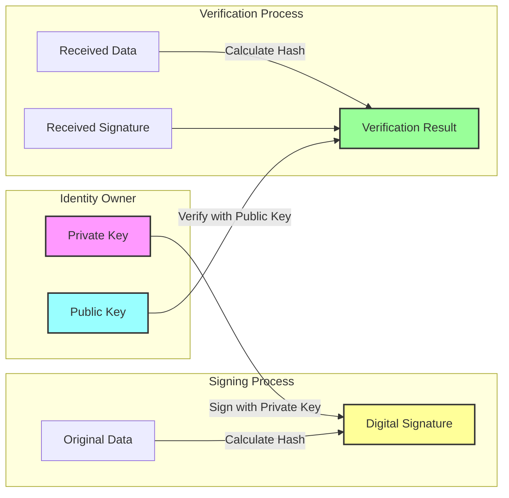

# Security Principles of did:wba

웹 기반 탈중앙화 식별자 방법인 did:wba는 보안을 핵심으로 합니다. 이 글에서는 did:wba의 보안 원칙을 깊이 있게 탐구하고 신뢰할 수 있고 안전한 신원 확인을 어떻게 보장하는지 분석합니다.

관련 did:wba 자료:

- did:wba 사양: [did:wba Specification](https://github.com/agent-network-protocol/AgentNetworkProtocol/blob/main/03-did%3Awba%20Method%20Design%20Specification.md)
- did:wba 간단한 소개: [did:wba - Web-based Decentralized Identifier](https://github.com/agent-network-protocol/AgentNetworkProtocol/blob/main/blogs/did%3Awba%2C%20a%20Web-based%20Decentralized%20Identifier.md)
- did:wba와 다른 솔루션 간의 비교: [did:wba vs OpenID Connect and API keys](https://github.com/agent-network-protocol/AgentNetworkProtocol/blob/main/blogs/Comparison%20of%20did%3Awba%20with%20OpenID%20Connect%20and%20API%20keys.md)

## 1. 보안의 기초: 비대칭 암호화

did:wba의 보안은 주로 비대칭 암호화를 기반으로 구축됩니다. 이 암호화 방법은 키 쌍을 사용합니다:

- Private Key: 신원 소유자만이 보유하며, 서명에 사용됩니다
- Public Key: 공개적으로 공유될 수 있으며, 서명 검증에 사용됩니다



이 암호화 메커니즘은 다음을 보장합니다:

1. 개인 키 보유자만이 유효한 서명을 생성할 수 있습니다. 개인 키는 기밀로 유지되어야 합니다.
2. 누구나 공개 키를 사용하여 서명의 진위를 확인할 수 있습니다. 성공적인 검증은 서명이 개인 키 보유자에 의해 생성되었음을 확인합니다.
3. 개인 키는 공개 키로부터 유도될 수 없습니다. 키 쌍은 함께 생성되지만, 공개 키는 개인 키를 노출할 수 없습니다.

## 2. DID Document 보안 보장

위의 과정에서 두 가지 핵심 사항이 did:wba의 보안을 보장합니다:

1. 개인 키의 기밀성이 유지되어야 합니다.
2. 검증자는 올바른 공개 키를 얻어야 합니다.

did:wba에서 사용자는 자신의 개인 키를 유지하고, 공개 키는 DID Document에 포함됩니다. DID Document는 사용자의 DID 서버에 저장되며 HTTPS 프로토콜을 사용하여 DID에서 생성된 URL을 통해 누구나 접근할 수 있습니다.

기본적으로 사용자가 올바른 DID Document를 얻을 수 있다면 상대방의 신원을 확인할 수 있습니다. did:wba에서는 사용자가 도메인 해결을 위해 DNS-over-HTTPS를 사용하고, HTTPS를 통해 DID Document에 접근하며, 보안 암호화 알고리즘을 사용하고, 엄격한 인증서 검증을 구현할 것을 권장합니다.

## 3. 신원 확인 과정 보안

did:wba의 신원 확인 과정은 여러 보안 메커니즘을 통합합니다:

### 3.1 요청 서명 메커니즘

각 인증 요청에는 다음이 포함됩니다:

```
Authorization: DID <did> Nonce <nonce> Timestamp <timestamp> VerificationMethod <key-id> Signature <signature>
```

구성 요소는 다음과 같습니다:

- Nonce: 재생 공격을 방지하는 무작위 수
- Timestamp: 요청의 시의성을 보장
- Signature: 중요한 정보에 서명

### 3.2 보안 조치

1. **재생 공격 방지**:
   - 각 요청에 대한 고유한 nonce 생성
   - 단일 사용 nonce 정책
   - 사용된 nonce의 서버 유지 블랙리스트

2. **Timestamp 검증**:
   - 제한된 요청 유효성 창
   - 과거 요청 재생 방지
   - 서버 측 timestamp 합리성 확인

3. **도메인 검증**:
   - 서명 데이터에 서버 도메인 포함
   - 서비스 간 서명 재사용 방지

4. **서명 검증**:
   - 서명 무결성 검증
   - 승인된 키 사용 확인

## 4. 추가 보안 고려사항

### 4.1 개인 키 손상

개인 키가 손상된 경우, 사용자는 즉시 새로운 키 쌍을 생성하고 DID Document를 업데이트해야 합니다. DID Document가 사용자의 DID 서버에 저장되어 있으므로 즉시 업데이트할 수 있습니다.

### 4.2 정기적인 키 순환

보안을 유지하기 위해 개인 키는 정기적으로 순환되어야 합니다.

## 결론

did:wba의 보안은 현대 암호학을 기반으로 하며, 비대칭 암호화, 안전한 DID Document 저장 및 검증 과정, 정기적인 개인 키 순환을 활용하여 신뢰할 수 있고 안전한 신원 확인을 보장합니다.

그 기본 원칙은 비대칭 암호화의 견고한 보안에 뿌리를 두고 있습니다. 인프라 수준에서는 새로운 인프라를 도입하지 않고 DNS, Public Key Infrastructure, HTTPS 프로토콜과 같은 기존의 성숙한 시스템에 의존합니다.

## Copyright Notice

Copyright (c) 2024 GaoWei Chang  
This file is released under the [MIT License](./LICENSE). You are free to use and modify it, but you must retain this copyright notice.
