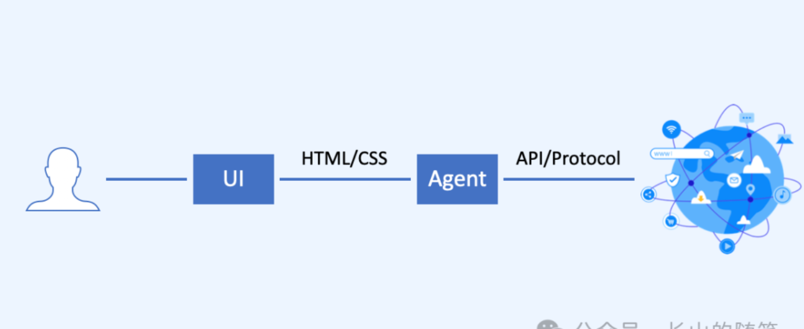

# The Three Major Trends of the Internet of Agents: The Connection Paradigm is Being Completely Restructured

저는 고전적인 인터넷 개념인 **연결이 힘이다**를 깊이 감사하게 생각합니다. 사람이 정보에 자유롭게 연결하고, 다른 사람들과 연결하고, 도구와 연결할 수 있다면, 그들은 세상을 바꿀 힘을 가지게 됩니다.

저는 Internet of Agents가 현재 인터넷의 연결 패러다임을 완전히 재구성하여 인터넷을 플랫폼에서 연결로 돌려놓을 것이라고 믿습니다.

이전에 저는 다음과 같은 글을 썼습니다: [How the Internet of Agents Differs](/blogs/What-Makes-Agentic-Web-Different.md). 오늘은 미래 Internet of Agents의 세 가지 주요 트렌드에 대해 더 깊이 알아보겠습니다. 이는 ANP (Agent Network Protocol) 설계의 기초 논리를 형성합니다.

종종 거시적 관점이 미시적 관점보다 판단하기 쉽습니다. 세부사항과 경로를 무시하고 본질을 파악함으로써 미래를 명확히 볼 수 있습니다. 이 문제에 대한 우리의 사고는 두 가지 기본 원칙에 의존합니다:

- **사회의 전반적인 운영 비용을 어떻게 낮출 것인가**
- **새로운 기술(AI)의 능력을 어떻게 더 잘 활용할 것인가**

이 글의 핵심 요점:

- Internet of Agents에 대한 세 가지 핵심 판단이 있습니다:
  - **Agent가 기존 소프트웨어를 대체할 것**이며 인터넷의 중요한 구성 요소가 될 것입니다
    - **개인 AI 비서가 새로운 인터넷 게이트웨이가 될 것**이며, 사람들이 현재 사용하는 대부분의 앱을 대체할 것입니다. 종합적인 시나리오에서는 현재 앱보다 10배 나은 경험을 제공할 수 있습니다.
    - **Agent가 기업에 서비스를 제공하는 소프트웨어를 대체할 것**입니다. 기업은 인터넷에 agent를 게시하여 사용자와 직접 연결하고 서비스를 제공할 수 있습니다.
    - **개인 AI 비서가 agent와 직접 연결하고, agent가 다른 agent와 직접 연결할 것**이며, 제3자 플랫폼을 통하지 않을 것입니다. 이는 새로운 연결 패러다임입니다.
  - **모든 agent가 다른 모든 agent와 상호 연결할 수 있어** 데이터 사일로를 해체하고 정보가 자유롭게 흐를 수 있게 할 것입니다.
    - 이를 통해 AI가 완전한 컨텍스트 정보를 얻을 수 있어 개인이나 기업이 더 지능적인 결정을 내릴 수 있도록 도울 것입니다.
    - 이를 통해 AI가 모든 도구 기능에 접근할 수 있어 개인이나 기업이 더 복잡한 작업을 완료할 수 있도록 도울 것입니다.
    - **Agent 간의 연결이 더 높은 비율을 차지할 것**이며, 인터넷의 주요 연결 유형이 될 것입니다.
  - **Agent는 프로토콜을 통해 연결할 것**이며, 이는 **AI 네이티브 연결 방식**입니다.
    - **Computer Use/Browser Use는 과도기적 형태일 뿐입니다**. AI에게 인간의 방식으로 인터넷과 상호작용하는 것을 가르치지만 AI의 능력을 완전히 활용할 수는 없습니다.
    - **프로토콜은 agent가 연결하는 가장 효율적인 방법입니다**. AI는 인간을 위해 설계된 화면의 UI나 웹 페이지의 HTML보다는 직접적이고 저수준의 데이터를 처리하는 것이 더 뛰어납니다.
    - Agent 통신 프로토콜은 HTTP처럼 agent 간의 범용 프로토콜이 될 것입니다. 미래에는 표준 agent 통신 프로토콜이 등장할 것입니다. 표준 프로토콜을 기반으로 **AI 접근을 위해 특별히 설계된 데이터 네트워크**가 등장할 것입니다.
- 생산력과 생산관계 관점에서 AI는 가장 진보된 생산력이고, 인터넷은 AI의 가장 직접적인 생산관계입니다. AI는 필연적으로 기존 인터넷 구조, 특히 AI 능력의 가장 큰 장애물인 데이터 사일로를 변화시킬 것입니다.
- 더 나은 솔루션(더 낮은 비용, 더 나은 경험)이 있다면 누군가가 구현할 것입니다. 대기업이 하지 않으면 스타트업이 할 것입니다.
- 우리의 이념적 학파: 고전적 인터넷 정신 + AI 네이티브 재구성. 우리는 **AI 네이티브 방식으로 인터넷을 재구축하여 "연결이 힘"이라는 초기 비전으로 돌아가서 더 개방적이고 활기차며 창의적인 인터넷을 만들기**를 희망합니다.
- Internet of Agents는 새로운 연결 패러다임을 보게 될 것이며, **연결이 힘**이 **플랫폼이 힘**을 대체할 것입니다.

우리는 행동을 통해 아이디어를 탐구하고 있습니다. 이것은 우리가 설계한 agent 통신 프로토콜인 ANP이며, **Internet of Agents 시대의 HTTP가 되는 것**을 목표로 합니다: <https://github.com/agent-network-protocol/AgentNetworkProtocol>.

또한 ANP 오픈소스 기술 커뮤니티에 참여하시기를 환영합니다. 우리 커뮤니티 슬로건은: **오픈소스를 통해 agent 연결과 협업을 정의합니다**.

주요 내용은 다음과 같습니다.

## 1. Agent가 기존 소프트웨어를 대체하고 인터넷의 중요한 구성 요소가 될 것입니다

### 1.1 개인 AI 비서가 새로운 인터넷 게이트웨이가 될 것입니다

미래에는 개인 AI 비서가 새로운 인터넷 게이트웨이가 될 것이고, 기존 앱의 대부분이 사라질 것입니다. 더 정확히 말하면, 현재 애플리케이션의 대부분은 더 이상 터미널에 사용자 인터페이스를 제공할 필요가 없을 것이며, 개인 AI 비서에게 데이터와 서비스만 제공하면 되고, 개인 AI 비서가 각 사용자를 위해 개인화된 UI를 제공하여 개별적인 요구를 충족시킬 것입니다.

호텔 예약과 같은 단일 시나리오에서는 개인 비서가 제공하는 서비스 경험이 기존 앱보다 크게 나을 것이 없을 수 있습니다.

하지만 여행 계획, 특히 다중 사용자 여행 계획과 같은 종합적인 시나리오에서는 모든 정보에 접근할 수 있는 권한을 가진 개인 비서가 모든 인터넷 도구를 호출하여 더 지능적인 계획을 세울 수 있어 **기존 앱보다 훨씬 우수한 서비스 경험**을 제공할 수 있습니다.

번역 앱과 같은 도구형 앱이 먼저 대체될 가능성이 높고, 그 다음에는 뉴스, 쇼핑, 소셜 앱이 따를 것입니다. 사람들에게 감정적 가치를 제공하고 복잡한 기기 내 렌더링을 가진 게임 앱은 단기간에는 대체되지 않을 수 있습니다.

### 1.2 Agent가 기업에 서비스를 제공하는 소프트웨어를 대체합니다

비즈니스 부문에서는 기업 소프트웨어도 agent로 대체될 것입니다. 예를 들어 고객 서비스, 마케팅, ERP, CRM, 커뮤니케이션 도구 등이 있습니다. 많은 기업들이 이미 이 분야에서 제품을 개발하고 있습니다.

인터넷 주제로 돌아가서, 모든 규모의 기업이 인터넷에 게시할 수 있는 대외적인 agent를 가지게 된다면, 이는 소비자가 기업과 연결하는 방식을 바꿀 수 있을 것입니다.

### 1.3 개인 AI 비서가 Agent와 직접 연결합니다

현재 사람과 기업이나 상인 간의 연결은 인터넷 플랫폼을 통해 이루어집니다. 모든 사람과 모든 기업이 인터넷에 agent를 가지게 된다면, 왜 직접 연결할 수 없을까요?

먼저 질문에 답해보겠습니다: 왜 이전에는 직접 연결이 실현 가능하지 않았고, 지금은 왜 가능한가요?

이전에는 모든 기업이 웹사이트나 앱을 개발한다면, 사용자들이 많은 소프트웨어에 로그인하고 접근해야 하므로 사용자 비용이 높았습니다. 동시에 기업들도 소프트웨어를 개발하고 유지해야 했으므로 비용이 많이 들었습니다. 따라서 인터넷 플랫폼은 한 번 개발하고 소프트웨어의 무한히 낮은 한계 비용을 활용하여 대규모 사용자에게 서비스를 제공할 수 있었고, 사용자들은 몇 개의 앱만 사용하면 되어 사용 비용을 낮게 유지할 수 있었습니다.

이제 몇 가지 변화가 차이를 만듭니다:

1. 소프트웨어의 비용 구조가 변했습니다. 개발 비용은 낮아지고 운영 비용(컴퓨팅 파워)은 높아져서, 비용 우위가 규모 효과에 더 의존하게 되었습니다. 미래에는 기업이 인터넷 플랫폼 소프트웨어를 사용하는 것과 자체 소프트웨어(또는 소프트웨어 구매)와 클라우드 컴퓨팅 파워를 사용하는 것 사이에 비용 차이가 크지 않을 수 있습니다.
2. 개인 비서가 인간을 대신하여 비즈니스 agent와 직접 연결하고 상호작용하여 사람들의 사용 비용을 줄입니다.
3. AI가 agent 간의 연결 비용 문제(프로토콜 조정, 테스트, 업그레이드 등)를 해결합니다.

따라서 Internet of Agents에서는 사람과 기업 간의 직접 연결이 더 이상 중요한 기술적 또는 비용적 장벽에 직면하지 않습니다.

마지막으로 비즈니스 관점에서, 현재 인터넷 e-커머스 플랫폼의 수익화율은 약 3-5%입니다(100단위 거래마다 플랫폼이 3-5단위를 얻습니다). 이것이 그들의 이익이 불합리하다는 것은 아니지만, 이 운영 모델이 더 높은 비용을 가진다는 것입니다.

직접 연결 모델이 더 낮은 비용으로 운영될 수 있다면, 예를 들어 총 GMV의 3% 미만의 거래 비용이라면, 이 모델이 더 경쟁력이 있을 것입니다.

물론 이 개념에는 여전히 애프터서비스 처리, 거래 보안 보장 등과 같이 해결해야 할 많은 문제들이 있습니다.

## 2. Agent는 상호 연결되어야 합니다 — 데이터 사일로가 AI의 잠재력을 억누르고 있습니다

우리는 기존 인터넷 데이터 사일로가 AI 능력을 활용하는 데 가장 큰 장애물이라고 믿습니다.

### 2.1 AI가 완전한 컨텍스트 정보를 얻을 수 있습니다

상호 연결을 통해서만 AI가 완전한 컨텍스트 정보를 얻어 개인이나 기업에게 더 지능적인 결정을 제공할 수 있습니다.

현재 인터넷에서 각 사람의 정보는 다양한 앱에 흩어져 있습니다. 예를 들어, 우리의 소셜 정보는 WeChat에, 쇼핑 정보는 Taobao/JD/Pinduoduo에, 엔터테인먼트 정보는 TikTok/Kuaishou에 있습니다. 이것이 Manus와 같은 일반 agent가 현재 공개 정보만 사용하여 인간 작업의 일부분만 완료할 수 있는 이유입니다.

이러한 데이터 사일로는 오늘날 AI 능력을 방해하는 가장 큰 문제이며 AI가 해결해야 할 첫 번째 문제입니다.

Agent 간의 상호 연결은 정보가 자유롭게 흐를 수 있게 하며, 이는 데이터 사일로 문제를 해결하는 열쇠입니다. 개별 사용자에게는 개인 비서를 사용하여 모든 agent와 연결하면 모든 개인 정보가 한 곳에 통합되어 개인 비서가 완전한 컨텍스트 정보를 갖게 됩니다.

### 2.2 AI가 모든 도구 기능에 접근할 수 있습니다

마찬가지로, 상호 연결을 통해서만 AI가 다른 agent가 제공하는 모든 도구 기능에 접근하여 개인이나 기업을 위해 더 많고 더 복잡한 작업을 완료할 수 있습니다.

예를 들어, 개인 비서를 통해 호텔의 agent와 연결하여 숙박을 예약하고, 항공사의 agent와 연결하여 항공편을 예약하고, 관광지의 agent와 연결하여 티켓을 예약할 수 있습니다.

Manus와 같은 일반 agent가 내 모든 정보에 접근할 수 있는 권한을 받고 모든 인터넷 도구 기능을 호출할 수 있다면, 현재 어떤 앱도 제공할 수 없는 제품 경험을 제공할 수 있을 것입니다.

### 2.3 Agent 간 연결의 더 높은 비율

Coze나 Dify와 같은 플랫폼의 많은 agent들은 여전히 주로 인간에게 서비스를 제공하도록 설계되어 있습니다. 우리는 개인 비서를 제외하고 대부분의 미래 agent는 인간에게 직접 서비스를 제공하기보다는 다른 agent에게 서비스를 제공해야 한다고 믿습니다.

사람이 agent에게 작업을 보내면, agent는 작업을 분해하고 다른 agent와 여러 번 협업하여 완료합니다. 이 과정에서 agent 간의 연결과 협업 수는 인간과 agent 간의 연결보다 클 것입니다.

우리는 agent 간의 연결이 미래 인터넷의 주요 연결 유형이 될 것이라고 믿습니다.

## 3. Agent는 프로토콜을 통해 연결됩니다 — AI 네이티브 연결 방법

### 3.1 Computer Use/Browser Use는 과도기적 형태입니다

이전에 인기를 얻었던 Computer Use 접근법과 Manus가 사용하는 최근의 Browser Use 접근법은 우리 관점에서는 AI에게 인간의 방식으로 인터넷과 상호작용하는 것을 가르치는 과도기적 솔루션입니다.

이러한 방법의 가장 큰 장점은 AI가 즉시 인터넷에 접근하여 정보와 도구에 연결할 수 있게 한다는 것이지만, 많은 문제도 있습니다:

- Computer Use는 가장 많은 정보를 얻을 수 있지만 상대적으로 비용이 많이 들고 사용자의 컴퓨터나 휴대폰을 점유합니다.
- Browser Use는 비용이 적게 들지만 앱 내의 정보에 접근할 수 없고, 클라우드 기반 로그인이 보안 문제를 제기할 수 있습니다.

우리는 agent가 더 네이티브한 연결 방법을 사용해야 한다고 믿습니다.

### 3.2 프로토콜은 Agent에게 가장 효율적인 연결 방법입니다

우리는 프로토콜을 통해 agent를 연결하는 것이 가장 효율적인 방법이며 AI 네이티브 연결 방식이라고 믿습니다.

AI는 인간을 위해 설계된 화면의 UI나 웹 페이지의 HTML보다는 직접적이고 저수준의 데이터를 처리하는 것이 더 뛰어납니다.

이 점에서 MCP와 우리가 설계한 ANP 프로토콜은 높은 일치성을 보이며, 같은 기술적 접근법에 속합니다.

또한 agent 통신 프로토콜을 사용하여 agent의 공개 정보는 **인간을 위해 설계된 UI 페이지 링크로 구성된 현재 인터넷과 구별되는, AI 접근이 쉽고 AI를 위해 특별히 설계된 데이터 네트워크를 구축**할 수 있습니다.

### 3.3 표준 Agent 통신 프로토콜이 등장할 것입니다

미래에는 표준 agent 통신 프로토콜이 등장하여 HTTP처럼 agent 간의 범용 프로토콜이 될 것입니다. 이렇게 해야만 업계의 agent들이 진정으로 상호 연결되어 진정한 Internet of Agents를 형성할 수 있습니다.

현재 많은 표준화 기구와 커뮤니티가 유사한 연구를 수행하고 있으며, agent를 위해 특별히 설계된 많은 프로토콜이 있습니다. 우리의 ANP 외에도 Agora Protocol, ACP, Agentsjson 등이 있습니다.

## 4. 우리의 "세 가지 판단"이 일어날 가능성

우리는 생산력과 생산관계 이론을 사용하여 이 세 가지 판단이 일어날 가능성을 분석할 수 있습니다.

**AI는 오늘날 가장 진보된 생산력이고, 인터넷은 AI의 가장 관련성 높은 생산관계입니다**. 데이터 사일로와 같은 현재 인터넷의 많은 현상들이 AI의 능력을 방해하고 있습니다. 우리는 이것들이 필연적으로 변화할 것이라고 믿지만, 변화의 경로는 불확실합니다.

**기존의 슈퍼 앱과 슈퍼 플랫폼은 강력합니다**. 그들은 엄청난 트래픽, 풍부한 데이터, 성숙한 비즈니스 모델을 가지고 있으며 현재 인터넷 구조를 유지할 동기가 있습니다.

하지만 더 나은 솔루션이 존재한다면, T가 구현하지 않으면 B가 할 것이고, B가 하지 않으면 A가 할 것입니다. 그리고 BAT(Baidu, Alibaba, Tencent)가 행동하든 말든, 저는 스타트업이 할 것이라고 믿습니다. **스타트업과 오픈소스가 이 기술 혁명의 중요한 힘이 될 것입니다**.

## 5. 우리의 철학: 고전적 인터넷 정신 + AI 네이티브 재구성

우리의 인터넷 철학을 요약한다면, 우리는 고전적 인터넷 정신 + AI 네이티브 재구성 학파에 속한다고 믿습니다.

1. **고전적 인터넷 정신**

우리는 인터넷이 Web 1.0 시대의 개방성으로 돌아가야 한다고 믿습니다. 새로운 기술(AI)의 지원으로 인터넷은 현재의 "**플랫폼이 힘**"이 아닌 "**연결이 힘**"이라는 초기 비전으로 돌아가야 합니다.

2. **AI 네이티브 재구성 (Agent-Native Web)**

이것은 단순한 "향수"가 아니라 AI를 완전히 새로운 기술 요소로 하여 인터넷을 재구축하고 새로운 질서와 인프라를 형성하는 것입니다.

"인간"을 위한 UI를 설계하는 것이 아니라 "agent"를 위한 프로토콜과 데이터 인터페이스를 설계하는 것입니다.

AI가 기존의 "페이지" 데이터 네트워크에 적응하게 하는 것이 아니라 프로토콜을 사용하여 AI 접근이 쉽고 AI를 위해 특별히 설계된 데이터 네트워크를 구축하는 것입니다.

## Internet of Agents는 생각보다 빨리 올 것입니다. 준비되셨나요?

이 주제에 관심이 있으시면 저희에게 연락해 주세요.

AgentNetworkProtocol의 목표는 Internet of Agents 시대의 HTTP가 되는 것입니다. 우리의 비전은 agent들이 서로 어떻게 연결하는지를 정의하고 수십억 개의 agent를 위한 개방적이고 안전하며 효율적인 협업 네트워크를 구축하는 것입니다.

ANP 오픈소스 기술 커뮤니티는 현재 20명 이상의 개발자를 보유하고 있으며 더 많은 인재를 모집하고 있습니다. agent 통신 프로토콜에 관심이 있으시다면, 개발, 제품, 운영 분야를 막론하고 저희와 함께 **오픈소스를 통해 agent 연결과 협업을 정의**할 수 있습니다.

또한 ANP 프로토콜에 관심이 있는 기업, 조직, 커뮤니티들의 오픈소스 커뮤니티 참여를 환영합니다!

연락처 정보:

- GitHub: <https://github.com/agent-network-protocol/AgentNetworkProtocol>
- Discord: <https://discord.gg/sFjBKTY7sB>
- Website: <https://agent-network-protocol.com/>
- WeChat: flow10240

Internet of Agents에 관심이 있으시면 아래 QR 코드를 스캔하여 토론 그룹에 참여하시거나, WeChat (Zhangxy66088)을 추가하여 그룹에 참여하세요.

또한 agent 통신 프로토콜 토론 그룹도 있습니다. 관심이 있으시면 제 WeChat (flow10240)을 추가하여 참여하세요.
